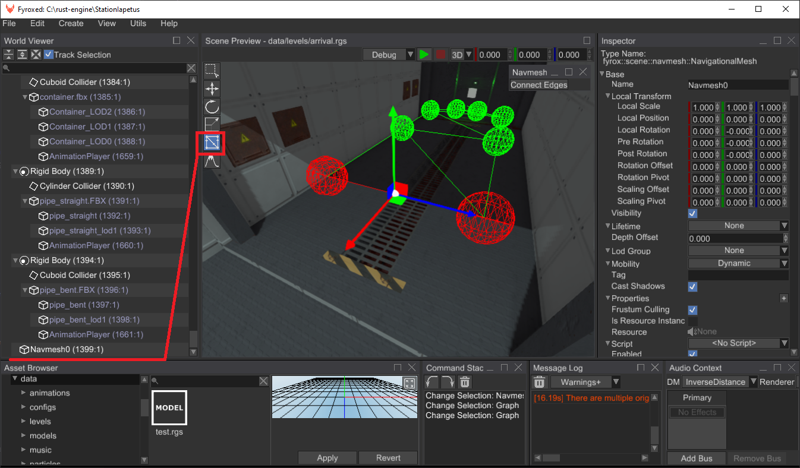
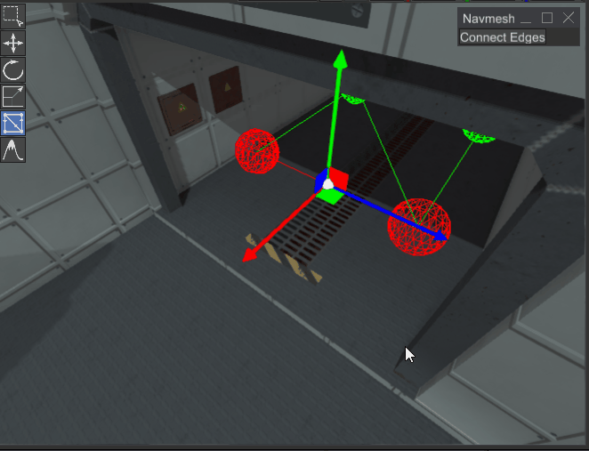

# Navigational Meshes


Navigational mesh (navmesh for short) is a surface which can be used for path finding. Unlike 
[A* Pathfinder](./pathfinding.md), it can build arbitrary paths on a surface of large polygons, making a path from 
point A to point B linear (standard pathfinder builds path only from vertex to vertex). Navmeshes should be used when
you have an arbitrary "walkable" surface, for example, a game level with rooms, hallways, multiple floors and so on. 
A* pathfinder should be used for strategies or any other types of games with uniform pathfinding grid.

## How to create

There are three major ways of creating navigational meshes: manual, automatic, from external data.

### Using the editor

Navigational meshes can be created and edited in the FyroxEd. At first, create a "Navigational Mesh" node, select it and
switch to "navmesh" interaction mode:



Now you can edit the navmesh. For now, editing capabilities are quite limited and the only way to edit the navmesh is
to Shift+Drag one if its edges:



You can also delete edges and vertices: select a vertex or an edge and press `Delete` key. If you need to create closed
loops, use "Connect Edges" button in the "Navmesh" floating panel:


### Using automatic generation

Fyrox does not support automatic navigational mesh generation yet. You can help by adding such feature.

### Using external data

It is possible to create a navigational mesh from an arbitrary mesh, which could be made somewhere else (in Blender,
3Ds Max, or even generated by a navmesh generator). If you have a `Mesh` scene node in your scene then you could do
something like this to build a navmesh from it:

```rust ,no_run
# extern crate fyrox;
# use fyrox::scene::Scene;
# use fyrox::utils::navmesh::Navmesh;
fn make_navmesh(scene: &Scene, navmesh_name: &str) -> Navmesh {
    // Find mesh node in existing scene and create navigation mesh from it.
    let navmesh_node_handle = scene.graph.find_by_name_from_root(navmesh_name).unwrap().0;
    Navmesh::from_mesh(scene.graph[navmesh_node_handle].as_mesh())
}
```

Alternatively, you can create a navmesh directly from code like so:

```rust ,no_run
# extern crate fyrox;
# use fyrox::utils::navmesh::Navmesh;
let navmesh = Navmesh::new(
    vec![
        TriangleDefinition([0, 1, 3]),
        TriangleDefinition([1, 2, 3]),
        TriangleDefinition([2, 5, 3]),
        TriangleDefinition([2, 4, 5]),
        TriangleDefinition([4, 7, 5]),
        TriangleDefinition([4, 6, 7]),
    ],
    vec![
        Vector3::new(0.0, 0.0, 0.0),
        Vector3::new(0.0, 0.0, 1.0),
        Vector3::new(1.0, 0.0, 1.0),
        Vector3::new(1.0, 0.0, 0.0),
        Vector3::new(2.0, 0.0, 1.0),
        Vector3::new(2.0, 0.0, 0.0),
        Vector3::new(3.0, 0.0, 1.0),
        Vector3::new(3.0, 0.0, 0.0),
    ],
);
```

The `Navmesh::new` method accepts a list of triangles and vertices, where triangles is a set of three indices of 
vertices forming a triangle.

## Agents

Navigational mesh agent helps you to build paths along the surface of a navigational mesh and follow it. Agents can be 
used to drive the motion of your game characters. Every agent knows about its target and automatically rebuilds the path
if the target has moved. Navmesh agents are able to move along the path, providing you with their current position, so you
can use it to perform an actual motion of your game characters. Agents work together with navigational meshes, you need
to update their state every frame, so they can recalculate path if needed. A simple example could something like this:

```rust,no_run
# extern crate fyrox;
# use fyrox::utils::navmesh::NavmeshAgent;
# struct Foo { 
// Add this to your script
agent: NavmeshAgent
# }
```

After that, you need to update the agent every frame to make sure it will follow the target:

```rust,no_run
# extern crate fyrox;
# use fyrox::{
#    core::algebra::Vector3, scene::navmesh::NavigationalMesh, utils::navmesh::NavmeshAgent,
# };
fn update_agent(
    agent: &mut NavmeshAgent,
    target: Vector3<f32>,
    dt: f32,
    navmesh: &mut NavigationalMesh,
) {
    // Set the target to follow and the speed.
    agent.set_target(target);
    agent.set_speed(1.0);

    // Update the agent.
    agent.update(dt, navmesh.navmesh_mut()).unwrap();

    // Print its position - you can use this position as target point of your game character.
    println!("{}", agent.position());
}
```

This method should be called in `on_update` of your script. It accepts four parameters: a reference to the agent, a 
target which it will follow, a time step (`context.dt`), and a reference to navigational mesh node. You can fetch 
navigational mesh from the scene graph by its name:

```rust,no_run
# extern crate fyrox;
# use fyrox::scene::{navmesh::NavigationalMesh, Scene};
fn find_navmesh<'a>(scene: &'a mut Scene, name: &str) -> &'a mut NavigationalMesh {
    let handle = scene.graph.find_by_name_from_root(name).unwrap().0;
    scene.graph[handle].as_navigational_mesh_mut()
}
```

### Radius

It is possible to specify a radius for navigation mesh agents, which could be used to walk around corners like so:


In some cases this behaviour is preferable, because it makes produced paths to look more natural. You can set agent's
radius using `set_radius` method. By default, it is set to 0.2 meters, which is an average radius that is suitable for
most of the cases.