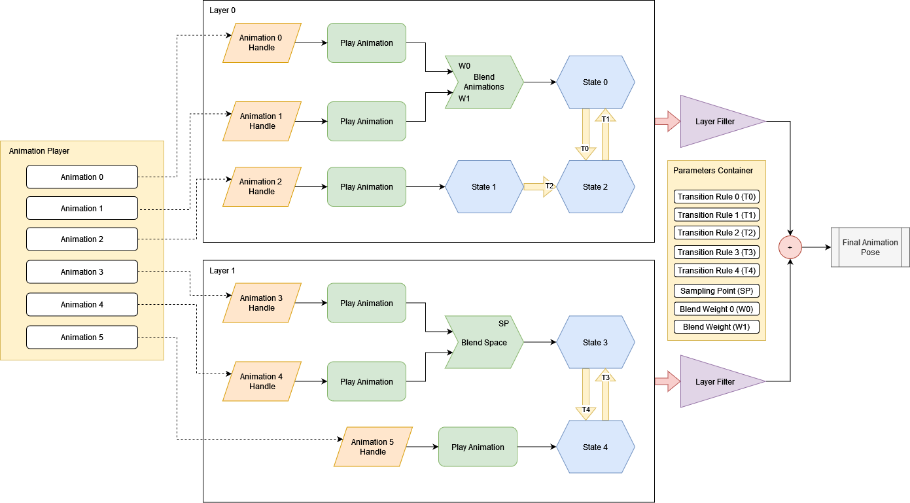

# Animation Blending

Animation blending is a powerful feature that allows you to mix multiple animations into one. Each animation
is mixed with a various weights which in sum gives 1.0 (100%). By having opposite coefficients (k1 = 0 -> 1, k2 = 1 -> 0)
changing in time it is possible to create transition effect. 

Handling transitions with all the coefficients is a routine job, the engine can handle it for you giving you some nice
features:

- Multiple states with smooth transitions between them
- Ability to blend multiple animations in one and use it as pose source for blending
- Ability to specify a set of variables that will be used as blending coefficients and transition rules.

All these features consolidated in so-called animation blending state machine (ABSM). Machine is used to blend multiple 
animation as well as perform automatic "smooth" transition between states. In general, ABSM could be represented like
this:



At the first look it may seem very complicated, but in reality it uses quite simple techniques. Let's start from
the left side of the picture and go to the right. Yellow rectangle at the left depicts an animation player node
that contains a bunch of animations, that will be used for blending. Two center blocks (layer 0 and layer 1) depicts
separate layers (ABSM could have any number of layers in it). Each layer can contain an arbitrary nodes (green
shapes), states (blue shapes), transitions (thick yellow arrows). 

Nodes serves as a source of poses, that can be blended in any desired way. States are the part of the inner state 
machine, only one state could be active at the same time. Transitions are used to specify state transition rules. 

At the "exit" of each layer there's a layer filter, it is responsible for filtering out values for specific
scene nodes and could be used to prevent some scene nodes from being animated by a certain layer. Please note
that despite the look of it, layer filter not necessarily be applied after all animations and states are blended -
it could be done at any moment and drawn like so only for simplicity reasons.

The last, but not the least, important thing on the picture is the parameters container on the right side of the
picture. Parameter either a transition rule, blending weight, or sampling point. If you look closely at the 
transitions or animation blending nodes you'll see small text marks. This is the names of the respective parameters.

In general, any state machine works like this - ABSM nodes are used to blend or fetch animations and their resulting
poses are used by ABSM states. Active state provides final pose, which is then passes filtering and returned to
you. After the last stage, you can apply the pose to a scene graph to make the resulting animation to have effect.

## How to create

As always, there are two major ways of creating things in Fyrox - from the editor or from code. Take your pick.

## From editor

Use [ABSM Editor](absm_editor.md) for to create animation blending state machines. 

## From code

You can always create an ABSM from code, a simple ABSM could be created like this:

```rust,no_run
{{#include ../code/snippets/src/animation/blending.rs:create_absm}}
```

Here we have Walk, Idle and Run states which use different sources of poses:
- Walk - is the most complicated here - it uses result of blending between `Aim` and `Walk` animations with different
  weights. This is useful if your character can only walk or can walk *and* aim at the same time. Desired pose determined
  by Walk Weight and Aim Weight parameters combination.
- Run and idle both directly use animation as pose source.

There are four transitions between three states each with its own rule. Rule is just a boolean parameter that indicates
that transition should be activated. Let's look at the code example of the above state graph:

As you can see, everything is quite straightforward. Even such simple state machine requires quite a lot of code, which
can be removed by using ABSM editor. Read the next chapter to learn about it.
