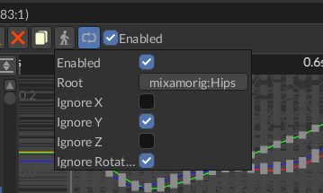

# Root Motion

Root motion is a special technique that transfers motion from some node in a hierarchy to a physical 
capsule, which is then used to perform the actual motion. In action it looks like this:

<iframe width="750" height="410" src="https://youtube.com/embed/0lG8Spzk128" title="YouTube video player" frameborder="0" allow="accelerometer; autoplay; clipboard-write; encrypted-media; gyroscope; picture-in-picture" allowfullscreen></iframe>

As you can see in the first part of the video, the movement of the character looks more like floating above
the ground. This happens because the actual movement of the physical capsule is not synchronized with the 
movement of the character. Root motion fixes exactly this issue by taking the motion of some root node of the
animated hierarchy (hips in case of this character) and transferring it to the physical capsule. This makes 
the actual movement to be fully synchronized with the movement "baked" in the animation.

Root motion also have some nice effect - you can move your character solely by the movement from animation, and
it will work perfectly in 99% of cases. Animations can also contain some rotations which can also be extracted
and applied to the physical capsule. The next awesome property is that your character will never stand out of 
its physical capsule, which will prevent phasing it into walls when playing animations with large movements.

In general, you should prefer root motion -driven movement for your characters whenever you can. Simply because
it eliminates a lot of common problems with character movement. It can also be applied to 2D world and will 
work exactly the same. 

## How to enable

You can enable/disable/setup it in the drop-down menu that opens by clicking `RM` button in the animation editor.
Keep in mind, that root motion should be configured on _per animation_ basis. Most of the animations does not
need the root motion at all.



The most important part here is the `Root` handle, it should be set to a root node that moves by your animation, usually
it is called like "hips" or similar:


After that, you need to apply filters for axes - most of the locomotion animations "works" in oXZ plane, so Y axis should
be ignored. Also, if you don't have any turns in your animation, you can also filter out the rotation part.

Alternatively, you can do the same from code:

```rust,no_run
{{#include ../../code/snippets/src/animation/root_motion.rs:setup_root_motion}}
```

This code does pretty much the same as the editor on the screenshots above. The arguments of this function are
the following: 

- `animation_player` - a handle to the animation player in which all your animations are stored,
- `animation` - a handle of the animation in which you want to enable the root motion (you can obtain the handle
by using [AnimationContainer::find_by_name_ref](https://docs.rs/fyrox/latest/fyrox/animation/struct.AnimationContainer.html#method.find_by_name_ref) 
method).
- `root_node` - a handle to a root node of your character's hierarchy, usually it is called something like "Hips"
or "Pelvis".
- `ctx` - script context from your current script.

## How to use

Direct root motion values extracted from animations are kind of useless by their own and in 99% of the cases you
should get the average root motion values from a [state machine](../blending.md) that animates your character. This
is because animation blending state machine properly blends the root motion from all active animation sources. 
In general, it could look something like this:

```rust ,no_run
{{#include ../../code/snippets/src/animation/root_motion.rs:fetch_and_apply_root_motion}}
```

This code extracts the current **local-space offset** for the current frame and then transforms the offset to
world-space coordinates. Finally, it reduces the offset by the current delta time (`1.0 / ctx.dt`) to obtain the
new velocity vector which is then applied to the rigid body (player's capsule).

The arguments in this function are following: 

- `absm` a handle to an instance of Animation Blending State Machine node
- `rigid_body` a handle to the rigid body that is used by your character
- `model` - a handle to the root node of your character's 3D model.

### Raw root motion values

If for some reason you still need raw root motion values from animations, then you can extract them directly
from the desired animation by using [Animation::root_motion](https://docs.rs/fyrox/latest/fyrox/animation/struct.Animation.html#method.root_motion)
method.

## Combining root motion with procedural motion

Sometimes there's a need to combine root motion with some procedural motion (for example - inertia after jumping).
This could be done pretty easily by adding two velocity vectors - one from the root motion, and one from the
procedural motion.