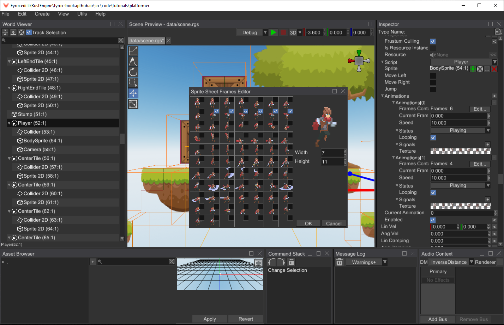

# Sprite Animation

Sprites can be animated using a series of pre-made images. For performance reasons they're usually packed
into a rectangular texture, where each individual image located in its own cell of a grid. Such texture is 
called a sprite sheet, and it looks something like this:


As you can see, there are multiple frames for each animation (idle, run, sword swing, etc.) packed into a 
single image. To play an animation, all we need to do is to change frames with some desired frequency and...
that's pretty much all. That's the simplest animation technique one could imagine.

Sprite sheets usually made by artists, not programmers, so just search online for some sprite sheet or 
order a new one from an artist. Programmer's art is pretty much always bad.

## How to use



Fyrox offers a built-in sprite animation system which has its own editor. To be able to use sprite animation
all you need to do is to add a `SpriteSheetAnimation` field (or a bunch of them) to your script and put 
the following code in its `on_update`:

```rust
{{#include ../../code/snippets/src/animation/mod.rs:animation}}
```