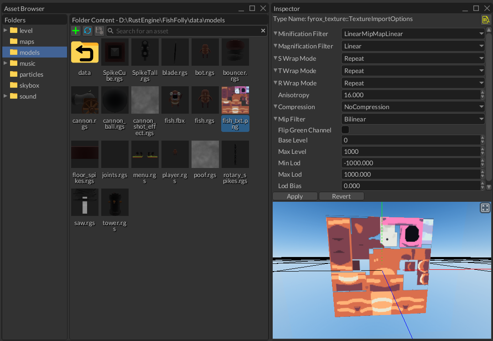

# Assets

Asset (or resource) is a shared container for some data that is usually stored in an external storage (a disk,
a web server, etc.). Pretty much every game depends on various assets, such as 3D models, textures, sounds, etc.
Fyrox has its own assets pipeline made to make your life easier.

## Asset Types

The engine offers a set of assets that should cover all of your needs:

- [Models](../resources/model.md) - are a set of objects. They can be a simple 3D model (barrels, bushes, weapons, 
etc.) or complex scenes with lots of objects and possibly other model instances. Fyrox supports a number main formats:
FBX and GLTF - which can be used to import 3D models, RGS - which are scenes made in FyroxEd. RGS models are 
special, as they can be used as [hierarchical prefabs](../scene/prefab.md).
- [Textures](../resources/texture.md) - are images used to add graphical details to objects. The
engine supports multiple texture formats, such as PNG, JPG, BMP, etc. Compressed textures in DDS format are also supported.
- [Sound buffers](../resources/sound.md) - are data buffers for sound sources. Fyrox supports a number of sound formats,
such as WAV, OGG, MP3, etc. formats. 
- [Curves](../resources/curve.md) - are parametric curves. They're used to create complex functions for numeric parameters. 
They can be made in the `Curve Editor` (`Utils -> Curve Editor`)
- [HRIR Spheres](../sound/hrtf.md) - head-related impulse response collection used for head-related transfer function
in the HRTF sound rendering.
- [Fonts](../ui/font.md) - arbitrary TTF/OTF fonts.
- [Materials](../rendering/materials.md) - materials for rendering.
- [Shaders](../rendering/shaders.md) - shaders for rendering.
- UI Style - a set of named variables that can be used to alternate the look of widgets, all at once.
- Tile Set - a set of descriptions for tiles used in [tile maps](../scene/tilemap.md).
- Animation Tracks Container - a special container for shared data of [animations](../animation/animation.md). 
- It is also possible to create custom assets. See [respective chapter](../resources/custom.md) for more info.
- Many more very specific asset types.

## Asset Management

Asset management is performed from the `Asset Browser` window in the editor, you can select an asset, preview it, and edit
its import options.



The most interesting part here is the import options section under the previewer. It allows you to set asset-specific import options
and apply them. Every asset has its own set of import options. See their respective asset page from the section above to learn
what each import option is for.

## Asset Instantiation

Some asset types can be instantiated in scenes; for now, you can only create direct instances from models. This
is done by simply dragging the model you want to instantiate and dropping it on the `Scene Preview`. While dragging it, 
you'll also see a preview of the model.


The maximum number of asset instances is not limited by the engine but it is by the memory and CPU resources of your PC. 
Note that the engine does try to reuse data across instances as much as possible.

You can also instantiate assets dynamically from your code. Here's an example of that for a Model:

```rust,no_run,edition2018
{{#include ../code/snippets/src/resource/mod.rs:instantiate_model}}
```

This is very useful with prefabs that you may want to instantiate in a scene at runtime. 

## Loading Assets

Usually, there is no need to manually handle the loading of assets since you have the editor to help with that - just create
a scene with all the required assets. However, there are times when you may need to instantiate some asset dynamically, for 
example, a bot prefab. For these cases, you can use the `ResourceManager::request<T>` method with the appropriate type,
such as `Model`, `Texture`, `SoundBuffer`, etc.
