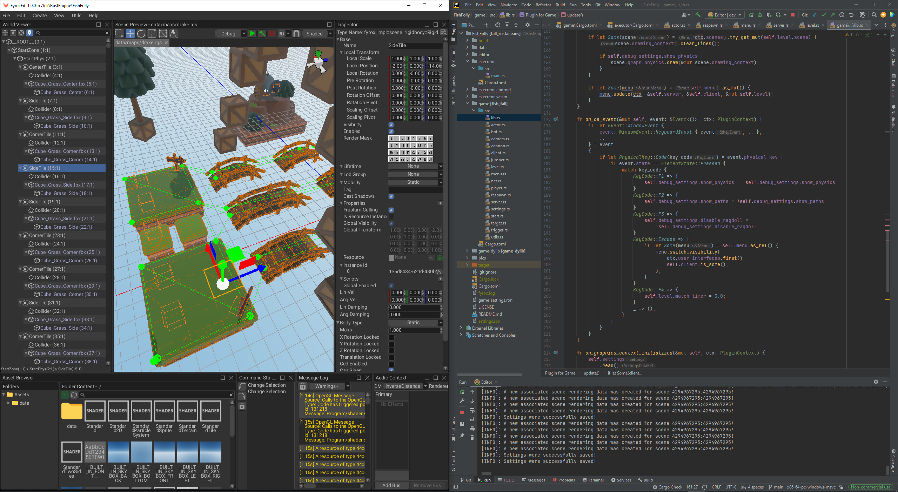
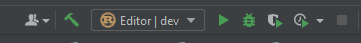
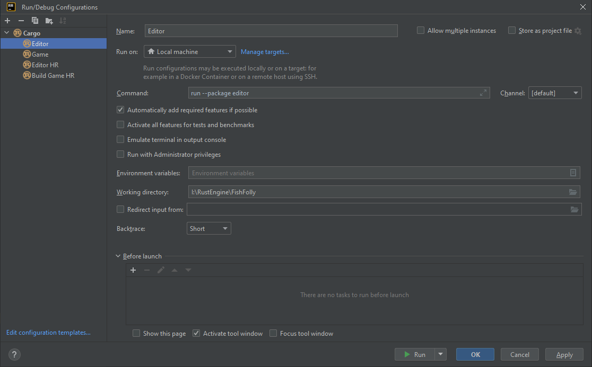
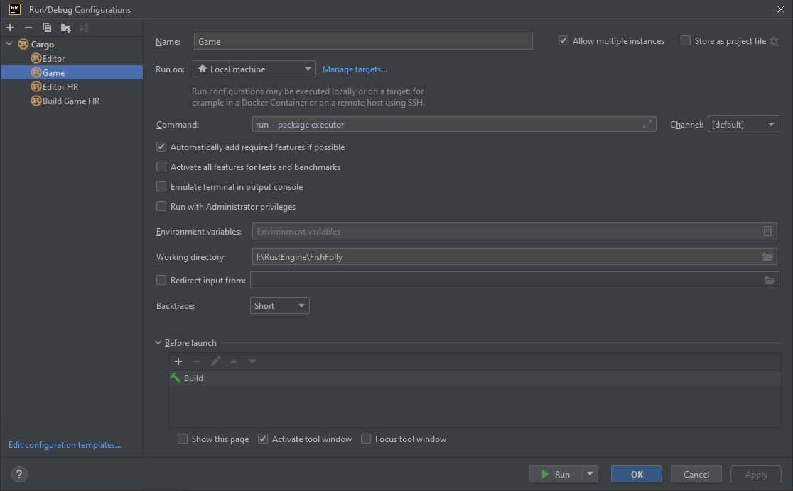
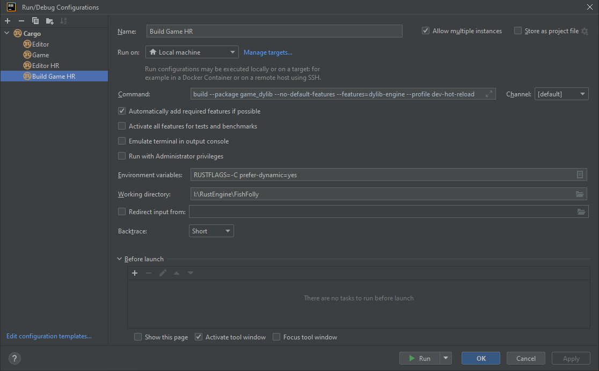
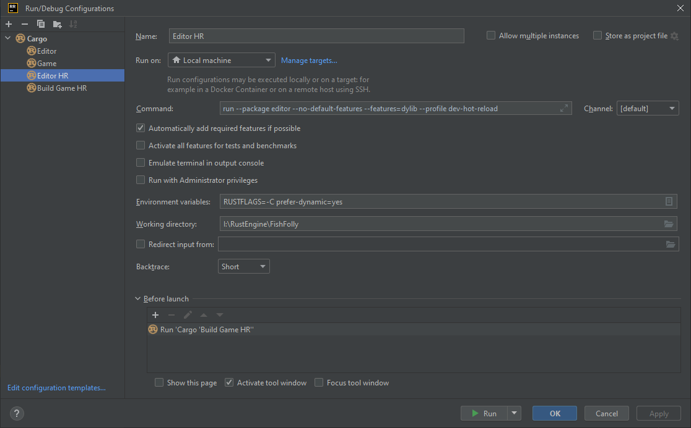

# IDE for code

Fyrox does not have its own integrated development environment (IDE for short) to edit the source code of your project.
Instead, you may use pretty much any IDE that you like. By default, Fyrox assumes that you're using RustRover. This
chapter describes the recommended way of using IDEs with the engine. As usual, using the right tools for the job
is a half of the overall success.

## RustRover

This section explains how to use the engine with RustRover and how to prepare it for the most efficient workflow.
RustRover is the recommended IDE for the engine. It is free for non-commercial use and works on pretty much every
major platform. A typical workflow is presented on this picture (keep in mind that it uses Classic UI extension):



The left side contains the opened editor and the right side contains the opened RustRover. When a new project is
created, all that you need to start using the IDE is simply go to `File -> Open` and select the project directory.
The same effect can be achieved via the [project manager](project_manager.md) by selecting your project and
clicking the `Open IDE` buttons. Once the project is open, find the following place in the UI and click on the
dropdown list and select `Edit Configurations...`.



### Static linking build configuration

Click on the `+` icon in the top left corner and select `Cargo`. Rename the new configuration to `Editor` and
specify the command to run:

```shell
run --package editor
```

> Note that the build commands aren't prefixed with `cargo`, it is done by RR automatically.

It should look like this:



To run the game separately from the editor, add the following:

```
run --package executor
```

It should look like this:



Typical workflow in the statically linked mode is the following:

1) Run the editor 
2) Do some changes in the scene
3) Run the game (`Debug` mode) from the editor
4) Repeat steps 2-4.

If any changes are needed in the game g

### Hot reloading build configuration

If you want to run the editor in [code hot reloading](hot_reloading.md) mode from the IDE, make sure to add the
following build configurations. The first step is to define a configuration that builds the game's dynamic library:

```shell
build --package game_dylib --no-default-features --features=dylib-engine --profile dev-hot-reload
```

Do not forget to add the following to `Environment Variables` as well:

```shell
RUSTFLAGS=-C prefer-dynamic=yes
```

In the RR it will look like this:



The next step is to add a configuration that builds the editor:

```shell
run --package editor --no-default-features --features=dylib --profile dev-hot-reload
```

Do not forget to add the following to `Environment Variables` as well:

```shell
RUSTFLAGS=-C prefer-dynamic=yes
```

The last step is to specify additional build configuration that must be run before the main one, this is done
in the bottom section of the window, and you should select `Build Game HR` configuration there. Overall, you should
have something like this:



Typical workflow with the native code hot reloading (CHR) is the following:

1) Run the editor first in CHR mode.
2) Do some changes in the scene.
3) Run the game in CHR mode from the editor (`Debug (HR)` build configuration in the editor).
4) Do some changes in the game code.
5) Select `Build Game HR` build configuration and run it, once the build is finished, the game and the editor
   will automagically reload the native code.
6) Repeat steps 4-6. 