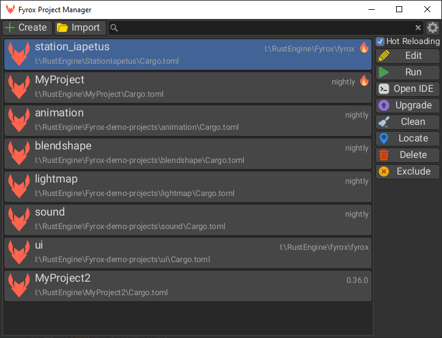
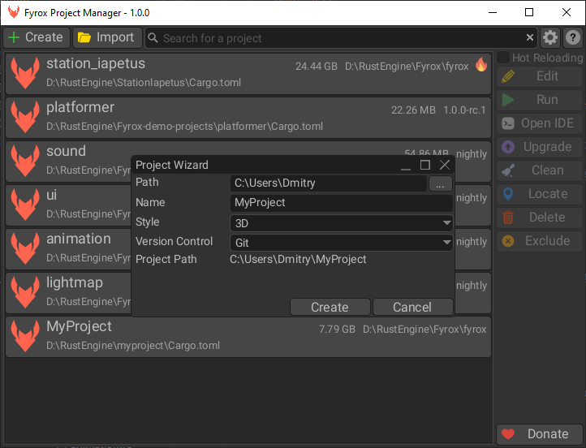
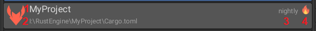
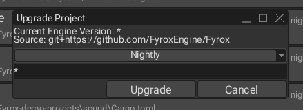

# Project Manager

This chapter explains how to use various parts of the project manager, what it can do in general, and why you should
prefer it over good ol' console commands.

## Overview

Project manager is a tool that is able to create projects, import existing projects, configure and build them, etc. Its 
main purpose is to reduce the complexity of project management to the minimum. For example, a new project can be created
and built in a few clicks. While the same is possible to be done manually, it requires some juggling with console commands
that in some cases (code hot reloading) contains a lot of unexpected parts.

## Creating a New Project

To create a new project simply click on `+Create` button, and you should see the following window:

This window contains four major options for your project:

- `Path` - specifies a parent directory in which a project's directory will be created and then filled with the
project's files.
- `Name` - project name, it must follow specific rules. The name must start either from a letter or underscore (`_`),
the rest of the characters must be letters, numbers, hyphens (`-`), underscore (`_`). The project manager performs 
name validation for you:

- `Style` - defines initial content of the default scene. In general, it does not restrict you to a specific number
of dimensions—you can still use both 2D and 3D or mix them.
- `Version Control` - allows you to select a desired version control system (VCS) for your project. It is Git by default,
but you can select any VCS you like or disable it completely by selecting `None` option.

Every project has its own item in the list of projects, it shows important information about the project:

1. Project name.
2. Full path to the project.
3. Version of the engine the project uses.
4. Code hot reloading marker. 

## Project Management

When a project is selected, it is possible to manage it using the toolbar on the right side. The available options 
are the following:

- `Hot Reloading` - allows you to enable or disable code hot reloading. Code hot reloading is a handy feature
for rapid prototyping. See [the respective chapter](./hot_reloading.md) for more info.
- `Edit` - builds and runs the editor.
- `Run` - builds and runs the game. Final builds of the game should be produced using the project exporter tool of the
editor. See [the respective chapter](../shipping/shipping.md) for more info. 
- `Open IDE` - opens the specified IDE to edit the project's source code. 
- `Upgrade` - opens a separate tool that allows you to select a desired engine version. See 
[the section below](#project-upgrade) for more info.
- `Clean` - removes all build artifacts from the project. Essentially it just runs `cargo clean` command for your project.
- `Locate` - opens the project directory in the file system explorer.
- `Delete` - deletes the project. This is a destructive operation, and it is "gated" with a separate confirmation dialog.
- `Exclude` - removes the project from the list of projects.

## Project Upgrade

This tiny tool allows you to select a desired version of the engine in a few clicks. Available options are the following:

- `Specific` - specific version of the engine. The version must comply with semver rules (for example - `0.36.0`).
- `Nightly` - latest possible _potentially unstable_ version of the engine directly from the development branch (`master`)
of the [GitHub repo](https://github.com/FyroxEngine/Fyrox). Use it if you need latest features and bugfixes.
- `Local` - special option that allows you to switch the engine to local copy of the engine repository. The engine must
be located in the parent folder of your project's directory.

## Settings

Project manager has its own settings, it is not much for now, but it will grow over time. Currently, there's only one
option—an IDE that can be used to edit source code of your project.

All that you need to is to specify a name of the executable of your IDE. The image above uses `RustRover` IDE. Keep in
mind, that you must modify your `PATH` environment variable to include full path to the specified executable, otherwise
this option will not work correctly!