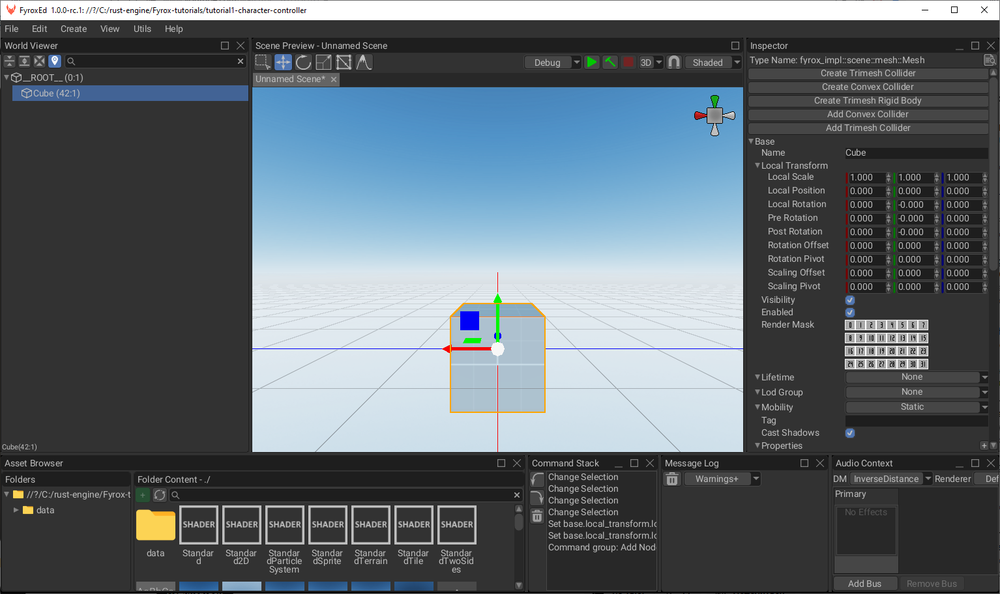

# Installation and Project Creation

Fyrox is a compiled game engine, this means that your game needs to be compiled to native code before it can be run.
This fact requires a specific project structure which is generated when you're making a new project. This project
consists of a few Rust crates (game, editor, executors for each platform). Every Fyrox game is just a plugin for both
the engine and the editor crates. This approach allows the game to run from the editor and enables editing of the game
entities from within it, or just run the game without the editor (since not every game needs an editor). This chapter
will cover how to install the engine with its platform-specific dependencies, how to use the plugins and scripting
system, and how to run the editor.

## Platform-specific Dependencies

Before starting to use the engine, make sure all required platform-specific development dependencies are installed. If
using Windows or macOS, no additional dependencies are required other than
the [latest Rust installed](https://rustup.rs) with the appropriate toolchain for your platform.

### Linux

On Linux, Fyrox needs the following libraries for development: `libxcb-shape0`, `libxcb-xfixes0`, `libxcb1`,
`libxkbcommon`, `libasound2`, `libegl-mesa0` and the `build-essential` package group.

For Debian based distros like Ubuntu, they can be installed like below:

```shell
sudo apt install libxcb-shape0-dev libxcb-xfixes0-dev libxcb1-dev libxkbcommon-dev libasound2-dev libegl-mesa0 build-essential
```

For NixOS, run `nix develop` from the root of your project to open a shell with all the required dependencies.
`flake.nix` is included in the generated project for you. It's content is the following:

<details>
<summary>flake.nix</summary>

```nix
{
  inputs = {
    nixpkgs.url = "github:nixos/nixpkgs/nixos-unstable";
    rust-overlay = {
      url = "github:oxalica/rust-overlay";
      inputs.nixpkgs.follows = "nixpkgs";
    };
  };

  outputs = {
    nixpkgs,
    rust-overlay,
    ...
  }:
  let
    overlays = [
      (import rust-overlay)
    ];

    systems = [
      "x86_64-linux"
      "aarch64-linux"
    ];

    forAllSystems = f:
      nixpkgs.lib.genAttrs systems
      (system: f { pkgs = import nixpkgs { inherit system overlays; }; });
  in
  {
    devShells = forAllSystems ({ pkgs }: with pkgs; {
      default = mkShell rec {
        buildInputs = [
          rust-bin.stable.latest.default

          pkg-config
          xorg.libxcb
          alsa-lib
          wayland
          libxkbcommon
          libGL
        ];
        LD_LIBRARY_PATH = "${lib.makeLibraryPath buildInputs}";
      };
    });
  };
}
```

</details>

## Project Manager

[](https://fyrox.rs/download.html)

[Project manager](https://fyrox.rs/download.html) is a part of the engine that allows you to manage multiple projects made with the engine all at once.
It allows you to create a new project or import an existing one, run the project or edit it in the editor,
upgrade the project to a selected version of the engine, and many more options. If you want to learn more about
the project manager, read [this chapter](project_manager.md).

[Download the project manager](https://fyrox.rs/download.html) for your OS from the website or install it using
`cargo install fyrox-project-manager` and run it. Then click the `+Create` button, select the path where you want the 
project to be located and click `Create`. The project manager will create a new directory for your project with the 
following structure (some files are omitted to be less verbose):

```text
YourProject
├───Cargo.toml
├───data
│       scene.rgs
├───game
│   │   Cargo.toml
│   └───src
│           lib.rs
├───editor
├───executor
├───executor-android
├───executor-wasm
├───export-cli
└───game-dylib
```

The most important parts in this structure:

- `Cargo.toml` - the workspace of your project.
- `game` - your game code.
- `data` - the folder where all the assets must be located (subfolders allowed).
- `editor` - the editor for your project (can be deleted if not needed).
- `executor` - entry point for PC (can be deleted if not needed).
- `executor-android` - entry point for Android (can be deleted if not needed).
- `executor-wasm` - entry point for WebAssembly (can be deleted if not needed).
- `export-cli` - command line interface for a [tool that handles project export](../shipping/ci_cd.md). 
- `game-dylib` - special "bridge" for native code hot reloading functionality (can be deleted if not needed). 

To run the project, select the new project in the list and click `Edit` button to run the editor, or `Run` to run 
the game without the editor (the game can also be run from the editor). Learn more about the
[project manager here](project_manager.md).

Your project needs to be compiled from scratch before it can be run, it may take some time, usually it takes up to 10
minutes on a CPU with 4 cores (8 core CPU will compile the engine in just 5 minutes or so). Next runs of the editor will
only compile your game, which usually takes a few seconds. Anyway, after some time you should see the editor window.



To cut down iteration times, you may want to use a powerful-yet-dangerous tool called native code hot reloading.
Learn more about it in [this chapter](hot_reloading.md).

## Usage Modes

There are a number of ways in which you can use the engine. For example, if you don't need the editor, just don't
use it. You can still compile your game to a desired platform. Even the project manager and the projects it 
generates aren't mandatory at all. 

If you want to manually initialize the engine without all these fancy bells and whistles, read 
[the respective chapter](../engine/manual_initialization.md). Keep in mind, however, that this book is written
in assumption that you're using the engine in the recommended way and all non-standard usage may result in
unexpected behavior. The recommended approach does all the "heavy lifting" for you.

## Adding Game Logic

Any object-specific game logic should be added using scripts. A script is a "container" for data and code, that will be
executed by the engine. Read the [respective chapter](../scripting/scripting.md) to learn how to create, edit, and use scripts
in your game.
