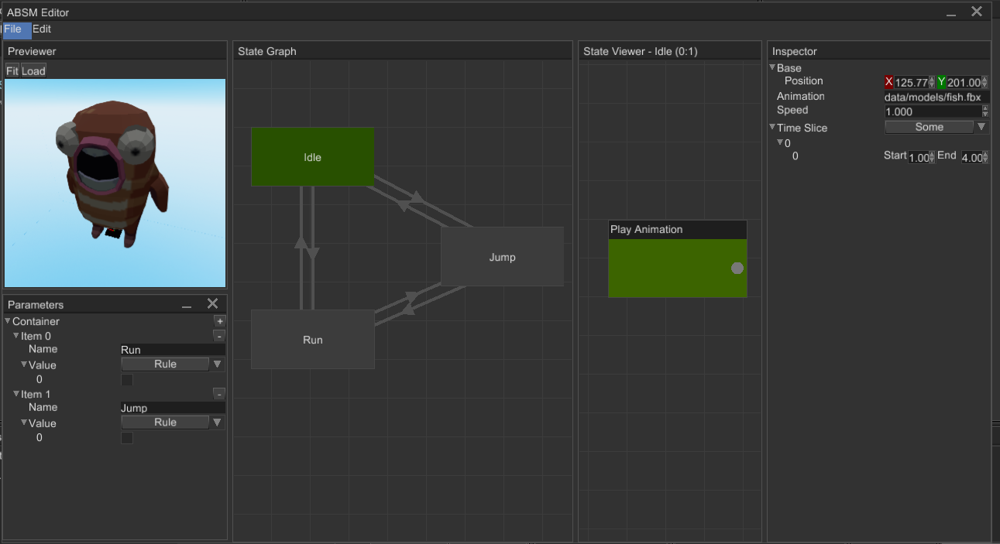
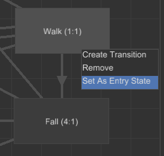
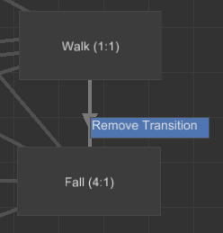
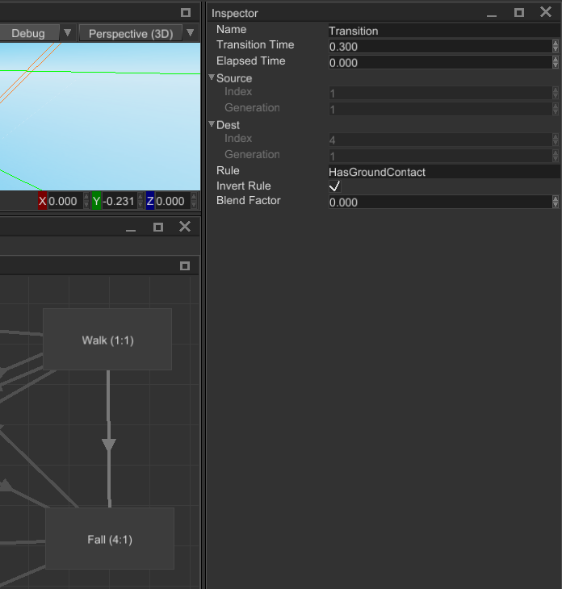
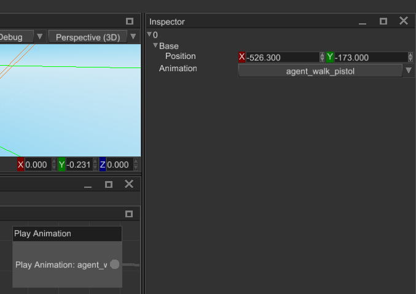

# Animation Blending State Machine (ABSM) Editor

While it is possible to create and manage animation blending and state manually from code, it quickly becomes too 
annoying and hardly manageable. To help you create and manage blending machines in easy way, the engine offers 
an ABSM Editor tool. This chapter is an overview of the editor, it is quite complex, but the guide should help you
to figure out which part is made for what. Next chapter will help you to create your first animation blending state
machine.

The editor has four main parts (panels):

1. `Toolbar` - contains a set of tools to edit animation layers and enable/disable preview mode. See [Toolbar](#toolbar)
section for more info.
2. `Parameters` - allows you to edit various variables that are responsible for transitions, weight parameters for 
blending, etc. See [Parameters](./absm_parameters.png) section for more info.
3. `State Graph` - allows you to create, delete, edit states and transition between them. See [State Graph](#state-graph)
section for more info.
4. `State Viewer` - allows you to edit pose source for a state. Pose source can be represented either by a single 
node that plays an animation, or a series of play animation nodes connected to blending nodes (which can be connected
to other blending nodes, etc.). See [State Viewer](#state-viewer) section for more info.

The editor can be opened in two ways - using `Utils -> ABSM Editor` or by selecting an animation blending state machine
node and clicking `Open ABSM Editor...` button:

In both ways you still need to select an an animation blending state machine node for editing.

## Toolbar

1. `Preview Switch` - enables or disables preview mode for the ABSM. See [Preview Mode](#preview-mode) section for more
info.
2. `Layer Name` - name of the selected layer. Type a new name here to rename currently selected layer (hit enter or just
click elsewhere to rename).
3. `Add Layer` - adds a new layer with the name in the `Layer Name` text box to the ABSM. ABSM can have multiple layers
with the same name, but it strongly advised to set unique names here.
4. `Remove Current Layer` - removes currently selected layer. You can delete all layers, but in this case your ABSM won't
have any effect.
5. `Layer Selector` - allows you to select a layer for editing, default selection is none.
6. `Layer Mask` - opens a `Layer Mask Editor` and helps you to edit the layer mask of the current layer. See 
[Layer Mask](#layer-mask) section for more info.

## Parameters

Parameter is a named and typed variable that provides the animation system with some data required for it to work. There
are only three type of parameters:

- `Rule` - boolean value that used as a trigger for transitions. When transition is using some rule, it checks the value
of the parameter and if it is `true` transition starts.
- `Weight` - real number (`f32`) that is used a weight when you're blending multiple animations into one.
- `Index` - natural number (`i32`) that is used as an animation selector.

1. `Add Parameters` - adds a new parameter to the parameters' container.
2. `Remove a Parameter` - removes selected parameter from the parameters' container.
3. `Parameter Name` - allows you to set a parameter name.
4. `Parameter Type` - allows you to select the type of the parameter.
5. `Parameter Value` - allows you to set parameter value.

## State Graph

State Graph allows you to create states and transitions between them. 

1. `State` - state is final animation for a set of scene nodes, only one state can be active at a time.
2. `Transition` - is an _ordered_ connection between two states, it defines how much time it needed to perform 
blending of two states.
3. `Root State` - is an entry state of the current layer.

### State Context Menu

- `Create Transition` - starts transition creation from the current state to some other.
- `Remove` - removes the state.
- `Set As Entry State` - marks the state as an entry state (this state will be active at beginning).

### Transition Context Menu

- `Remove Transition` - removes selected transition.

### State Properties

Select a `State` node to edit the following properties:

- `Position` - is a location of the state on the canvas.
- `Name` - name of the state.
- `Root` - handle of the backing animation node inside the state.

### Transition Properties

Select a `Transition` node to edit the following properties:

- `Name` - name of the state.
- `Transition Time` - amount of time for blending between two states (in seconds).
- `Elapsed Time` - starting amount of blending time.
- `Source` - handle of a source state.
- `Desc` - handle of a destination state.
- `Rule` - a name of `Rule` type parameter that defines whether the transition can be activated or not.
- `Invert Rule` - defines whether to invert the value of `Rule` or not.
- `Blend Factor` - defines a percentage (in `0..1` range) of how much transition was active. 

## State Viewer

State Viewer allows you to edit contents of states. You can create animation blending chains of any complexity, the
simplest content of a state is just a single `Play Animation` node. Currently, the engine supports just three animation
blending nodes:

- `Play Animation` - takes animation pose directly from specified animation, does nothing to it.
- `Blend Animations` - takes multiple animation poses from respective animations and blends them together with 
respective blend weights.
- `Blend Animations By Index` - takes multiple animation poses from respective animations and switches between them 
with "smooth" transition using an index parameter.

1. `Node` - is a source of animation for blending.
2. `Connection` - defines how nodes are connected to each other. To create a new connection, click on a small dot on a
node, hold the button and start dragging to a dot on some other node. 
3. `Root Node` - root node is marked green; root node is a final source of animation for the parent state. 

### `Play Animation` Properties

Select a `Play Animation` node to edit the following properties:

- `Position` - is a location of the node on the canvas.
- `Animation` - an animation to fetch the pose from.

### `Blend Animations` Properties

Select a `Blend Animations` node to edit the following properties:

- `Position` - is a location of the node on the canvas.
- `Pose Sources` - a set of input poses. To add a pose either click on `+` or `+Input` on the node itself. Don't forget
to connect some nodes to the new input poses.
  - `Weight` - a weight of the pose; could be either a constant value or some parameter.

### `Blend Animations By Index` Properties

Select a `Blend Animations By Index` node to edit the following properties:

 

- `Position` - is a location of the node on the canvas.
- `Index Parameter` - a name of an indexing parameter (must be `Index` type).
- `Inputs` - a set of input poses. To add a pose either click on `+` or `+Input` on the node itself. Don't forget to
connect some nodes to the new input poses.
  - `Blend Time` - defines how much time is needed to transition to the pose.

### Connection Context Menu

Every connection has a context menu that can be shown by a right-click on a connection.

- `Remove Connection` - removes the connection between parent nodes.

### Node Context Menu

Every node has a context menu that can be shown by a right-click on a connection.

- `Set As Root` - sets the node as the final pose source of the parent state. 
- `Remove` - removes the node from the state.

## Layer Mask

Layer mask editor allows you to select which nodes **won't** be animated by the current animation layer. Selected nodes
are marked with dark color. To select multiple nodes at once, hold `Ctrl` and click on items. The text box at the top
of the window allows you to search for a particular scene node. To save edited layer mask click `OK`.

## Preview Mode

Preview mode turns on the animation blending state machine and its animation player and allows you to see the result
of the work of the machine. Any significant changes in the scene automatically disables the preview mode and any
changes done by the machine is discarded. While the preview mode is active, you can freely change the values of the 
parameters to see how the machine will react to this. This helps you to debug your state machine, it is especially 
useful for complex state machines with lots of layers. Here's how the preview mode works:

