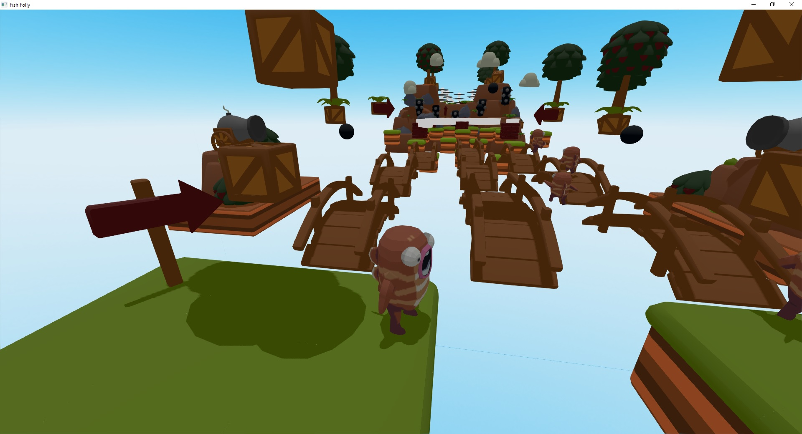
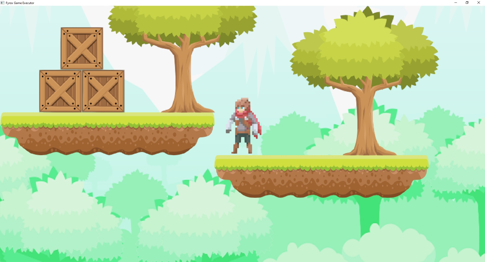

# Introduction to Fyrox

Fyrox is a feature-rich, general purpose game engine that is suitable for any kind of games. It is capable to power
games with small- or medium-sized worlds, large-sized world most likely will require some manual work. 

Games made with the engine are capable to run on desktop platforms (PC, Mac, Linux) and Web (WebAssembly). Mobile is
planned for future releases.

## What can the engine do?

You can create pretty much any kind of game or interactive applications. Here's some examples of what the engine can 
do:

## How does the engine work?

The engine consists of two parts that you'll be actively using: the framework and the editor. The framework is a 
foundation of the engine, it manages rendering, sound, scripts, plugins, etc. While the editor contains lots of tools 
that can be used to create game worlds, manage assets, edit game objects, scripts and more.

## Programming languages

Everything of your game can be written entirely in Rust, utilizing its safety guarantees as well as speed. However, it
is possible to use any scripting language you want, but that's have no built-in support, and you need to implement this
manually.

## Engine Features

This is a more or less complete (yet, it can be outdated) list of engine features:

### General

- Exceptional safety, reliability, and speed.
- PC (Windows, Linux, macOS), Android, [Web (WebAssembly) support](https://fyrox.rs/examples).
- Modern, PBR rendering pipeline.
- Comprehensive [documentation](https://docs.rs/Fyrox).
- [Guide book](https://fyrox-book.github.io)
- 2D support.
- Integrated editor.
- Fast iterative compilation.
- Classic object-oriented design.
- Lots of examples.

### Rendering

- Custom shaders, materials, and rendering techniques.
- Physically-based rendering.
- Metallic workflow.
- High dynamic range (HDR) rendering.
- Tone mapping.
- Color grading.
- Auto-exposure.
- Gamma correction.
- Deferred shading.
- Directional light.
- Point lights + shadows.
- Spotlights + shadows.
- Screen-Space Ambient Occlusion (SSAO).
- Soft shadows.
- Volumetric light (spot, point).
- Batching.
- Instancing.
- Fast Approximate Anti-Aliasing (FXAA).
- Normal mapping.
- Parallax mapping.
- Render in texture.
- Forward rendering for transparent objects.
- Sky box.
- Deferred decals.
- Multi-camera rendering.
- Lightmapping.
- Soft particles.
- Fully customizable vertex format.
- Compressed textures support.
- High-quality mip-map on-demand generation.

### Scene

- Multiple scenes.
- Full-featured scene graph.
- Level-of-detail (LOD) support.
- GPU Skinning.
- Various scene nodes:
    - Pivot.
    - Camera.
    - Decal.
    - Mesh.
    - Particle system.
    - Sprite.
    - Multilayer terrain.
    - Rectangle (2D Sprites)
    - Rigid body + Rigid Body 2D
    - Collider + Collider 2D
    - Joint + Joint 2D

### Sound

- [High quality binaural sound with HRTF support](https://github.com/FyroxEngine/Fyrox/tree/master/fyrox-sound).
- Generic and spatial sound sources.
- Built-in streaming for large sounds.
- Raw samples playback support.
- WAV/OGG format support.
- HRTF support for excellent positioning and binaural effects.
- Reverb effect.

### Serialization

- Powerful serialization system
- Almost every entity of the engine can be serialized
- No need to write your own serialization.

### Animation

- Animation blending state machine - similar to Mecanim in Unity Engine.
- Animation retargetting - allows you to remap animation from one model to another.

### Asset management

- Advanced asset manager.
- Fully asynchronous asset loading.
- PNG, JPG, TGA, DDS, etc. textures.
- FBX models loader.
- WAV, OGG sound formats.
- Compressed textures support (DXT1, DXT3, DTX5).

### Artificial Intelligence (AI)

- A* pathfinder.
- Navmesh.
- Behavior trees.

### User Interface (UI)

- [Advanced node-based UI](https://github.com/FyroxEngine/Fyrox/tree/master/fyrox-ui) with lots of widgets.
- More than 32 widgets
- Powerful layout system.
- Full TTF/OTF fonts support.
- Based on message passing.
- Fully customizable.
- GAPI-agnostic.
- OS-agnostic.
- Button widget.
- Border widget.
- Canvas widget.
- Color picker widget.
- Color field widget.
- Check box widget.
- Decorator widget.
- Drop-down list widget.
- Grid widget.
- Image widget.
- List view widget.
- Popup widget.
- Progress bar widget.
- Scroll bar widget.
- Scroll panel widget.
- Scroll viewer widget.
- Stack panel widget.
- Tab control widget.
- Text widget.
- Text box widget.
- Tree widget.
- Window widget.
- File browser widget.
- File selector widget.
- Docking manager widget.
- NumericUpDown widget.
- `Vector3<f32>` editor widget.
- Menu widget.
- Menu item widget.
- Message box widget.
- Wrap panel widget.
- Curve editor widget.
- User defined widget.

### Physics

- Advanced physics (thanks to the [rapier](https://github.com/dimforge/rapier) physics engine)
- Rigid bodies.
- Rich set of various colliders.
- Joints.
- Ray cast.
- Many other useful features.
- 2D support.