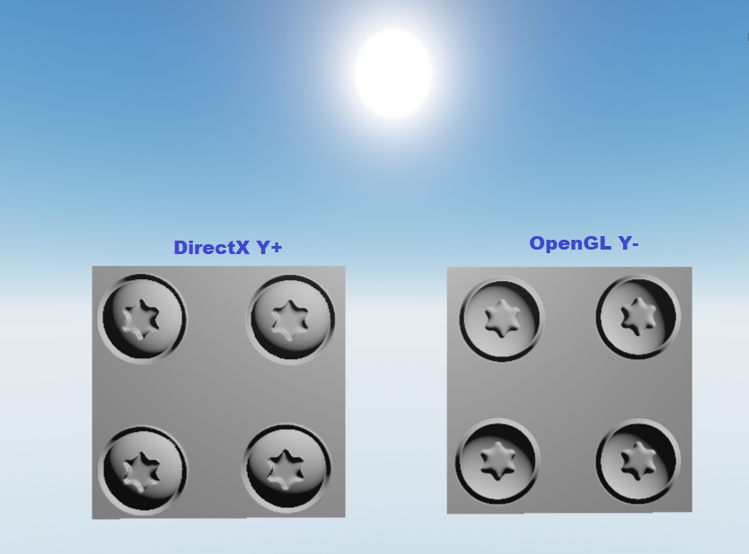

# Normal Maps

This chapter explains how to use normal maps in the engine correctly and how to solve common issues with normal maps as
well.

## Format

Fyrox uses so-called `DirectX Y-` normal maps, which means that it expects the origin of local coordinate system of a
normal map to be at the left-top corner of the map, instead of `OpenGL Y+` normal maps where the origin is at the 
left-bottom corner of the map. `DirectX Y-` normal maps are much more prevalent nowadays, especially when it comes to 
game-ready 3D models. Some software (like Substance Painter), by default has exporting settings to be set to `DirectX Y-`
style normal maps. 

The difference between the two is quite obvious if you look at the lighting with both normal maps:

The left one is `DirectX Y-` and the right one is `OpenGL Y+`. As you can see, the left one looks correctly - the 
screw head is convex as in reality and the lighting is also correct. On the other side, however, the screw head look to
be concave and the lighting is opposite.

## Solving Issues

If you have these sort of issues in your project, all you need to do is to flip (`G = 1 - G`) green channel of you 
normal map. For now, this should be done manually in some pictures editor, future versions of the engine will have a
switch to flip green channel for you automatically.

A simple trick of how to understand which type of normal map you have: look at any obvious bump (convex part) on the normal 
map, if its top contains green-ish colors then you have `OpenGL Y+` normal maps and its green channel should be flipped:

On the image above, the screw head (in the red circle) is an obviously convex and on the left side you can see, that
the green-ish colors is at the bottom, while on the right side green-ish colors is at the top. You could also check the 
lighting results on your 3D model and see if they're correct (looks the same as in the 3D modelling software, for 
instance) while moving a light source around. 