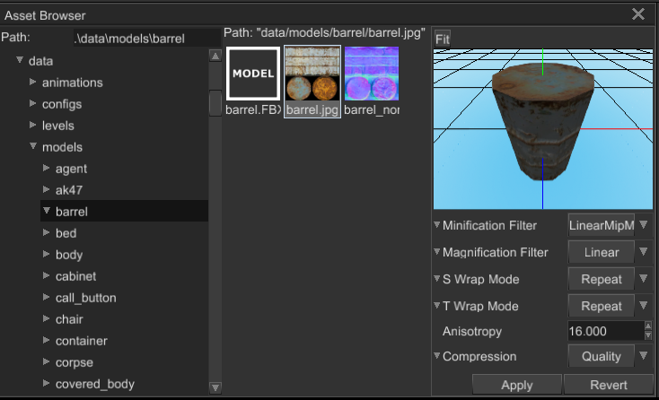

# Textures

Texture is an image that used to fill faces to add details to them. In most cases textures are just 2D images, however 
there are some exclusions to that - for example cube maps, that may be used for environment mapping. Fyrox supports 1D,
2D, 3D and Cube textures.

## Supported formats

To load images and decode them, Fyrox uses image and ddsfile crates. Here is the list of supported formats: png,
tga, bmp, dds, jpg, gif, tiff, dds.

## Compressed textures

Fyrox supports most commonly used formats of compressed textures: DXT1, DXT3, DXT5. Such textures can be loaded
only from `DDS` files. You can specify on-demand texture compression in import options (see below), it works for every
texture format excepts DDS. It is meant to be used when you don't want to bother with DDS format, there are two
compression methods:

- `Quality` - has 4:1 compression ratio, supports full 8-bit alpha channel. Textures with gradients will most likely
suffer from noticeable banding.
- `Speed` - has lower quality compared to `Quality` mode, but it has 8:1 compression ratio for texture without alpha
channel and 6:1 with alpha channel. Keep in mind, that alpha channel in this mode supports only 1 bit - it is either
enabled or not.

Compressed textures usually does not support color gradient very well, if you have a texture with a lot of colors and
gradients, then you'll most likely get compressed texture with lots of graphical artifacts such as banding.

It is also worth mention, that you should **never** use compression with normal maps, it can significantly distort 
normals because normal maps usually have lots of color gradients.

## Import options

It is possible to define custom import options. Using import options you could set desired compression quality,
filtering, wrapping, etc. Import options should be defined using Asset Browser in the editor:



It is also possible to define import options manually in a separate file with the same name as the source
texture, but with additional extension `options`, this is what the editor does for you. For example, you have a 
`foo.jpg` texture, a file with import options should be called `foo.jpg.options`. It's content may look something like
this:

```text
(
    minification_filter: Linear,
    magnification_filter: Linear,
    s_wrap_mode: Repeat,
    t_wrap_mode: ClampToEdge,
    anisotropy: 8.0,
    compression: NoCompression,    
)
```

Even if it is possible to modify it by hand, it strongly advised to use the editor to edit import options, because
it reduces chances to mess up something.

## Render target

Texture can be used as render target to render scene in it. To do this you should use new_render_target method and
pass its result to scene's render target property. Renderer will automatically provide you info about metrics of
texture, but it won't give you access to pixels of render target.