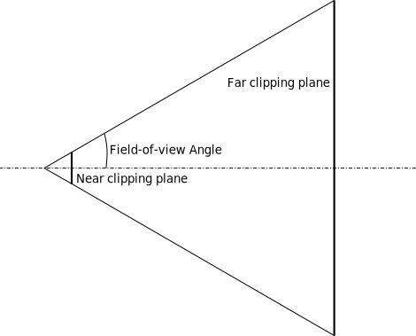
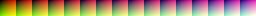

# Camera node

Camera is a special scene node that allows you to "look" at your scene from any point and with any orientation.
Currently, the engine supports only _perspective_ cameras, which could be represented as a frustum volume. Everything
that "intersects" with the frustum will be rendered. 



## How to create

An instance of camera node could be created using `CameraBuilder`: 

```rust,no_run
# extern crate fyrox;
# use fyrox::{
#     core::pool::Handle,
#     scene::{base::BaseBuilder, camera::CameraBuilder, node::Node, Scene},
# };

fn create_camera(scene: &mut Scene) -> Handle<Node> {
    CameraBuilder::new(BaseBuilder::new())
        // Set some properties.
        .with_fov(80.0f32.to_radians())
        .with_z_far(256.0)
        .build(&mut scene.graph)
}
```

Orientation and position should be set in `BaseBuilder` as usual.

## Projection modes

Projection mode defines how your scene will look like after rendering, there are two projection modes available.

### Perspective

Perspective projection makes distant objects smaller and parallel lines converging when using it, it is the most 
common projection type for 3D games. By default, each camera uses perspective projection. It's defined by three 
parameters that describes frustum volume:

- Field of view angle
- Near clipping plane location
- Far clipping plane location

Here is a simple example of how to create a camera with perspective projection:

```rust,no_run
# extern crate fyrox;
# use fyrox::{
#     core::pool::Handle,
#     scene::{
#         base::BaseBuilder,
#         camera::{CameraBuilder, PerspectiveProjection, Projection},
#         graph::Graph,
#         node::Node,
#     },
# };
fn create_perspective_camera(graph: &mut Graph) -> Handle<Node> {
    CameraBuilder::new(BaseBuilder::new())
        .with_projection(Projection::Perspective(PerspectiveProjection {
            // Keep in mind that field of view expressed in radians!
            fov: 60.0f32.to_radians(),
            z_near: 0.025,
            z_far: 1024.0,
        }))
        .build(graph)
}
```

### Orthographic

Orthographic projection prevents parallel lines from converging, it does not affect object size with distance.
If you're making 2D games or isometric 3D games, this is the projection mode you're looking for. Orthographic
projection defined by three parameters:

- Vertical Size
- Near Clipping Plane
- Far Clipping Plane

Vertical size defines how large the "box" will be in vertical axis, horizontal size is derived from vertical
size by multiplying vertical size with aspect ratio.

Here is a simple example of how to create a camera with orthographic projection:

```rust,no_run
# extern crate fyrox;
# use fyrox::{
#     core::pool::Handle,
#     scene::{
#         base::BaseBuilder,
#         camera::{CameraBuilder, OrthographicProjection, Projection},
#         graph::Graph,
#         node::Node,
#     },
# };
fn create_perspective_camera(graph: &mut Graph) -> Handle<Node> {
    CameraBuilder::new(BaseBuilder::new())
        .with_projection(Projection::Orthographic(OrthographicProjection {
            vertical_size: 5.0,
            z_near: 0.025,
            z_far: 1024.0,
        }))
        .build(graph)
}
```

## Performance

Each camera forces engine to re-render scene one more time, which can be very resource-intensive (both CPU and GPU)
operation. 

To reduce GPU load, try to keep the Far Clipping Plane at lowest possible values. For example, if you're making a game
with closed environment (lots of corridors, small rooms, etc.) set the Far clipping Plane to max possible distance that 
can be "seen" in your game - if the largest thing is a corridor, then set the Far clipping Plane to slightly exceed the 
length. This will force the engine to clip everything that is out of bounds and do not draw such objects.

## Skybox

Outdoor scenes usually have distant objects that can't be reached, these can be mountains, sky, distant forest, etc.
such objects can be pre-rendered and then applied to a huge cube around camera, it always will be rendered first and will
be the background of your scene. To create a Skybox and set it to a camera, you can use the following code:

```rust,no_run,edition2018
# extern crate fyrox;
# use fyrox::{
#     core::{futures::executor::block_on, pool::Handle},
#     engine::resource_manager::ResourceManager,
#     resource::texture::TextureWrapMode,
#     scene::{
#         base::BaseBuilder,
#         camera::{CameraBuilder, SkyBox, SkyBoxBuilder},
#         node::Node,
#         Scene,
#     },
# };

async fn create_skybox(resource_manager: ResourceManager) -> SkyBox {
    // Load skybox textures in parallel.
    let (front, back, left, right, top, bottom) = fyrox::core::futures::join!(
        resource_manager.request_texture("path/to/front.jpg"),
        resource_manager.request_texture("path/to/back.jpg"),
        resource_manager.request_texture("path/to/left.jpg"),
        resource_manager.request_texture("path/to/right.jpg"),
        resource_manager.request_texture("path/to/up.jpg"),
        resource_manager.request_texture("path/to/down.jpg")
    );

    // Unwrap everything.
    let skybox = SkyBoxBuilder {
        front: Some(front.unwrap()),
        back: Some(back.unwrap()),
        left: Some(left.unwrap()),
        right: Some(right.unwrap()),
        top: Some(top.unwrap()),
        bottom: Some(bottom.unwrap()),
    }
    .build()
    .unwrap();

    // Set S and T coordinate wrap mode, ClampToEdge will remove any possible seams on edges
    // of the skybox.
    let skybox_texture = skybox.cubemap().unwrap();
    let mut data = skybox_texture.data_ref();
    data.set_s_wrap_mode(TextureWrapMode::ClampToEdge);
    data.set_t_wrap_mode(TextureWrapMode::ClampToEdge);

    skybox
}

fn create_camera(scene: &mut Scene, resource_manager: ResourceManager) -> Handle<Node> {
    CameraBuilder::new(BaseBuilder::new())
        .with_skybox(block_on(create_skybox(resource_manager)))
        .build(&mut scene.graph)
}
```

## Color grading look-up tables

Color grading Look-Up Tables (LUT) allows you to transform color space of your frame. Probably everyone saw the
famous "mexican" movie effect when everything becomes yellow-ish when action takes place in Mexico, this is done
via color grading LUT effect. When used wisely, it can significantly improve perception of your scene.

Here is the same scene having no color correction along with another case that has "mexico" color correction:

| Scene                                                  | Look-up-table
|--------------------------------------------------------|-------------------
|       | 
|   | 

To use color grading LUT you could do something like this:

```rust,no_run
# extern crate fyrox;
# use fyrox::{
#     core::{futures::executor::block_on, pool::Handle},
#     engine::resource_manager::ResourceManager,
#     scene::{
#         base::BaseBuilder,
#         camera::{CameraBuilder, ColorGradingLut},
#         node::Node,
#         Scene,
#     },
# };

fn create_camera_with_lut(
    scene: &mut Scene,
    resource_manager: ResourceManager,
) -> Handle<Node> {
    CameraBuilder::new(BaseBuilder::new())
        .with_color_grading_enabled(true)
        .with_color_grading_lut(
            block_on(ColorGradingLut::new(
                resource_manager.request_texture("path/to/lut.jpg"),
            ))
            .unwrap(),
        )
        .build(&mut scene.graph)
}
```

## Picking 

In some games you may need to do mouse picking of objects in your scene. To do that, at first you need to somehow convert
a point on the screen to ray in the world. `Camera` has `make_ray` method exactly for that purpose:

```rust,no_run
# extern crate fyrox;
# use fyrox::{
#     core::{algebra::Vector2, math::ray::Ray},
#     renderer::Renderer,
#     scene::camera::Camera,
# };
# 
fn make_picking_ray(camera: &Camera, point: Vector2<f32>, renderer: &Renderer) -> Ray {
    camera.make_ray(point, renderer.get_frame_bounds())
}
```

The ray then can be used to [perform a ray cast over physics entities](../physics/ray.md). This is the simplest way
of camera picking, and you should prefer it most of the time.

### Advanced picking

**Important**: The following picking method is for advanced engine users only, if you don't know the math you should not
use it.

If you know the math and don't want to create physical entities, you can use this ray to perform manual 
ray intersection check:

```rust,no_run
# extern crate fyrox;
# use fyrox::{
#     core::{
#         algebra::Vector3,
#         algebra::{Matrix4, Point3},
#         math::TriangleDefinition,
#         math::{ray::Ray, Vector3Ext},
#         visitor::Node,
#     },
#     scene::mesh::{
#         buffer::{VertexAttributeUsage, VertexReadTrait},
#         surface::SurfaceData,
#         Mesh,
#     },
# };
# 
fn read_vertex_position(data: &SurfaceData, i: u32) -> Option<Vector3<f32>> {
    data.vertex_buffer
        .get(i as usize)
        .and_then(|v| v.read_3_f32(VertexAttributeUsage::Position).ok())
}

fn transform_vertex(vertex: Vector3<f32>, transform: &Matrix4<f32>) -> Vector3<f32> {
    transform.transform_point(&Point3::from(vertex)).coords
}

fn read_triangle(
    data: &SurfaceData,
    triangle: &TriangleDefinition,
    transform: &Matrix4<f32>,
) -> Option<[Vector3<f32>; 3]> {
    let a = transform_vertex(read_vertex_position(data, triangle[0])?, transform);
    let b = transform_vertex(read_vertex_position(data, triangle[1])?, transform);
    let c = transform_vertex(read_vertex_position(data, triangle[2])?, transform);
    Some([a, b, c])
}

pub fn precise_ray_test(
    node: &Node,
    ray: &Ray,
    ignore_back_faces: bool,
) -> Option<(f32, Vector3<f32>)> {
    let mut closest_distance = f32::MAX;
    let mut closest_point = None;

    if let Some(mesh) = node.query_component_ref::<Mesh>() {
        let transform = mesh.global_transform();

        for surface in mesh.surfaces().iter() {
            let data = surface.data();
            let data = data.lock();

            for triangle in data
                .geometry_buffer
                .iter()
                .filter_map(|t| read_triangle(&data, t, &transform))
            {
                if ignore_back_faces {
                    // If normal of the triangle is facing in the same direction as ray's direction,
                    // then we skip such triangle.
                    let normal =
                        (triangle[1] - triangle[0]).cross(&(triangle[2] - triangle[0]));
                    if normal.dot(&ray.dir) >= 0.0 {
                        continue;
                    }
                }

                if let Some(pt) = ray.triangle_intersection_point(&triangle) {
                    let distance = ray.origin.sqr_distance(&pt);

                    if distance < closest_distance {
                        closest_distance = distance;
                        closest_point = Some(pt);
                    }
                }
            }
        }
    }

    closest_point.map(|pt| (closest_distance, pt))
}
```

`precise_ray_test` is what you need, it performs precise intersection check with geometry of a mesh node. It returns a
tuple of the closest distance and the closest intersection point. 

## Exposure and HDR

(WIP)