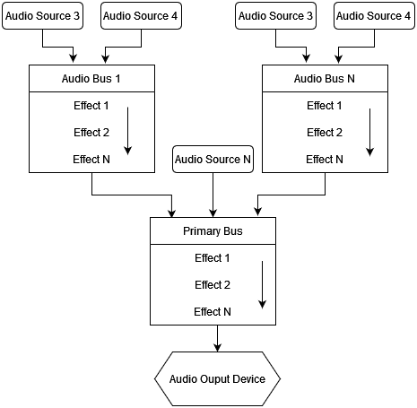

# Audio Bus

<iframe width="750" height="410" src="https://youtube.com/embed/6-M3LUv9Jto" title="YouTube video player" frameborder="0" allow="accelerometer; autoplay; clipboard-write; encrypted-media; gyroscope; picture-in-picture" allowfullscreen></iframe>

Audio bus is an audio processing unit that takes audio samples from any number of sound sources and passes them through
a chain of effects (zero or more). Processed samples then can be either sent to an audio playback device (speakers, 
headphones, etc.) or to some other audio bus. There's always one audio bus (primary) that sends its data to an audio playback 
device, every other audio buses are considered secondary.

## Graph

As stated above, any audio bus (except primary), can output its audio samples to some other audio bus (primary or secondary).
Such relationship forms an audio bus graph:

As you can see, there can be any number of sound sources which attached to the respective audio buses. Each audio bus
can have any number of effects (such as lowpass, highpass, etc. filtering; reverb effect and more). Finally, each audio
bus is connected to some other audio bus.

Such complex audio processing structure allows you to create pretty much any sound environment. For example, you can
create an audio bus with a reverb effect, that will represent a huge hangar with lots of echoes. Then you attach all
sound sources located in this "hangar" to the audio bus and your sound sources will sound more naturally, according
to environment. 

## Effects

Audio bus can have zero or more audio processing effects. The effects applied one after another (see the arrows on the
picture above). You can set any of the following effects:

- **Attenuation** - changes "volume" of input sound samples.
- **Reverb** - adds echoes, early and late reflections. Could be used to simulate environment with high reflectivity (hangars,
parking lots, etc.)
- **Low Pass Filter** - passes all frequencies below the specified cut-off frequency.
- **High Pass Filter** - passes all frequencies above the specified cut-off frequency.
- **Band Pass Filter** - passes all frequencies in a given range around the specified cut-off frequency.
- **All Pass Filter** - shifts phase of the signal by 90 degrees at the specified cut-off frequency. 
- **Low Shelf Filter** - reduces amplitude of frequencies in a shape like this ̅ \_ at the cutoff frequency.
- **High Shelf Filter** - reduces amplitude of frequencies in a shape like this _/̅  at the cutoff frequency.

## Editor

In the editor, audio bus graph is located in the Audio Context panel:

Primary audio bus is located at the left of the panel, every other audio bus is located to the right. Each audio bus
(except primary) has a dropdown list (at the bottom), that specifies output audio bus. The list of effect is located 
in the center; it can be edited in the Inspector (right side of the image).

To attach a sound source to an audio bus, select in the scene and find `Audio Bus` property in the Inspector and set it
to the name of desired audio bus.

