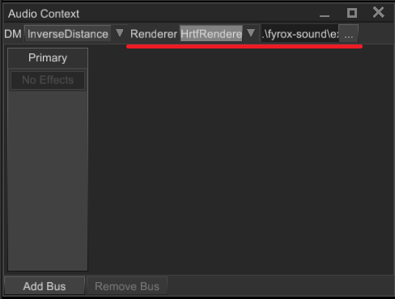

# Head Related Transfer Function 

Head Related Transfer Function (HRTF for short) is special audio processing technique that improves audio spatialization.
By default, sound spatialization is very simple - volume of each audio channel (left and right) changes accordingly to
orientation of the listener. While this simple and fast, it does not provide good audio spatialization - sometimes
it is hard to tell from which direction the actual sound is coming from. To solve this issue, we can use head-related
transfer function. Despite its scary, mathematical name, it is easy to understand what it's doing. Instead of uniformly
changing volume of all frequencies of the signal (as the naive spatialization does), it changes them separately for 
each channel. The exact "gains" of each frequency of each channel is depends on the contents of head-related transfer
function. This is done for each azimuth and elevation angles, which gives full picture of how audio signal from each
direction travels to each ear.

HRTF is usually recorded using a head model with ears with a microphone inside each ear. To capture head-related impulse
response (time domain) at a fixed distance and angle pair (azimuth and elevation), a very short impulse of sound is produced. 
Microphones inside each ear records the signal, and then HRIR (time domain) can be converted in HRTF (frequency domain).

## HRTF on practice

The theory above could be boring, however it is very simple to use HRTF on practice. Pick a HRIR sphere from the 
[database](https://github.com/mrDIMAS/hrir_sphere_builder/tree/master/hrtf_base/IRCAM) (any of *.bin files) and load
it in the Audio Context panel:



Once it is loaded, all sounds in the scene will use the HRTF for rendering. The same can be achieved by code:

```rust,no_run
# extern crate fyrox;
# use fyrox::scene::{
#     graph::Graph,
#     sound::{self, HrirSphere, HrtfRenderer, Renderer},
# };
# 
fn use_hrtf(graph: &mut Graph) {
    let hrir_sphere = HrirSphere::from_file("path/to/hrir.bin", sound::SAMPLE_RATE).unwrap();
    graph
        .sound_context
        .state()
        .set_renderer(Renderer::HrtfRenderer(HrtfRenderer::new(hrir_sphere)));
}
```

## Performance

HRTF is heavy. It is 5-6 times slower than the simple spatialization, so use it only on middle-end or high-end hardware.
HRTF performance is linearly dependent on the amount of sound sources: the more sound sources use HRTF, the worse performance
will be and vice versa.