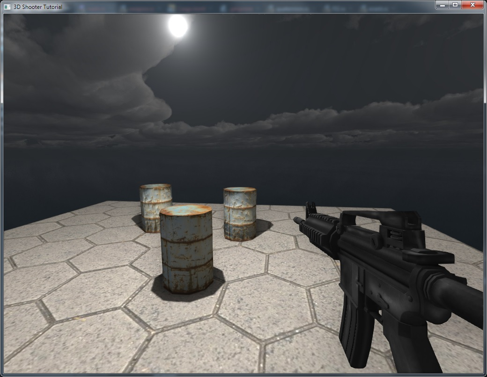
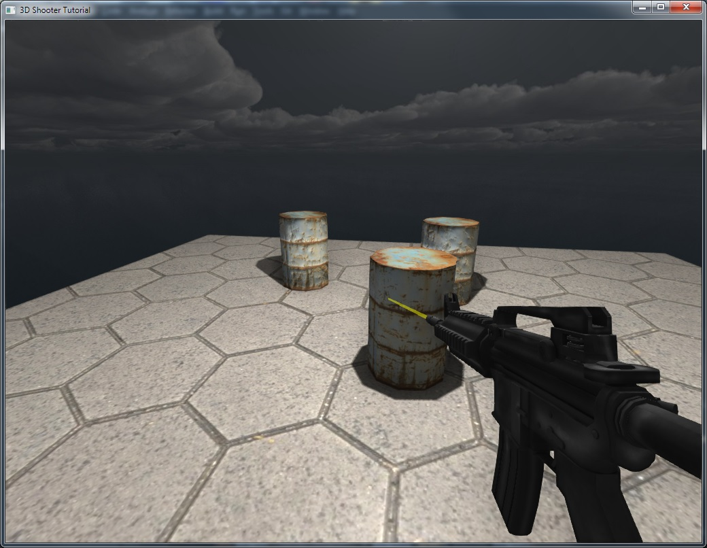
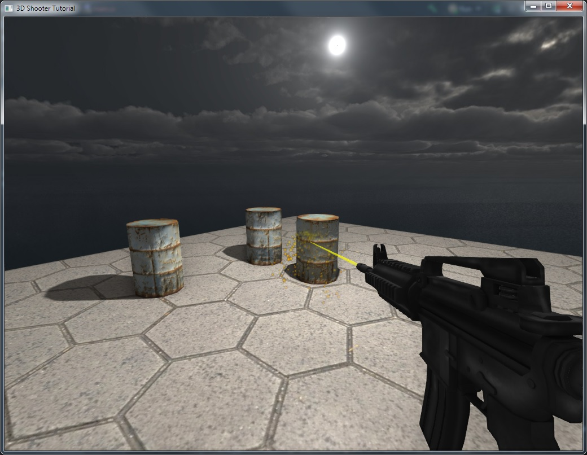

# FPS Tutorial Part 2 - Weapons

**WARNING: This tutorial is using obsolete engine features, which are subject to be removed in future versions!**

**Source code**: [GitHub](https://github.com/FyroxEngine/Fyrox-tutorials/tree/main/tutorial2-character-controller)

## Table of contents

- [Introduction](#introduction)
- [Adding weapons](#adding-weapons)
- [Game architecture](#game-architecture)
- [Recoil](#recoil)
- [Impact effects](#impact-effects)
- [Conclusion](#conclusion)

## Introduction

Of course for a shooter game we need weapons and targets to shoot at. In this tutorial we'll add weapons to the game.
For simplicity, we'll add only one weapon, as you'll see later it is pretty easy to add more weapons yourself. This 
is the result we're aiming in the tutorial:

<iframe width="560" height="315" src="https://www.youtube.com/embed/GmVAdBdnqeM" title="YouTube video player" frameborder="0" allow="accelerometer; autoplay; clipboard-write; encrypted-media; gyroscope; picture-in-picture" allowfullscreen></iframe>

## Adding weapons

Add a new module `weapon.rs` near your `main.rs` and use it somewhere after other imports:

```rust,no_run,compile_fail
pub mod weapon;
...
use weapon::Weapon;
```

Switch to `weapon.rs` and paste this code into it:

```rust,no_run,edition2018
# extern crate fyrox;
use fyrox::scene::graph::Graph;
use fyrox::{
    core::{algebra::Vector3, math::Vector3Ext, pool::Handle},
    engine::resource_manager::ResourceManager,
    scene::{node::Node, Scene},
};

pub struct Weapon {
    model: Handle<Node>,
    shot_point: Handle<Node>,
    shot_timer: f32,
}

impl Weapon {
    pub async fn new(scene: &mut Scene, resource_manager: ResourceManager) -> Self {
        // Yeah, you need only few lines of code to load a model of any complexity.
        let model = resource_manager
            .request_model("data/models/m4.fbx")
            .await
            .unwrap()
            .instantiate(scene);

        let shot_point = scene.graph.find_by_name(model, "Weapon:ShotPoint").unwrap().0;

        Self {
            model,
            shot_point,
            shot_timer: 0.0,
        }
    }

    pub fn model(&self) -> Handle<Node> {
        self.model
    }

    pub fn shot_point(&self) -> Handle<Node> {
        self.shot_point
    }

    pub fn update(&mut self, dt: f32) {
        self.shot_timer = (self.shot_timer - dt).min(0.0);
    }

    pub fn can_shoot(&self) -> bool {
        self.shot_timer <= 0.0
    }

    pub fn shoot(&mut self) {
        self.shot_timer = 1.0;
    }
}

```

This piece of code just loads a [weapon model](./m4.zip) and saves an instance handle for 
further use. Also, each weapon should contain a helper node that tells from where it will "emit" bullets, the node 
was added in a 3D editor and has name `Weapon:ShotPoint`. Weapon implementation has helper methods that provide read-only
access to inner fields (`model`, `shot_point`). `update` method just decreases the timer's value which is used to change
the pace of shooting. You may ask "why `shoot` method just modifies timer's value and does not create bullets, etc.?" -
please be patient, I will explain this later in [game architecture](#game-architecture) section of the tutorial.
OK, now we need to make a point where every weapon will be "mounted" on, go to `Player::new` and add these lines in 
the `BaseBuilder` of the `CameraBuilder` instance (you also need to import `PivotBuilder`):

```rust,no_run,compile_fail
.with_children(&[{
    weapon_pivot = PivotBuilder::new(
        BaseBuilder::new().with_local_transform(
            TransformBuilder::new()
                .with_local_position(Vector3::new(
                    -0.1, -0.05, 0.015,
                ))
                .build(),
        ),
    )
    .build(&mut scene.graph);
    weapon_pivot
}]),
```

What is going on here? We're just adding new child node to the camera and offset it by some vector. Every weapon will
be attached to this pivot. Please keep in mind that the offset given in **local** coordinates, which means that weapon
pivot will move with the camera, but with some offset relative to it. Also, do not forget to add this line after 
`let camera;`:

```rust,no_run,compile_fail
let weapon_pivot;
```

Finally, add the weapon pivot to `Self { ... }` (and also add `weapon_pivot: Handle<Node>` to the `Player` struct):

```rust,no_run,compile_fail
Self {
    camera,
    weapon_pivot, // <- here
    rigid_body: rigid_body_handle.into(),
    controller: Default::default(),
}
```

Next we need a container for weapons, let's add it to the `Game` struct:

```rust,no_run,compile_fail
struct Game {
    scene: Handle<Scene>,
    player: Player,
    weapons: Pool<Weapon> // Weapons will live in a pool
}
```

Also do not forget to import `Pool` from `fyrox::core::pool` in `main.rs`:

```rust,no_run,compile_fail
...
use fyrox::core::pool::{Handle, Pool};
...
```

Now we need to change `Game::new()` a bit to add a weapon to the player:

```rust,no_run,compile_fail
pub async fn new(engine: &mut Engine) -> Self {
    let mut scene = Scene::new();

    // Load a scene resource and create its instance.
    engine
        .resource_manager
        .request_model("data/models/scene.rgs")
        .await
        .unwrap()
        .instantiate(&mut scene);

    // Create player first.
    let player = Player::new(&mut scene, engine.resource_manager.clone()).await;

    // Create weapon next.
    let weapon = Weapon::new(&mut scene, engine.resource_manager.clone()).await;

    // "Attach" the weapon to the weapon pivot of the player.
    scene.graph.link_nodes(weapon.model(), player.weapon_pivot);

    // Create a container for the weapons.
    let mut weapons = Pool::new();

    // Put the weapon into it.
    weapons.spawn(weapon);

    Self {
        player,
        scene: engine.scenes.add(scene),
        weapons,
    }
}
```

At first, we're loading the scene, next we're creating player as usual. Next we're creating a weapon and attach it to 
the weapon pivot we've made earlier. Finally, we're creating a container for the weapons: we'll use Pool to be able 
to borrow weapon later on when we need. So, let's run the game, and you should see something like this:



Alright, now we have a weapon, but it still can't shoot. Let's fix that. 

### Game architecture

We at the point now where we need to choose correct approach of interaction between parts of the game. We already have
two kinds of entities: player and weapon. In naive approach to shoot a weapon, you'd pass a reference to a weapon in 
`Player::update()` and would call something like `weapon.shoot()`. Most likely that at some point you'll end up
in a situation when you need too much of a context in a single method. This is so-called strong coupling, this is
the thing that disappoints borrow checker too much, and it rejects your code because you're trying to borrow same things
multiple times. So we need a way to change strong coupling to loose coupling. To do that we'll use messages to delay 
execution of some actions that require too much of a context. In general, we'll replace direct function call with a 
message that will be put in a common queue and executed later on one by one at the top of call hierarchy (in 
`Game::update` in our case). Let's begin by adding a MPSC (Multiple Producer Single Consumer) queue to the `Game`:

```rust,no_run,compile_fail
struct Game {
    scene: Handle<Scene>,
    player: Player,
    weapons: Pool<Weapon>,
    receiver: Receiver<Message>, // Single receiver, it cannot be cloned.
    sender: Sender<Message>, // Sender can be cloned and used from various places.
}
```

Now we need a `Message` enumeration, add `message.rs` module, import it in `main.rs` (`pub mod message;`) and fill it
with the following code:

```rust,no_run,compile_fail
use crate::weapon::Weapon;
use fyrox::core::pool::Handle;

pub enum Message {
    ShootWeapon {
        weapons: Handle<Weapon>
    }
}
```

For now, we have only one message kind - `ShootWeapon` with a single parameter, a handle of a weapon to shoot. We need
a place to handle messages, `Game::update` seems to be the most suitable - it is on top of "call hierarchy" and has 
most wide context. Let's change `Game::update` to this code:

```rust,no_run,compile_fail
pub fn update(&mut self, engine: &mut Engine, dt: f32) {
    self.player.update(&mut engine.scenes[self.scene]); 

    // v New code v 
    //
    for weapon in self.weapons.iter_mut() {
        weapon.update(dt);
    }

    // We're using `try_recv` here because we don't want to wait until next message -
    // if the queue is empty just continue to next frame.
    while let Ok(message) = self.receiver.try_recv() {
        match message {
            Message::ShootWeapon { weapon } => {
                self.shoot_weapon(weapon, engine);
            }
        }
    }
}
```

So, these first three new lines updating every weapon in the game, for now update of a weapon just updates shooting timer.
As you can see we've added new parameter to the function `dt: f32`, this is the time span from last frame. Do not forget
to pass this parameter in `fn main()`: `game.update(&mut engine, TIMESTEP);`. Finally, at the end of the function we're
handling messages from the queue one by one. As you can see we're handling `ShootWeapon` message, but there is a 
mysterious line `self.shoot_weapon(weapon, engine)` which is not yet defined, let's fix that, add these lines to 
`impl Game`:

```rust,no_run,compile_fail
 fn shoot_weapon(&mut self, weapon: Handle<Weapon>, engine: &mut Engine) {
    let weapon = &mut self.weapons[weapon];

    if weapon.can_shoot() {
        weapon.shoot();

        let scene = &mut engine.scenes[self.scene];

        let weapon_model = &scene.graph[weapon.model()];

        // Make a ray that starts at the weapon's position in the world and look toward
        // "look" vector of the weapon.
        let ray = Ray::new(
            scene.graph[weapon.shot_point()].global_position(),
            weapon_model.look_vector().scale(1000.0),
        );

        let mut intersections = Vec::new();

        scene.graph.physics.cast_ray(
            RayCastOptions {
                ray_origin: Point3::from(ray.origin),
                max_len: ray.dir.norm(),
                groups: Default::default(),
                sort_results: true, // We need intersections to be sorted from closest to furthest.
                ray_direction: ray.dir,
            },
            &mut intersections,
        );

        // Ignore intersections with player's capsule.
        let trail_length = if let Some(intersection) = intersections
            .iter()
            .find(|i| i.collider != self.player.collider)
        {
            //
            // TODO: Add code to handle intersections with bots.
            //

            // For now just apply some force at the point of impact.
            let colliders_parent = scene.graph[intersection.collider].parent();
            let picked_rigid_body = scene.graph[colliders_parent].as_rigid_body_mut();
            picked_rigid_body.apply_force_at_point(
                ray.dir.normalize().scale(10.0),
                intersection.position.coords,
            );
            picked_rigid_body.wake_up();

            // Trail length will be the length of line between intersection point and ray origin.
            (intersection.position.coords - ray.origin).norm()
        } else {
            // Otherwise trail length will be just the ray length.
            ray.dir.norm()
        };

        create_shot_trail(&mut scene.graph, ray.origin, ray.dir, trail_length);
    }
}
```

Wow! Why is there so much code to shoot a weapon!? Actually, this is not all the code - check the last line

```rust,no_run,compile_fail
create_shot_trail(&mut scene.graph, ray.origin, ray.dir, trail_length);
```

This is yet another function we must add, it is a standalone helper function that creates a shot trail:

```rust,no_run
# extern crate fyrox;
# use fyrox::{
#     core::{
#         algebra::{UnitQuaternion, Vector3},
#         color::Color,
#         parking_lot::Mutex,
#         sstorage::ImmutableString,
#     },
#     material::{Material, PropertyValue, SharedMaterial},
#     scene::{
#         base::BaseBuilder,
#         graph::Graph,
#         mesh::{
#             surface::{SurfaceBuilder, SurfaceData, SurfaceSharedData},
#             MeshBuilder, RenderPath,
#         },
#         transform::TransformBuilder,
#     },
# };
use std::sync::Arc;
fn create_shot_trail(
    graph: &mut Graph,
    origin: Vector3<f32>,
    direction: Vector3<f32>,
    trail_length: f32,
) {
    let transform = TransformBuilder::new()
        .with_local_position(origin)
        // Scale the trail in XZ plane to make it thin, and apply `trail_length` scale on Y axis
        // to stretch is out.
        .with_local_scale(Vector3::new(0.0025, 0.0025, trail_length))
        // Rotate the trail along given `direction`
        .with_local_rotation(UnitQuaternion::face_towards(&direction, &Vector3::y()))
        .build();

    // Create unit cylinder with caps that faces toward Z axis.
    let shape = SurfaceSharedData::new(SurfaceData::make_cylinder(
        6,     // Count of sides
        1.0,   // Radius
        1.0,   // Height
        false, // No caps are needed.
        // Rotate vertical cylinder around X axis to make it face towards Z axis
        &UnitQuaternion::from_axis_angle(&Vector3::x_axis(), 90.0f32.to_radians()).to_homogeneous(),
    ));

    // Create an instance of standard material for the shot trail.
    let mut material = Material::standard();
    material
        .set_property(
            &ImmutableString::new("diffuseColor"),
            // Set yellow-ish color.
            PropertyValue::Color(Color::from_rgba(255, 255, 0, 120)),
        )
        .unwrap();

    MeshBuilder::new(
        BaseBuilder::new()
            // Do not cast shadows.
            .with_cast_shadows(false)
            .with_local_transform(transform)
            // Shot trail should live ~0.25 seconds, after that it will be automatically
            // destroyed.
            .with_lifetime(0.25),
    )
    .with_surfaces(vec![SurfaceBuilder::new(shape)
        .with_material(SharedMaterial::new(material))
        .build()])
    // Make sure to set Forward render path, otherwise the object won't be
    // transparent.
    .with_render_path(RenderPath::Forward)
    .build(graph);
}
```

Okay... Let's disassemble this heap of code line by line. At first, we're borrowing the weapon by its handle and 
check if it can shoot (if the timer has reached zero), and "shoot" (reset the timer) if so:

```rust,no_run,compile_fail
 let weapon = &mut self.weapons[weapon];

    if weapon.can_shoot() {
        weapon.shoot();
    ...
```

Next we're using ray casting to find the target we're shooting at:

```rust,no_run,compile_fail
// ...

let scene = &mut engine.scenes[self.scene];

let weapon_model = &scene.graph[weapon.model()];

// Make a ray that starts at the weapon's position in the world and look toward
// "look" vector of the weapon.
let ray = Ray::new(
    scene.graph[weapon.shot_point()].global_position(),
    weapon_model.look_vector().scale(1000.0),
);

let mut intersections = Vec::new();

scene.graph.physics.cast_ray(
    RayCastOptions {
        ray_origin: Point3::from(ray.origin),
        max_len: ray.dir.norm(),
        groups: Default::default(),
        sort_results: true, // We need intersections to be sorted from closest to furthest.
        ray_direction: ray.dir,
    },
    &mut intersections,
);

...
```

To determine the "target", we're have to make a ray first. It starts from the "shot point" we've attached to the weapon.
Direction of the ray is the "look" vector of the weapon model scaled by some large value which defines a "length" of the
ray. Finally, we're casting the ray. Next we have to check each intersection and find the target:

```rust,no_run,compile_fail
// Ignore intersections with player's capsule.
let trail_length = if let Some(intersection) = intersections
    .iter()
    .find(|i| i.collider != self.player.collider)
{
    //
    // TODO: Add code to handle intersections with bots.
    //

    // For now just apply some force at the point of impact.
    let colliders_parent = scene.graph[intersection.collider].parent();
    let picked_rigid_body = scene.graph[colliders_parent].as_rigid_body_mut();
    picked_rigid_body.apply_force_at_point(
        ray.dir.normalize().scale(10.0),
        intersection.position.coords,
    );
    picked_rigid_body.wake_up();

    // Trail length will be the length of line between intersection point and ray origin.
    (intersection.position.coords - ray.origin).norm()
} else {
    // Otherwise trail length will be just the ray length.
    ray.dir.norm()
};
```

First intersection most likely will be player's capsule, because shot point may be inside player's capsule. We're 
filtering such intersection in the first three lines. To do that, we have to remember the handle of player's capsule
in `Player`: `collider: Handle<Node>` and fill the field in `Player::new` like this:

```rust,no_run,compile_fail
let collider;
...
// Add capsule collider for the rigid body.
{
    collider = ColliderBuilder::new(BaseBuilder::new())
        .with_shape(ColliderShape::capsule_y(0.25, 0.2))
        .build(&mut scene.graph);
    collider
}

...

Self {
    ...
    collider, // <-
    ...
}

```

Next goes `TODO` comment, remember this line, it will be replaced when we'll add bots in future tutorial.
Until we have no bots, we should somehow emulate shot impact, to do that we'll just apply some force at the point of
impact. Finally, we're calculating desired shot trail length - it is just distance between point of impact and ray's 
origin. In the `else` branch we're setting the length to be the length of the ray. Finally, we're creating a shot trail: 

```rust,no_run,compile_fail
create_shot_trail(&mut scene.graph, ray.origin, ray.dir, trail_length);
```

Now let's dive into this function. It starts from the definition of local transform of the trail:

```rust,no_run,compile_fail
let transform = TransformBuilder::new()
    .with_local_position(origin)
    // Scale the trail in XZ plane to make it thin, and apply `trail_length` scale on Y axis
    // to stretch is out.
    .with_local_scale(Vector3::new(0.0025, 0.0025, trail_length))
    // Rotate the trail along given `direction`
    .with_local_rotation(UnitQuaternion::face_towards(&direction, &Vector3::y()))
    .build();
```

Its purpose is to shrink cylinder in XZ plane and stretch it out on Y axis to the length of the trail. Next we're making
geometry for the cylinder:

```rust,no_run,compile_fail
let shape = SurfaceSharedData::new(SurfaceData::make_cylinder(
    6,     // Count of sides
    1.0,   // Radius
    1.0,   // Height
    false, // No caps are needed.
    // Rotate vertical cylinder around X axis to make it face towards Z axis
    &UnitQuaternion::from_axis_angle(&Vector3::x_axis(), 90.0f32.to_radians()).to_homogeneous(),
));
```

Here we're creating unit vertical cylinder, rotate it to make it face towards Z axis. Finally, we're creating mesh node:

```rust,no_run,compile_fail
// Create an instance of standard material for the shot trail.
let mut material = Material::standard();
material
    .set_property(
        &ImmutableString::new("diffuseColor"),
        // Set yellow-ish color.
        PropertyValue::Color(Color::from_rgba(255, 255, 0, 120)),
    )
    .unwrap();

MeshBuilder::new(
    BaseBuilder::new()
        .with_local_transform(transform)
        // Shot trail should live ~0.25 seconds, after that it will be automatically
        // destroyed.
        .with_lifetime(0.25),
)
.with_surfaces(vec![SurfaceBuilder::new(shape)
    .with_material(SharedMaterial::new(material))
    .build()])
// Do not cast shadows.
.with_cast_shadows(false)
// Make sure to set Forward render path, otherwise the object won't be
// transparent.
.with_render_path(RenderPath::Forward)
.build(graph);
```

The trail will live just 0.25 seconds, Fyrox has built-in functionality for short-living objects, you have to just set 
desired lifetime, and an object will be removed at the time. Also, we don't want the trail to cast shadows, and we want 
the trail to be transparent yellow, to do that we have to change render path of the mesh to `Forward`. In short, every
mesh by default rendered using `Deferred` renderer which does not support transparent objects due to technical reasons,
but Fyrox has `Forward` renderer for such objects. Check this [article](https://www.3dgep.com/forward-plus/) to learn more 
about Deferred and Forward rendering techniques. Ok, now we have to "teach" player how to shoot. At first, let's add new 
field to `InputController`: `shoot: bool`. We'll be changing this flag by left mouse click, to do that let's add these lines
at the end of `Event::WindowEvent` match arm before `_ => {}` in `Player::process_input_event`:

```rust,no_run,compile_fail
&WindowEvent::MouseInput { button, state, .. } => {
    if button == MouseButton::Left {
        self.controller.shoot = state == ElementState::Pressed;
    }
}
```

Now we need a way to send messages to the game from the player. We need a new field in `Player` struct 
`sender: Sender<Message>`. Also, we must change signature of `Player::new()` to this:

```rust,no_run,compile_fail
async fn new(
    scene: &mut Scene,
    resource_manager: ResourceManager,
    sender: Sender<Message>,
) -> Self 
```

Just pass the `sender` in the `Self { .. }` like this: 

```rust,no_run,compile_fail
Self {
    ...
    sender, // <- Pass sender 
    ...
}
```

Player must know about its weapons, let's fix this by adding new field to the `Player`: `weapon: Handle<Weapon>`, we'll
fill this field in the `Game::new()`, not in `Player::new()` because at the moment of creation of the player there are
no weapons:

```rust,no_run,compile_fail
...

// Put the weapon into it - this operation moves the weapon in the pool and returns handle.
let weapon = weapons.spawn(weapon);

// "Give" the weapon to the player.
player.weapon = weapon;

...
```

Finally, at the end of `Player::update` we will handle the state of the input controller:

```rust,no_run,compile_fail
if self.controller.shoot {
    self.sender
        .send(Message::ShootWeapon {
            weapon: self.weapon,
        })
        .unwrap();
}
```

Ok, at this momemt you should be able to compile the game and as you run it, you should see something like this when
you'll press left mouse button:



Barrels should react to shots as in the video at the beginning of the tutorial. 

## Recoil

Ok, the weapon shoots but looks kinda unnatural, to fix that we need to add a recoil. This is very simple to do, let's 
start by adding these fields in the `Weapon` struct:

```rust,no_run,compile_fail
recoil_offset: Vector3<f32>,
recoil_target_offset: Vector3<f32>,
```

Initialize these fields with default values (zero vector):

```rust,no_run,compile_fail
recoil_offset: Default::default(),
recoil_target_offset: Default::default(),
```

First vector is the actual recoil offset that will be applied to the weapon model, second - target recoil value which
first vector will follow. Why do we need two vectors instead just one? The answer is very simple, we need to smoothly
change offset over time, and to do that offset will just "follow" target offset which will give us desired smooth 
movement. Let's add the code responsible for the recoil to the `Weapon::update`:

```rust,no_run,compile_fail
// Notice new `graph` parameter
pub fn update(&mut self, dt: f32, graph: &mut Graph) {  
    self.shot_timer = (self.shot_timer - dt).max(0.0);
    
    // v New code v
        
    // `follow` method defined in Vector3Ext trait and it just increases or
    // decreases vector's value in order to "follow" the target value with 
    // given speed.
    self.recoil_offset.follow(&self.recoil_target_offset, 0.5);

    // Apply offset to weapon's model.
    graph[self.model]
        .local_transform_mut()
        .set_position(self.recoil_offset);

    // Check if we've reached target recoil offset.
    if self
        .recoil_offset
        .metric_distance(&self.recoil_target_offset)
        < 0.001
    {
        // And if so, reset offset to zero to return weapon at
        // its default position.
        self.recoil_target_offset = Default::default();
    }
}
```

At first, in the first line we force the `recoil_offset` to follow `recoil_target_offset` with given speed. Next we're 
applying offset to weapon's model. Finally, we're checking if we've reached target offset and if so, just reset target
offset to return a weapon to its default position. Also we have to slightly modify `Weapon::shoot` to modify target
offset:

```rust,no_run,compile_fail
pub fn shoot(&mut self) {
    self.shot_timer = 0.1;

    // Set new offset after each shot.
    self.recoil_target_offset = Vector3::new(0.0, 0.0, -0.025); 
}
```

The last thing we need to do is to slightly modify code at the `Game::update` to pass new parameter to `Weapon::update`:

```rust,no_run,compile_fail
 pub fn update(&mut self, engine: &mut GameEngine, dt: f32) {
    let scene = &mut engine.scenes[self.scene];

    self.player.update(scene);

    for weapon in self.weapons.iter_mut() {
        weapon.update(dt, &mut scene.graph);
    }
        
    ...
```

Ok, run the game, and the weapon should feel more natural now. 

## Impact effects

Shooting have become much better after we've added a recoil, but there is still no impact effects like sparks. Let's fix
that! This is the first time when we'll use particle systems. Let's add this function somewhere in `main.rs`

```rust,no_run
# extern crate fyrox;
# use fyrox::{
#     core::{
#         algebra::{UnitQuaternion, Vector3},
#         color::Color,
#         color_gradient::{ColorGradient, GradientPoint},
#         pool::Handle,
#     },
#     engine::resource_manager::ResourceManager,
#     scene::{
#         base::BaseBuilder,
#         graph::Graph,
#         node::Node,
#         particle_system::{
#             emitter::{base::BaseEmitterBuilder, sphere::SphereEmitterBuilder},
#             ParticleSystemBuilder,
#         },
#         transform::TransformBuilder,
#     },
# };
# use std::path::Path;
fn create_bullet_impact(
    graph: &mut Graph,
    resource_manager: ResourceManager,
    pos: Vector3<f32>,
    orientation: UnitQuaternion<f32>,
) -> Handle<Node> {
    // Create sphere emitter first.
    let emitter = SphereEmitterBuilder::new(
        BaseEmitterBuilder::new()
            .with_max_particles(200)
            .with_spawn_rate(3000)
            .with_size_modifier_range(-0.01..-0.0125)
            .with_size_range(0.0075..0.015)
            .with_lifetime_range(0.05..0.2)
            .with_x_velocity_range(-0.0075..0.0075)
            .with_y_velocity_range(-0.0075..0.0075)
            .with_z_velocity_range(0.025..0.045)
            .resurrect_particles(false),
    )
    .with_radius(0.01)
    .build();

    // Color gradient will be used to modify color of each particle over its lifetime.
    let color_gradient = {
        let mut gradient = ColorGradient::new();
        gradient.add_point(GradientPoint::new(0.00, Color::from_rgba(255, 255, 0, 0)));
        gradient.add_point(GradientPoint::new(0.05, Color::from_rgba(255, 160, 0, 255)));
        gradient.add_point(GradientPoint::new(0.95, Color::from_rgba(255, 120, 0, 255)));
        gradient.add_point(GradientPoint::new(1.00, Color::from_rgba(255, 60, 0, 0)));
        gradient
    };

    // Create new transform to orient and position particle system.
    let transform = TransformBuilder::new()
        .with_local_position(pos)
        .with_local_rotation(orientation)
        .build();

    // Finally create particle system with limited lifetime.
    ParticleSystemBuilder::new(
        BaseBuilder::new()
            .with_lifetime(1.0)
            .with_local_transform(transform),
    )
    .with_acceleration(Vector3::new(0.0, 0.0, 0.0))
    .with_color_over_lifetime_gradient(color_gradient)
    .with_emitters(vec![emitter])
    // We'll use simple spark texture for each particle.
    .with_texture(resource_manager.request_texture(Path::new("data/textures/spark.png")))
    .build(graph)
}
```

Ok, again a heap of code... As usual, everything here is pretty straightforward. At first, we're creating spherical
emitter - it is a spherical volume that responsible for spawning particles. It has a radius, and a bunch of basic properties
such as spawn rate, maximum amount of particles, initial velocity range, etc. Next we're creating color gradient to make
particles fade over their lifetime. Next, we're creating simple transform that will orient and position particle system 
in world space. Finally, we're creating particle system itself, using pre-made parts. For each particle we'll use simple
[spark texture](./spark.png), it should be placed in `data/textures`. Now we need to find
correct place to create this particle system. It should be placed right after we're applying force to target we've hit 
in `Game::shoot_weapon`:

```rust,no_run,compile_fail
// Add bullet impact effect.
let effect_orientation = vector_to_quat(intersection.normal);

create_bullet_impact(
    &mut scene.graph,
    engine.resource_manager.clone(),
    intersection.position.coords,
    effect_orientation,
);
```

Ok, now run the game, and you should see something like this:



One more thing that could be added is bullet shells that should come from a weapon when we're shooting, but I think the
tutorial is already pretty big already, and I'll leave this as a "homework", but I'll just give some hints of how to do 
this. Make or download a shell model in FBX format, then write a function that will load it via resource manager, 
instantiate it and create a physical body for it (with cylinder collider for example), link a model with a body and call 
this function when shooting a weapon.

## Conclusion

In this tutorial we added weapon to the game, added recoil to make shooting more natural, and added impact effects. I 
hope you liked this tutorial, and if so, please consider supporting the project on
[Patreon](https://patreon.com/mrdimas) or [LiberaPay](https://liberapay.com/mrDIMAS). Source code is available on
[GitHub](https://github.com/FyroxEngine/Fyrox-tutorials). In the next tutorial we'll add sounds to the game and something
special (let it be a surprise).

Discussion: [Reddit](https://www.reddit.com/r/rust/comments/m2055c/writing_a_3d_shooter_using_rg3d_2_adding_shooting/),
[Discord](https://discord.gg/xENF5Uh).