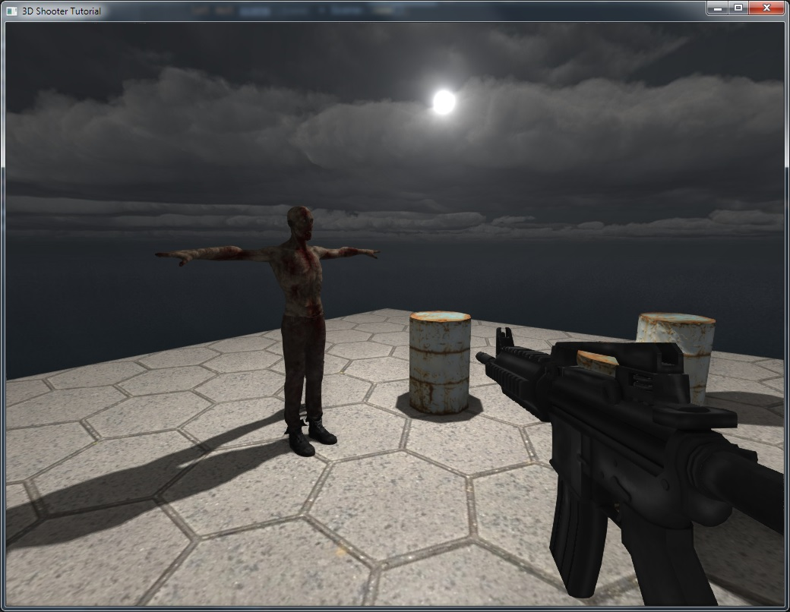
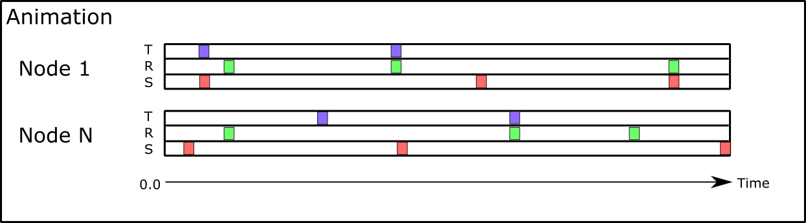
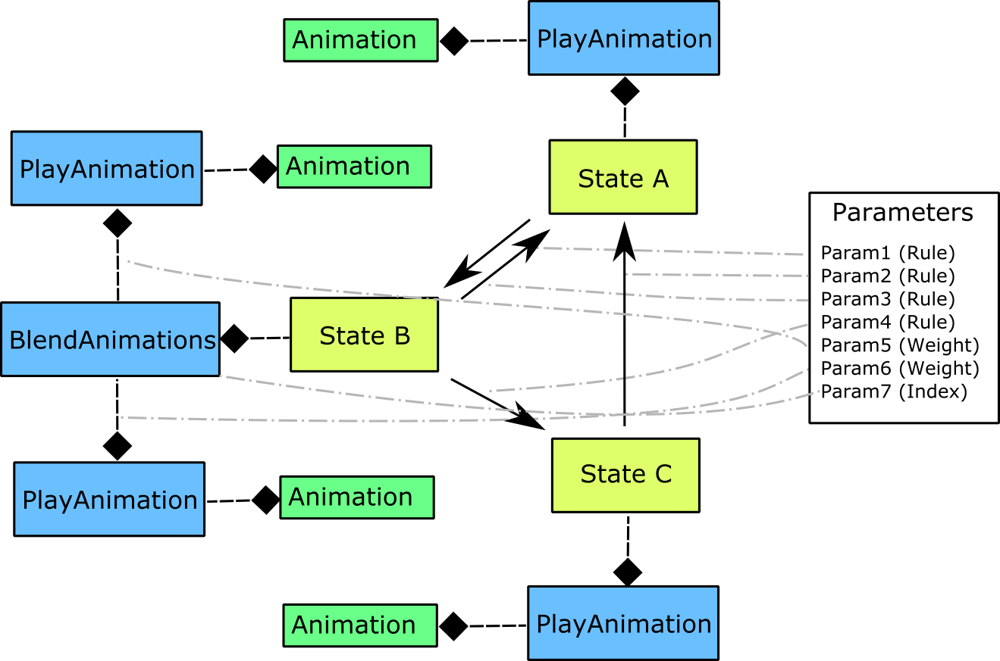
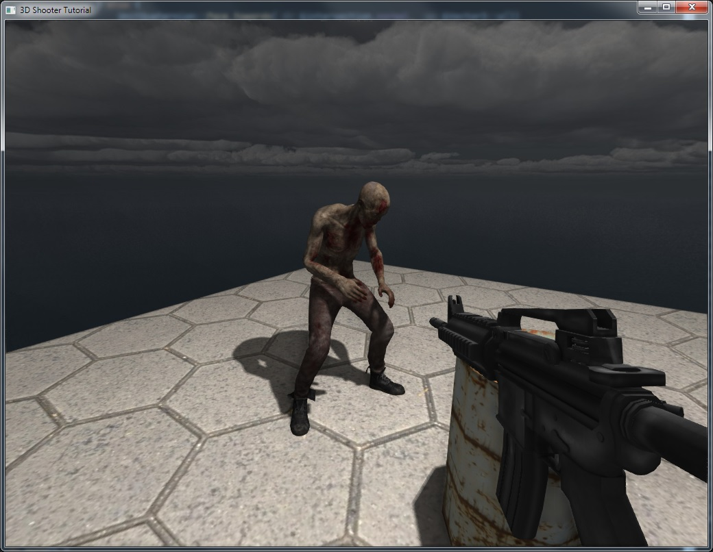
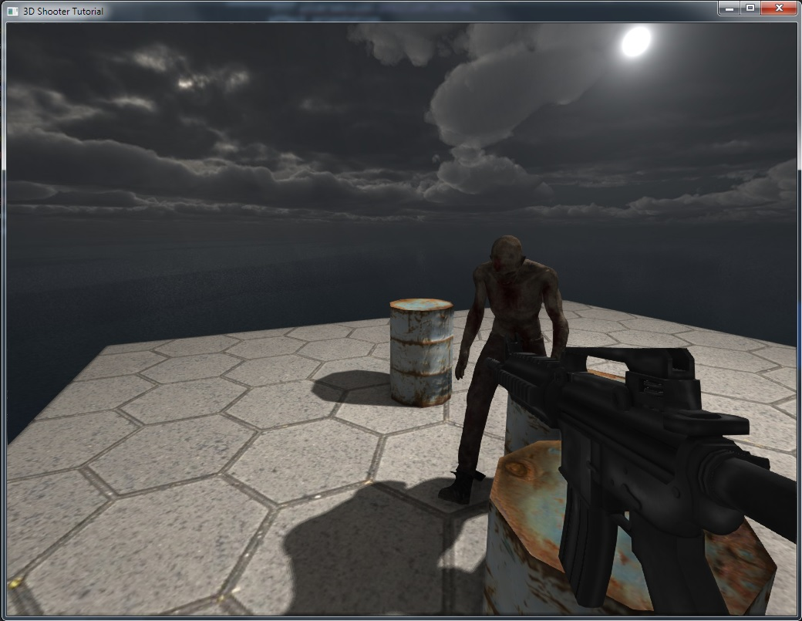

# FPS Tutorial Part 1 - Bots and AI

**WARNING: This tutorial is using obsolete engine features, which are subject to be removed in future versions!**

**Source code**: [GitHub](https://github.com/FyroxEngine/Fyrox-tutorials/tree/main/tutorial3-character-controller)

## Table of contents

- [Introduction](#introduction)
- [Bots](#bots)
- [Animations](#animations)
- [Simple AI](#simple-ai)
- [Conclusion](#conclusion)

## Introduction

In the previous tutorial we've added weapons, but we still have no bots to shoot at. Let's fix that! In this tutorial
we'll add bots and a very simple AI. Bots will be a bit dumb, but it will be fixed in future tutorials. This is the
result we're aiming in the tutorial:

<iframe width="560" height="315" src="https://www.youtube.com/embed/dtudhbRBIq0" title="YouTube video player" frameborder="0" allow="accelerometer; autoplay; clipboard-write; encrypted-media; gyroscope; picture-in-picture" allowfullscreen></iframe>

## Bots

Previous tutorials were children's play in comparison to this, prepare for some advanced stuff. Let's begin by adding
a separate module for bots - add `bot.rs` and fill it with following code:

```rust,no_run,compile_fail
use fyrox::engine::resource_manager::MaterialSearchOptions;
use fyrox::{
    animation::{
        machine::{Machine, Parameter, PoseNode, State, Transition},
        Animation,
    },
    core::{
        algebra::{UnitQuaternion, Vector3},
        pool::Handle,
    },
    asset::manager::ResourceManager,
    physics3d::{
        rapier::dynamics::RigidBodyBuilder, rapier::geometry::ColliderBuilder, ColliderHandle,
        RigidBodyHandle,
    },
    resource::model::Model,
    scene::{base::BaseBuilder, node::Node, Scene},
};

pub struct Bot {
    rigid_body: Handle<Node>,
    collider: Handle<Node>,
}

impl Bot {
    pub async fn new(
        scene: &mut Scene,
        position: Vector3<f32>,
        resource_manager: ResourceManager,
    ) -> Self {
        // Load bot 3D model as usual.
        let model = resource_manager
            .request::<Model, _>("data/models/zombie.fbx")
            .await
            .unwrap()
            .instantiate(scene);

        scene.graph[model]
            .local_transform_mut()
            // Move the model a bit down to make sure bot's feet will be on ground.
            .set_position(Vector3::new(0.0, -0.45, 0.0))
            // Scale the model because it is too big.
            .set_scale(Vector3::new(0.0047, 0.0047, 0.0047));

        let collider;
        let rigid_body = RigidBodyBuilder::new(
            BaseBuilder::new()
                .with_local_transform(
                    TransformBuilder::new()
                        .with_local_position(Vector3::new(position.x, position.y, position.z))
                        .build(),
                )
                .with_children(&[
                    // Attach model to the rigid body.
                    model,
                    // Add capsule collider for the rigid body.
                    {
                        collider = ColliderBuilder::new(BaseBuilder::new())
                            .with_shape(ColliderShape::capsule_y(0.25, 0.2))
                            .build(&mut scene.graph);
                        collider
                    },
                ]),
        )
        // We don't want a bot to tilt.
        .with_locked_rotations(true)
        .with_can_sleep(false)
        .build(&mut scene.graph);

        Self {
            rigid_body,
            collider,
        }
    }
}
```

Ok, before we dive into the code, we need to add some more code in `main.rs`, let's begin by adding a container for
bots in `Game`: `bots: Pool<Bot>,`. Next we need to add some more code to `Game::new` where we'll add a bot instance in
the game. Also, you can add more than one bot at different positions if you want. Do not forget to download bot model
with textures from [here](./zombie.zip) and unpack `fbx` file in `data/models` and other files
(textures), in `data/textures`.

```rust,no_run,compile_fail
// Add some bots.
let mut bots = Pool::new();

bots.spawn(
    Bot::new(
        &mut scene,
        Vector3::new(-1.0, 1.0, -1.0),
        engine.resource_manager.clone(),
    )
    .await,
);

...

Self {
    ...
    bots
}
```

As usual, let's disassemble the code line-by-line. Creation of bot begins from loading its 3D model in the scene:

```rust,no_run,compile_fail
let model = resource_manager
    .request::<Model, _>("data/models/zombie.fbx")
    .await
    .unwrap()
    .instantiate(scene);
```

Nothing really new here, loading and instantiation of a 3D model of _any_ complexity is the same as before. Next we have
to slightly modify the model, shift it a bit down and shrink:

```rust,no_run,compile_fail
scene.graph[model]
    .local_transform_mut()
    // Move the model a bit down to make sure bot's feet will be on ground.
    .set_position(Vector3::new(0.0, -0.45, 0.0))
    // Scale the model because it is too big.
    .set_scale(Vector3::new(0.0047, 0.0047, 0.0047));
```

Here we're borrow model in the scene graph, and modify its local transform. Next we're creating rigid body with a capsule
collider, and attaching the model to the rigid body:

```rust,no_run,compile_fail
let collider;
let rigid_body = RigidBodyBuilder::new(
    BaseBuilder::new()
        .with_local_transform(
            TransformBuilder::new()
                .with_local_position(Vector3::new(position.x, position.y, position.z))
                .build(),
        )
        .with_children(&[
            // Attach model to the rigid body.
            model,
            // Add capsule collider for the rigid body.
            {
                collider = ColliderBuilder::new(BaseBuilder::new())
                    .with_shape(ColliderShape::capsule_y(0.25, 0.2))
                    .build(&mut scene.graph);
                collider
            },
        ]),
)
// We don't want a bot to tilt.
.with_locked_rotations(true)
.with_can_sleep(false)
.build(&mut scene.graph);
```

Finally, we're returning bot's instance:

```rust,no_run,compile_fail
Self {
    pivot,
    rigid_body,
    collider,
}
```

Ok, now for the bots instantiation, for simplicity we create a single bot in `Game::new`:

```rust,no_run,compile_fail
let mut bots = Pool::new();

bots.spawn(
    Bot::new(
        &mut scene,
        Vector3::new(-1.0, 1.0, 1.5),
        engine.resource_manager.clone(),
    )
    .await,
);
```

As you can see, we'll store bots in a pool as many other game entities, this will allow us to borrow bots later on when 
we'll be adding AI. Ok, now run the game, and you should see something like this:



Wow... a T-posing bot... Is this some kind of Cyberpunk 2077 reference? This is boring, let's add some animations to 
make it more "alive".

### Animations

Let's start from definition of animation. Animation is a set of tracks, where each track responsible for animation
of a single node and contains key frames placed on a timeline with some transition rules between key frames. Animation
usually changes just position/rotation/scale of a node. When animation is playing it calculates intermediate values for
each parameter using interpolation techniques (linear and spherical interpolation). Animations in general is very simple
and powerful technique, but at many times it still does not enough. If you will just switch multiple animations from one
to one, it will look very bad and unnatural. This is where animation blending machines come into play.



Fyrox provides very powerful mechanism for animations - animation blending machines. If you're already familiar with 
Mecanim in Unity game engine or similar thing in Unreal Engine, then you'll probably already understood what will be
in this paragraph. Animation blending machine (ABM) is a state machine that allows you to blend multiple animations
in one and apply it to a set of bones (or nodes in general). ABM is a graph where each node is a state, each state
has a source of animation pose which in its turn may be another subgraph of pose emitting nodes. States connected 
between each other using transition edges which have some parameters like transition time, a rule for transition, etc.
At each moment of time either state or transition can be active. In other words this means that ABM is either
transitioning from a state to state or hold a state. This leads to another fact - ABM cannot jump from a state to state
if they're not connected with transition edge. ABMs in general can be represented like this:



States are marked yellow, animation nodes - blue, animations - green. As you can see there can be multiple transitions
between states, each transition has corresponding `Rule` parameter which is a simple boolean value which tells a machine
when it is possible to start transition. Each state is supplied with animation node (`PlayAnimation`, `BlendAnimations`,
`BlendAnimationsByIndex`, etc.) which does exactly what the name states. `PlayAnimation` just plays given animation, 
`BlendAnimations` - blends multiple animations with different weights into one, BlendAnimationsByIndex - blends multiple
animations as the BlendAnimations, but each animation has transition time, and the node uses an index parameter to switch
between attached animations. Please keep in mind that `BlendAnimations` node can have various sources of pose, as you can 
see in the picture, it uses two `PlayAnimation` nodes as source of poses, but nothing keeps you from adding new pose source
which will be yet another `BlendAnimations`. So everything depends on your needs and ABM just gives you enough flexibility.

Ok, back to the game. Let's create a simple ABM for bots. For simplicity, it will contain only three states - Idle, Walk,
Attack. Put this code somewhere at the end of `bot.rs`:

```rust,no_run,compile_fail
// Simple helper method to create a state supplied with PlayAnimation node.
fn create_play_animation_state(
    animation_resource: Model,
    name: &str,
    layer: &mut MachineLayer,
    scene: &mut Scene,
    model: Handle<Node>,
) -> (Handle<Animation>, Handle<State>) {
    // Animations retargetting just makes an instance of animation and binds it to
    // given model using names of bones.
    let animation = *animation_resource
        .retarget_animations(model, &mut scene.graph)
        .get(0)
        .unwrap();
    // Create new PlayAnimation node and add it to machine.
    let node = layer.add_node(PoseNode::make_play_animation(animation));
    // Make a state using the node we've made.
    let state = layer.add_state(State::new(name, node));
    (animation, state)
}

pub struct BotAnimationMachineInput {
    // Whether a bot is walking or not.
    pub walk: bool,
    // Whether a bot is attacking or not.
    pub attack: bool,
}

pub struct BotAnimationMachine {
    animation_player: Handle<Node>,
    machine: Machine,
}

impl BotAnimationMachine {
    // Names of parameters that will be used for transition rules in machine.
    const IDLE_TO_WALK: &'static str = "IdleToWalk";
    const WALK_TO_IDLE: &'static str = "WalkToIdle";
    const WALK_TO_ATTACK: &'static str = "WalkToAttack";
    const IDLE_TO_ATTACK: &'static str = "IdleToAttack";
    const ATTACK_TO_IDLE: &'static str = "AttackToIdle";
    const ATTACK_TO_WALK: &'static str = "AttackToWalk";

    pub async fn new(
        scene: &mut Scene,
        model: Handle<Node>,
        resource_manager: ResourceManager,
    ) -> Self {
        let animation_player =
            AnimationPlayerBuilder::new(BaseBuilder::new()).build(&mut scene.graph);
        scene.graph.link_nodes(animation_player, model);

        let mut machine = Machine::new();

        let root = machine.layers_mut().first_mut().unwrap();

        // Load animations in parallel.
        let (walk_animation_resource, idle_animation_resource, attack_animation_resource) = fyrox::core::futures::join!(
            resource_manager.request::<Model, _>("data/animations/zombie_walk.fbx"),
            resource_manager.request::<Model, _>("data/animations/zombie_idle.fbx"),
            resource_manager.request::<Model, _>("data/animations/zombie_attack.fbx"),
        );

        // Now create three states with different animations.
        let (_, idle_state) = create_play_animation_state(
            idle_animation_resource.unwrap(),
            "Idle",
            root,
            scene,
            model,
        );

        let (walk_animation, walk_state) = create_play_animation_state(
            walk_animation_resource.unwrap(),
            "Walk",
            root,
            scene,
            model,
        );

        let (attack_animation, attack_state) = create_play_animation_state(
            attack_animation_resource.unwrap(),
            "Attack",
            root,
            scene,
            model,
        );

        // Next, define transitions between states.
        root.add_transition(Transition::new(
            // A name for debugging.
            "Idle->Walk",
            // Source state.
            idle_state,
            // Target state.
            walk_state,
            // Transition time in seconds.
            0.4,
            // A name of transition rule parameter.
            Self::IDLE_TO_WALK,
        ));
        root.add_transition(Transition::new(
            "Walk->Idle",
            walk_state,
            idle_state,
            0.4,
            Self::WALK_TO_IDLE,
        ));
        root.add_transition(Transition::new(
            "Walk->Attack",
            walk_state,
            attack_state,
            0.4,
            Self::WALK_TO_ATTACK,
        ));
        root.add_transition(Transition::new(
            "Idle->Attack",
            idle_state,
            attack_state,
            0.4,
            Self::IDLE_TO_ATTACK,
        ));
        root.add_transition(Transition::new(
            "Attack->Idle",
            attack_state,
            idle_state,
            0.4,
            Self::ATTACK_TO_IDLE,
        ));
        root.add_transition(Transition::new(
            "Attack->Walk",
            attack_state,
            walk_state,
            0.4,
            Self::ATTACK_TO_WALK,
        ));

        // Define entry state.
        root.set_entry_state(idle_state);

        Self {
            animation_player,
            machine,
        }
    }

    pub fn update(&mut self, scene: &mut Scene, dt: f32, input: BotAnimationMachineInput) {
        let animation_player = scene.graph[self.animation_player]
            .query_component_ref::<AnimationPlayer>()
            .unwrap();

        self.machine
            // Set transition parameters.
            .set_parameter(Self::WALK_TO_IDLE, Parameter::Rule(!input.walk))
            .set_parameter(Self::IDLE_TO_WALK, Parameter::Rule(input.walk))
            .set_parameter(Self::WALK_TO_ATTACK, Parameter::Rule(input.attack))
            .set_parameter(Self::IDLE_TO_ATTACK, Parameter::Rule(input.attack))
            .set_parameter(Self::ATTACK_TO_IDLE, Parameter::Rule(!input.attack))
            .set_parameter(Self::ATTACK_TO_WALK, Parameter::Rule(!input.attack))
            // Update machine and evaluate final pose.
            .evaluate_pose(animation_player.animations(), dt)
            // Apply the pose to the graph.
            .apply(&mut scene.graph);
    }
}
```

Ok, this might be the biggest heap of code we've ever been dealing with at once. There is lots of stuff happening, 
let's thoroughly "scan" this code. It starts from the simple helper method to create states:

```rust,no_run,compile_fail
// Simple helper method to create a state supplied with PlayAnimation node.
fn create_play_animation_state(
    animation_resource: Model,
    name: &str,
    layer: &mut MachineLayer,
    scene: &mut Scene,
    model: Handle<Node>,
) -> (Handle<Animation>, Handle<State>) {
    // Animations retargetting just makes an instance of animation and binds it to
    // given model using names of bones.
    let animation = *animation_resource
        .retarget_animations(model, &mut scene.graph)
        .get(0)
        .unwrap();
    // Create new PlayAnimation node and add it to machine.
    let node = layer.add_node(PoseNode::make_play_animation(animation));
    // Make a state using the node we've made.
    let state = layer.add_state(State::new(name, node));
    (animation, state)
}
```

Here we're using new method of Model resource - [retarget_animations](https://github.com/FyroxEngine/Fyrox/blob/master/src/resource/model.rs#L110),
in short, it creates an instance of animation, and binds animations tracks to nodes in given sub graph that starts from
a node given as first parameter. Next we're adding a PlayAnimation node to machine and making a new state node. Now we're
adding a structure with input parameter for ABM:

```rust,no_run
pub struct BotAnimationMachineInput {
    // Whether a bot is walking or not.
    pub walk: bool,
    // Whether a bot is attacking or not.
    pub attack: bool,
}
```

This structure will contain more flags in the future, but now on to `BotAnimationMachine::new()`. At first, we're creating
new ABM instance, nothing fancy here. Next we're loading animations in parallel: 

```rust,no_run,compile_fail
let mut machine = Machine::new();

// Load animations in parallel.
let (walk_animation_resource, idle_animation_resource, attack_animation_resource) = fyrox::core::futures::join!(
    resource_manager.request::<Model, _>("data/animations/zombie_walk.fbx"),
    resource_manager.request::<Model, _>("data/animations/zombie_idle.fbx"),
    resource_manager.request::<Model, _>("data/animations/zombie_attack.fbx"),
);
```

As you may have noticed, there is no difference between animation resource and model resource, this is because any 3D
model can have animations. The animations we're loading, contain only bones and key frames for them, but not mesh of a bot.
We simply don't need a mesh, because we've already created the mesh earlier. This separation of animations and mesh is 
very handy, because it saves CPU cycles and disk space. Ok, next we're creating states for ABM:

```rust,no_run,compile_fail
// Now create three states with different animations.
let (_, idle_state) = create_play_animation_state(
    idle_animation_resource.unwrap(),
    "Idle",
    root,
    scene,
    model,
);

let (walk_animation, walk_state) = create_play_animation_state(
    walk_animation_resource.unwrap(),
    "Walk",
    root,
    scene,
    model,
);

let (attack_animation, attack_state) = create_play_animation_state(
    attack_animation_resource.unwrap(),
    "Attack",
    root,
    scene,
    model,
);
```

These states are those yellow-ish rectangles on diagram up above. As you can see we're creating three states: idle, walk,
attack. Next we need to connect states between each other. 

```rust,no_run,compile_fail
// Next, define transitions between states.
root.add_transition(Transition::new(
    // A name for debugging.
    "Idle->Walk",
    // Source state.
    idle_state,
    // Target state.
    walk_state,
    // Transition time in seconds.
    0.4,
    // A name of transition rule parameter.
    Self::IDLE_TO_WALK,
));

... // Rest are intentionally omitted 
```

Ok, comments should clarify what is going on here, but one thing I want to mention specifically. As you may have noticed,
transition is that black arrow on the diagram up above, and it is linked with a parameter. Parameter have a name, and as
you'll see later the name will be used to modify parameters. Finally, we're setting entry state to idle and return 
ABM instance:

```rust,no_run,compile_fail
// Define entry state.
machine.set_entry_state(idle_state);

Self { machine }
```

Now for another important part, we have to "feed" machine with actual parameters for each transition:

```rust,no_run,compile_fail
pub fn update(&mut self, scene: &mut Scene, dt: f32, input: BotAnimationMachineInput) {
    let animation_player = scene.graph[self.animation_player]
        .query_component_ref::<AnimationPlayer>()
        .unwrap();

    self.machine
        // Set transition parameters.
        .set_parameter(Self::WALK_TO_IDLE, Parameter::Rule(!input.walk))
        .set_parameter(Self::IDLE_TO_WALK, Parameter::Rule(input.walk))
        .set_parameter(Self::WALK_TO_ATTACK, Parameter::Rule(input.attack))
        .set_parameter(Self::IDLE_TO_ATTACK, Parameter::Rule(input.attack))
        .set_parameter(Self::ATTACK_TO_IDLE, Parameter::Rule(!input.attack))
        .set_parameter(Self::ATTACK_TO_WALK, Parameter::Rule(!input.attack))
        // Update machine and evaluate final pose.
        .evaluate_pose(animation_player.animations(), dt)
        // Apply the pose to the graph.
        .apply(&mut scene.graph);
}
```

Here we're setting each transition rule one by one, then forcing machine to evaluate animation pose and apply it to 
the graph. You may ask how machine knows which nodes (bones) should be affected? Remember what was the definition of 
animation and its tracks? Right, each track knows about the node it affects, animation blending machine just combines
multiple sources of poses into one and animation for same node blends into a final pose and final pose contains animation
for each node that was used in all tracks used in ABM. 

Next we need to use the machine we've made. Add a new field to `Bot`: `machine: BotAnimationMachine` and initialize it in
"constructor":

```rust,no_run,compile_fail
Self {
    machine: BotAnimationMachine::new(scene, model, resource_manager).await,
    ...
}
```

Next we need to update machine, add following method to `impl Bot`: 

```rust,no_run,compile_fail
pub fn update(&mut self, scene: &mut Scene, dt: f32) {
    // For now these are set to false which will force bot to be in idle state.
    let input = BotAnimationMachineInput {
        walk: false,
        attack: false,
    };

    self.machine.update(scene, dt, input);
}
```

This method will update machine and "feed" it with actual state, for now the state has flags combination that forces
bot to be in idle state. This will be fixed when we'll add simple AI later in this tutorial. Finally, we need to update
each bot we have, go to `Game::update` and add following lines there (somewhere after update of weapons):

```rust,no_run,compile_fail
for bot in self.bots.iter_mut() {
    bot.update(scene, dt);
}
```

Now run the game, and you should see that bots now is in idle state and animation is playing, it should look like this:



## Simple AI

Ok, now we have to use ABM we've made at full capacity, to do that we'll write simple AI - bot will just follow player
in a straight line and attack if they're close enough. Let's start by modifying `Bot::update`:

```rust,no_run,compile_fail
pub fn update(&mut self, scene: &mut Scene, dt: f32, target: Vector3<f32>) {
    let attack_distance = 0.6;

    // Simple AI - follow target by a straight line.
    let self_position = scene.graph[self.rigid_body].global_position();
    let direction = target - self_position;

    // Distance to target.
    let distance = direction.norm();

    if distance != 0.0 && distance < 1.5 {
        self.follow_target = true;
    }

    if self.follow_target && distance != 0.0 {
        let rigid_body = scene.graph[self.rigid_body].as_rigid_body_mut();

        // Make sure bot is facing towards the target.
        rigid_body
            .local_transform_mut()
            .set_rotation(UnitQuaternion::face_towards(
                &Vector3::new(direction.x, 0.0, direction.z),
                &Vector3::y_axis(),
            ));

        // Move only if we're far enough from the target.
        if distance > attack_distance {
            // Normalize direction vector and scale it by movement speed.
            let xz_velocity = direction.scale(1.0 / distance).scale(0.9);

            let new_velocity =
                Vector3::new(xz_velocity.x, rigid_body.lin_vel().y, xz_velocity.z);

            rigid_body.set_lin_vel(new_velocity);
        }
    }

    // For now these are set to false which will force bot to be in idle state.
    let input = BotAnimationMachineInput {
        walk: self.follow_target && distance > attack_distance,
        attack: distance < attack_distance,
    };

    self.machine.update(scene, dt, input);
}
```

Also add a new field to `Player`: `follow_target: bool` and initialize it in the constructor: 

```rust,no_run,compile_fail
Self {
    follow_target: false,
    ...
}
```

So, the AI algorithm is very simple - stand still until a target (player) come closer, once it's close enough, switch
`follow_target` flag to true and begin to follow the target. To do that, all we have to do is to find a vector between
target and position of a bot, make sure bots is facing towards the target and move it if it is far enough. So let's 
begin digging the code:

```rust,no_run,compile_fail
let attack_distance = 0.6;

// Simple AI - follow target by a straight line.
let self_position = scene.graph[self.pivot].global_position();
let direction = target - self_position;

// Distance to target.
let distance = direction.norm();

if distance != 0.0 && distance < 1.5 {
    self.follow_target = true;
}
```

At the beginning we define a melee attack distance, bot will attack target only if it close enough. Next, we're 
building vector to from bot's position to target, calculate distance by taking length of the vector and check if 
we should switch `follow_target` flag. Next goes the most interesting parts of the AI:

```rust,no_run,compile_fail
if self.follow_target && distance != 0.0 {
    let rigid_body = scene.graph[self.rigid_body].as_rigid_body_mut();

    // Make sure bot is facing towards the target.
    rigid_body
        .local_transform_mut()
        .set_rotation(UnitQuaternion::face_towards(
            &Vector3::new(direction.x, 0.0, direction.z),
            &Vector3::y_axis(),
        ));

    ...
```

Here we just borrow rigid body a bot, and make sure it rotated towards the target. Next we're moving bot if it is
far enough from the target:

```rust,no_run,compile_fail
    ...

    // Move only if we're far enough from the target.
    if distance > attack_distance {
        // Normalize direction vector and scale it by movement speed.
        let xz_velocity = direction.scale(1.0 / distance).scale(0.9);

        let new_velocity =
            Vector3::new(xz_velocity.x, rigid_body.lin_vel().y, xz_velocity.z);

        rigid_body.set_lin_vel(new_velocity);
    }
}
```

This part is pretty simple too, all we have to do is to check how far the bot is, normalize direction vector, scale it
by movement speed and form new velocity vector using new XZ velocity + current Y velocity of a bot to preserve velocity
added by gravity (otherwise bot would just fly, you can experiment with this part to make flying zombies). One last
thing before we build and run the game, change lines of how we're updating bots to following lines:

```rust,no_run,compile_fail
let target = scene.graph[self.player.pivot].global_position();

for bot in self.bots.iter_mut() {
    bot.update(scene, dt, target);
}
```

As you can see, here we're using player's position as target. In future tutorials we'll improve AI to be able to 
automatically select targets to attack. Also, we'll "teach" bots to use weapons. Now it's the time to build and run 
the game and you should see something like this (something like in the video at the beginning of the tutorial):



## Conclusion

In this tutorial we've added bots, animations, and a simple AI. This was the most advanced tutorial so far, but I 
promise that this series is far from completion. I hope you liked this tutorial, and if so, please consider supporting 
the project on [Patreon](https://patreon.com/mrdimas) or [LiberaPay](https://liberapay.com/mrDIMAS). Source code is 
available on [GitHub](https://github.com/FyroxEngine/Fyrox-tutorials).

Discussion: [Reddit](https://www.reddit.com/r/rust/comments/m2ydjc/bots_and_ai_writing_a_3d_shooter_using_rg3d_3/), 
[Discord](https://discord.gg/xENF5Uh).