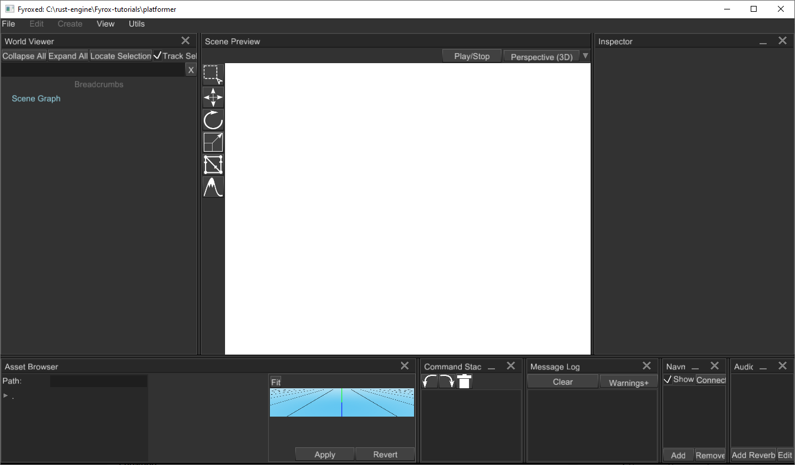

# 2D Platformer Tutorial (WORK IN PROGRESS)

**THIS IS UNFINISHED TUTORIAL, IGNORE IT**

In this tutorial we'll make a 2D platformer using new plugin and scripting system that was become available in Fyrox 0.25.

Let's start by making a new project using special tiny tool - `fyrox-template` - it allows you to generate all boilerplate
parts in a single call. Install it using following command:

```shell
cargo install fyrox-template
```

Navigate to a folder where you want the project to be created and do the following command:

```shell
fyrox-template --name platformer
```

The tool accepts only one argument - project name (it could be extended in the future). After the project is generated, you 
should memorize two commands:

- `cargo run --package editor --release` - launches the editor with your game attached, the editor allows you to run your game
inside it and edit game entities. It is intended to be used only for development.
- `cargo run --package executor --release` - creates and runs production binary of your game that can be shipped (for
example - to a store).

Navigate to the `platformer` directory and run `cargo run --package editor --release`, after some time you should see the editor:



Great! Now we can actually start making our game. Go to `game/src/lib.rs` - it is where your game logic located, as you can see 
the `fyrox-template` generate quite some code for you. There are tiny comments about which place is for what. For more info
about each method, please refer [to the docs](https://docs.rs/fyrox/0.25.0/fyrox/plugin/trait.Plugin.html).

For now we don't even need to write a single line of code, we can create a scene entirely in the editor. To save your time,
I prepared game-ready scene which we'll be using for the rest of the tutorial. To learn how to use the editor, please refer to
the `FyroxEd` section of the book.

Download the scene from [here](scene.zip) and unpack it to `platformer/data`, run the editor and use `File -> Load Scene` to 
load the scene. You should see something like this (do not forget to switch to Orthographic camera mode in scene previewer).


Run the game using `Play/Stop` button at the top of the scene previewer.