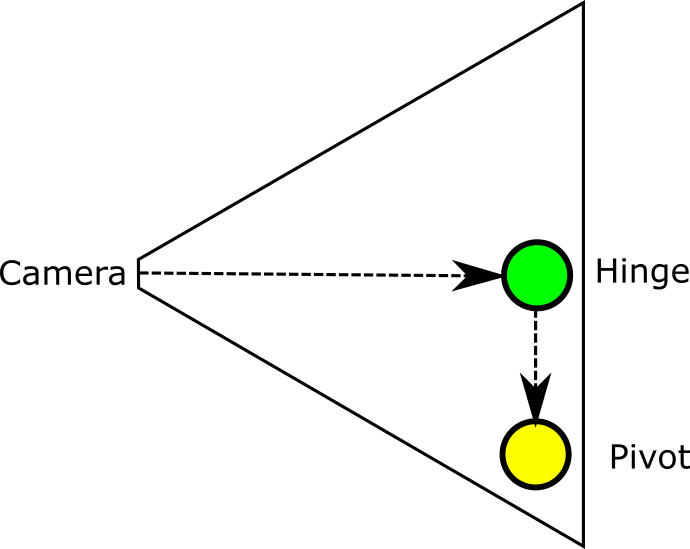
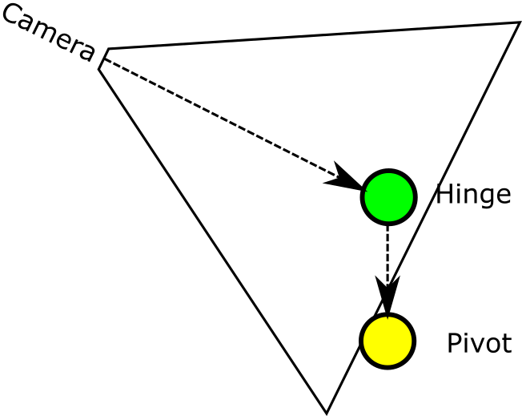
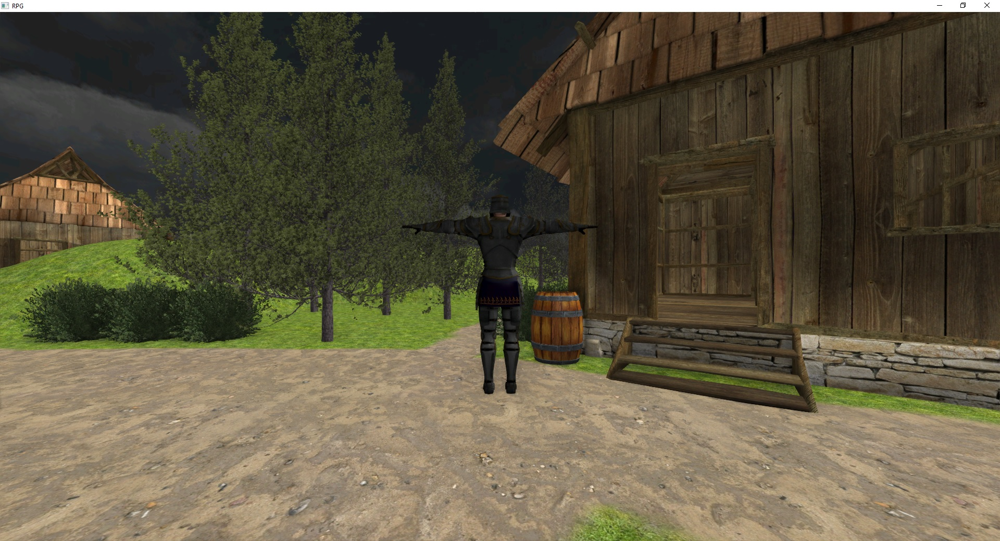

# RPG Tutorial Part 1 - Character Controller

**Source code**: [GitHub](https://github.com/FyroxEngine/Fyrox-tutorials/tree/main/rpg-tutorial1-character-controller)

## Table of contents

- [Introduction](#introduction)
- [Framework](#framework)
- [Assets](#assets)
- [Player and camera controller](#player-and-camera-controller)
- [Camera movement](#camera-movement)
- [Player locomotion](#player-locomotion)
- [Animations](#animations)
- [Conclusion](#conclusion)

## Introduction

In this series of tutorials we will make a game similar to The Elder Scrolls series (but much, much smaller indeed),
we'll have a main character, a simple world with intractable items and a few kind of enemies. I'll show you how to add an inventory,
a quests journal, and the quests itself. This series should have at least 5 tutorials, but this might change. At the end
of the series we'll have a playable RPG which you will be able to use to continue making your own game. It is very ambitious,
but totally doable with the current state of the engine.

Most of the role-playing games (RPGs for short) using 3rd person camera which allows you to see your character entirely.
In this tutorial we'll make something similar. Check the video with final result of the tutorial:

<iframe width="560" height="315" src="https://www.youtube.com/embed/l2ZbDpoIdqk" title="YouTube video player" frameborder="0" allow="accelerometer; autoplay; clipboard-write; encrypted-media; gyroscope; picture-in-picture" allowfullscreen></iframe>

As you can see, at the end of the tutorial we'll be able to walk and explore a small fantasy world. Let's start by creating
a new cargo project:

`cargo init rpg-tutorial`

Add `fyrox` as dependency:

```toml
[dependencies]
fyrox = "0.25.0"
```

## Framework

Now let's create the window and initialize the engine. We'll skip most engine initialization by using new `Framework` helper
that hides most of the engine initialization and provides unified interface for your games allowing you to focus on
your game code. `Framework` is not mandatory, you may use the [previous](https://fyrox.rs/tutorials/2021/03/05/tutorial1.html#creating-a-window)
variant with manual engine initialization and "opened" main loop.

```rust,no_run
# extern crate fyrox;
// Import everything we need for the tutorial.
use fyrox::{
    core::{color::Color, futures::executor::block_on, pool::Handle},
    engine::{
        framework::{Framework, GameState},
        Engine,
    },
    event::{DeviceEvent, DeviceId, WindowEvent},
    event_loop::ControlFlow,
    scene::Scene,
};

struct Game {
    // Empty for now.
}

impl GameState for Game {
    fn init(engine: &mut Engine) -> Self
    where
        Self: Sized,
    {
        Self {}
    }

    fn on_tick(&mut self, engine: &mut Engine, dt: f32, _control_flow: &mut ControlFlow) {
        // This method is called at fixed rate of 60 FPS.
        // It will contain all the logic of the game.
    }
}

fn main() {
    Framework::<Game>::new().unwrap().title("RPG").run()
}
```

It is much easier to initialize the engine now compared to the initialization described in the series of tutorials about
writing a 3D shooter. If you run it, you'll see a window with black background with an "RPG" title.

## Assets

For any kind of game you need a lot of various assets, in our case we need a 3D model for our character, a set of
animations, a level, a set of textures for terrain, trees and bushes, barrels, etc. I prepared all assets as a single
ZIP archive which can be downloaded [here](./data.zip). Once you've downloaded it, unpack it in `./data` folder.

## Player and camera controller

Now we can start adding Player to our game. Create a folder `player` under your `src` directory and add `mod.rs` with
following content:

```rust,no_run,edition2018
# extern crate fyrox;

# #[cfg(test)]
use crate::player::camera::CameraController;

// Import everything we need for the tutorial.
use fyrox::{
    animation::{
        machine::{Machine, Parameter, PoseNode, State, Transition},
        Animation,
    },
    core::{
        algebra::{UnitQuaternion, Vector3},
        pool::Handle,
    },
    engine::resource_manager::ResourceManager,
    event::{DeviceEvent, ElementState, KeyboardInput, VirtualKeyCode},
    resource::model::Model,
    scene::{
        base::BaseBuilder, collider::ColliderBuilder, collider::ColliderShape,
        graph::physics::CoefficientCombineRule, node::Node, rigidbody::RigidBodyBuilder,
        transform::TransformBuilder, Scene, graph::Graph
    },
};

# #[cfg(test)]
mod camera;

# struct CameraController;
# impl CameraController {
#     async fn new(_: &mut Graph, _: ResourceManager) -> Self { Self }
# }

pub struct Player {
    model: Handle<Node>,
    camera_controller: CameraController,
}

impl Player {
    pub async fn new(resource_manager: ResourceManager, scene: &mut Scene) -> Self {
        // Load paladin 3D model and create its instance in the scene.
        let model = resource_manager
            .request_model("data/models/paladin/paladin.fbx")
            .await
            .unwrap()
            .instantiate_geometry(scene);

        scene.graph[model]
            .local_transform_mut()
            // Move the model a bit down because its center is at model's feet
            // and we'd get floating model without this offset.
            .set_position(Vector3::new(0.0, -0.75, 0.0))
            // Scale down paladin's model because it is too big. 
            .set_scale(Vector3::new(0.02, 0.02, 0.02));
        
        Self {
            model,

            // As a final stage create camera controller.
            camera_controller: CameraController::new(&mut scene.graph, resource_manager).await,
        }
    }
}
```

Let's disassemble this heap of code line by line. At first, we're creating pivot for our character, we'll use it as a
"mounting point" for character's 3D model, also it will have a physical body, but that will be added later in this
tutorial. Next, we're loading paladin 3D model and creating its instance in the scene, we need only geometry without
animations, so we use `instantiate_geometry` here, animations will be added later in this tutorial. Next we scale the
model a bit, because it is too big. Also, we're moving the model a bit down because its center is at paladin's feet so
when we're attaching the model to the pivot, it will "stay" on the pivot. We want it to stay on ground, so we're moving
it down by height of the model. Finally, we're attaching the model to the pivot, forcing the engine to move
the model together with pivot. In the end we're creating camera controller, it needs its own module, so add `camera.rs`
module under `src/player` with following content:

```rust,no_run,edition2018
# extern crate fyrox;
// Import everything we need for the tutorial.
use fyrox::{
    core::{
        algebra::{UnitQuaternion, Vector3},
        pool::Handle,
    },
    engine::resource_manager::ResourceManager,
    event::DeviceEvent,
    resource::texture::TextureWrapMode,
    scene::{
        base::BaseBuilder,
        camera::{CameraBuilder, SkyBox, SkyBoxBuilder},
        graph::Graph,
        node::Node,
        transform::TransformBuilder,
        pivot::PivotBuilder
    },
};

async fn create_skybox(resource_manager: ResourceManager) -> SkyBox {
    // Load skybox textures in parallel.
    let (front, back, left, right, top, bottom) = fyrox::core::futures::join!(
        resource_manager.request_texture("data/textures/skybox/front.jpg"),
        resource_manager.request_texture("data/textures/skybox/back.jpg"),
        resource_manager.request_texture("data/textures/skybox/left.jpg"),
        resource_manager.request_texture("data/textures/skybox/right.jpg"),
        resource_manager.request_texture("data/textures/skybox/up.jpg"),
        resource_manager.request_texture("data/textures/skybox/down.jpg")
    );

    // Unwrap everything.
    let skybox = SkyBoxBuilder {
        front: Some(front.unwrap()),
        back: Some(back.unwrap()),
        left: Some(left.unwrap()),
        right: Some(right.unwrap()),
        top: Some(top.unwrap()),
        bottom: Some(bottom.unwrap()),
    }
        .build()
        .unwrap();

    // Set S and T coordinate wrap mode, ClampToEdge will remove any possible seams on edges
    // of the skybox.
    let cubemap = skybox.cubemap();
    let mut data = cubemap.as_ref().unwrap().data_ref();
    data.set_s_wrap_mode(TextureWrapMode::ClampToEdge);
    data.set_t_wrap_mode(TextureWrapMode::ClampToEdge);

    skybox
}

pub struct CameraController {
    pivot: Handle<Node>,
    hinge: Handle<Node>,
    camera: Handle<Node>,
}

impl CameraController {
    pub async fn new(graph: &mut Graph, resource_manager: ResourceManager) -> Self {
        let camera;
        let hinge;
        let pivot = PivotBuilder::new(BaseBuilder::new()
            .with_children(&[{
                hinge = PivotBuilder::new(BaseBuilder::new()
                    .with_local_transform(
                        TransformBuilder::new()
                            .with_local_position(Vector3::new(0.0, 0.55, 0.0))
                            .build(),
                    )
                    .with_children(&[{
                        camera = CameraBuilder::new(
                            BaseBuilder::new().with_local_transform(
                                TransformBuilder::new()
                                    .with_local_position(Vector3::new(0.0, 0.0, -2.0))
                                    .build(),
                            ),
                        )
                        .with_z_far(48.0)
                        .with_skybox(create_skybox(resource_manager).await)
                        .build(graph);
                        camera
                    }]))
                    .build(graph);
                hinge
            }]))
            .build(graph);

        Self {
            pivot,
            hinge,
            camera,
        }
    }
}
```

To understand what this code does let's look closely at this picture:



The pivot is marked yellow here, the hinge - green, and finally the camera is just a trapeze. Lines with arrows shows
how the nodes linked together. As you can see we're attaching the hinge to the pivot and move it up slightly (usually to the
height of the character). Next we're attaching the camera to the hinge and move it back so in default position it will
be behind the character. To understand why we need such layout, let's find out how we need to move and rotate the
camera. We need to rotate the camera around imaginary axis that goes through hinge ("in" the screen on the picture) -
in this layout the camera will always look at character's head and rotate around **local** hinge's X axis. So to do that
we need to rotate the hinge around X axis, not the camera. Here's the picture to help your understanding this better.



That was just one of the axes, now we need to understand how to rotate the camera around Y axis, but preserving the
rotation around X axis. This is very simple, we have the pivot for that. Remember that each of the nodes (pivot, hinge, camera)
are linked together, so if we'll rotate the pivot around Y axis the hinge will rotate too as well as the camera. Fow
now our camera controller does not have an ability to rotate, we'll add this later in the tutorial.

Now let's load a level where our character will "live", add `level.rs` with following content:

```rust,no_run,edition2018
# extern crate fyrox;
use fyrox::{
    core::pool::Handle,
    engine::resource_manager::{ResourceManager},
    scene::{node::Node, Scene},
};

pub struct Level {
    root: Handle<Node>,
}

impl Level {
    pub async fn new(resource_manager: ResourceManager, scene: &mut Scene) -> Self {
        let root = resource_manager
            .request_model("data/levels/level.rgs")
            .await
            .unwrap()
            .instantiate_geometry(scene);

        Self { root }
    }
}
```

This small piece of code just loads the scene I made for this tutorial. It has a terrain and some decorations, including
houses, trees, bushes, barrels, etc. The scene was made in the Fyroxed and can be freely edited without any
problems. Just open the scene and modify it as you need.

Now we need to "glue" all the pieces (the player, and the level) together, let's go back to `main.rs` and change it to
the following code:

```rust,no_run,edition2018
# extern crate fyrox;
# #[cfg(test)]
use crate::{level::Level, player::Player};
use fyrox::{
    core::{color::Color, futures::executor::block_on, pool::Handle},
    engine::{
        framework::{Framework, GameState},
        resource_manager::ResourceManager,
        Engine,
    },
    event::{DeviceEvent, DeviceId, WindowEvent},
    event_loop::ControlFlow,
    scene::Scene,
};

# #[cfg(test)]
mod level;
# #[cfg(test)]
mod player;

# struct Player;
# impl Player {
#    async fn new(_: ResourceManager, _: &mut Scene) -> Self { Self }
# }

# struct Level;
# impl Level {
#    async fn new(_: ResourceManager, _: &mut Scene) -> Self { Self }
# }

struct Game {
    scene: Handle<Scene>,
    level: Level,
    player: Player,
}

impl GameState for Game {
    fn init(engine: &mut Engine) -> Self
    where
        Self: Sized,
    {
        let mut scene = Scene::new();

        scene.ambient_lighting_color = Color::opaque(150, 150, 150);

        let player = block_on(Player::new(engine.resource_manager.clone(), &mut scene));

        Self {
            player,
            level: block_on(Level::new(engine.resource_manager.clone(), &mut scene)),
            scene: engine.scenes.add(scene),
        }
    }

    fn on_tick(&mut self, engine: &mut Engine, dt: f32, _control_flow: &mut ControlFlow) {
        // This method is called at fixed rate of 60 FPS.
        // It will contain all the logic of the game.
    }
}

fn main() {
    Framework::<Game>::new().unwrap().title("RPG").run()
}
```

As you can see, everything is pretty straightforward: at first we're creating a new scene, set its ambient lighting to
"daylight", next we're creating the player and the level. Finally, we're adding the scene to the engine and now if you
run the game you should see something like this:



For now everything is static, let's fix that by adding the ability to move the character and rotate the camera.

## Camera movement

Let's start from the camera movement and rotation. We need two new fields in the `CameraController`:

```rust,no_run
# struct Stub {
// An angle around local Y axis of the pivot.
yaw: f32,
// An angle around local X axis of the hinge.
pitch: f32,
# }
```

Do not forget to initialize them with zeros:

```rust,no_run,compile_fail
Self {
    ...,
    yaw: 0.0,
    pitch: 0.0,
}
```

Now we need to handle device events coming from the OS to rotate the camera. Add following method to the `impl CameraController`:

```rust,no_run,compile_fail
pub fn handle_device_event(&mut self, device_event: &DeviceEvent) {
    if let DeviceEvent::MouseMotion { delta } = device_event {
        const MOUSE_SENSITIVITY: f32 = 0.015;

        self.yaw -= (delta.0 as f32) * MOUSE_SENSITIVITY;
        self.pitch = (self.pitch + (delta.1 as f32) * MOUSE_SENSITIVITY)
            // Limit vertical angle to [-90; 90] degrees range
            .max(-90.0f32.to_radians())
            .min(90.0f32.to_radians());
    }
}
```

In this method we use only `MouseMotion` events, because CameraController does not move - it can only rotate. The method
is pretty straightforward. We're changing yaw and pitch using mouse offsets in two axes. X axis changes yaw, Y axis changes
pitch. Pitch should be limited in specific range to prevent camera to rotate 360 degrees around object, we need angle
to be in `[-90; 90]` range.

Once we've changed yaw and pitch, we need to apply rotations to the hinge and the camera. To do that, we need to add
a new method to the `impl CameraController`:

```rust,no_run,compile_fail
pub fn update(&mut self, graph: &mut Graph) {
    // Apply rotation to the pivot.
    graph[self.pivot]
        .local_transform_mut()
        .set_rotation(UnitQuaternion::from_axis_angle(
            &Vector3::y_axis(),
            self.yaw,
        ));

    // Apply rotation to the hinge.
    graph[self.hinge]
        .local_transform_mut()
        .set_rotation(UnitQuaternion::from_axis_angle(
            &Vector3::x_axis(),
            self.pitch,
        ));
}
```

It is a very simple method, it borrows nodes, and applies rotations around specific axes. Now we need to call those two
methods from somewhere. The most suitable place is `impl Player`, because `Player` owns an instance of `CameraController`:

```rust,no_run,compile_fail
pub fn handle_device_event(&mut self, device_event: &DeviceEvent) {
    self.camera_controller.handle_device_event(device_event)
}

pub fn update(&mut self, scene: &mut Scene) {
    self.camera_controller.update(&mut scene.graph);
}
```

For now both methods are just proxies, but it will be changed pretty soon. Now we need to call the proxies, but from where?
The most suitable place is `on_tick` and `on_device_event` of the `GameState` trait implementation for our `Game` structure:

```rust,no_run,compile_fail
fn on_tick(&mut self, engine: &mut Engine, dt: f32, _control_flow: &mut ControlFlow) {
    let scene = &mut engine.scenes[self.scene];

    self.player.update(scene);
}

fn on_device_event(
    &mut self,
    _engine: &mut Engine,
    _device_id: DeviceId,
    event: DeviceEvent,
) {
    self.player.handle_device_event(&event);
}
```

Now you can run the game, and the camera should rotate when you're moving your mouse. Now it's the time to add an ability
to walk for our character.

## Player locomotion

Our player still can't move, in this section we'll fix it. Player's movement for third person camera differs from the
movement of first person. For the third person camera we must move the player either where the camera looks or according
to pressed keys on the keyboard. Let's start by adding input controller, it will hold info about needed movement:

```rust,no_run
#[derive(Default)]
struct InputController {
    walk_forward: bool,
    walk_backward: bool,
    walk_left: bool,
    walk_right: bool,
}
```

Add new field to the `Player`:

```rust,no_run,compile_fail
input_controller: InputController,
```

And initialize it with `Default::default` in the `Player::new`:

```rust,no_run,compile_fail
Self {
    ...,
    input_controller: Default::default(),
}
```

Now we need to change the state of the input controller, to do that we'll use keyboard events. Add following method to
the `impl Player`:

```rust,no_run,compile_fail
pub fn handle_key_event(&mut self, key: &KeyboardInput) {
    if let Some(key_code) = key.virtual_keycode {
        match key_code {
            VirtualKeyCode::W => {
                self.input_controller.walk_forward = key.state == ElementState::Pressed
            }
            VirtualKeyCode::S => {
                self.input_controller.walk_backward = key.state == ElementState::Pressed
            }
            VirtualKeyCode::A => {
                self.input_controller.walk_left = key.state == ElementState::Pressed
            }
            VirtualKeyCode::D => {
                self.input_controller.walk_right = key.state == ElementState::Pressed
            }
            _ => (),
        }
    }
}
```

Now we need to call this method, we'll do it from `on_window_event` in the `GameState` trait implementation for our
`Game`:

```rust,no_run,compile_fail
fn on_window_event(&mut self, _engine: &mut Engine, event: WindowEvent) {
    match event {
        WindowEvent::KeyboardInput { input, .. } => {
            self.player.handle_key_event(&input);
        }
        _ => (),
    }
}
```

Ok, now we have input controller functioning. Now we can start adding movement logic to the player. Let's start by adding
a physical body to the player. We'll use a capsule rigid body with locked rotations for that. Add these lines somewhere
in `Player::new`:

```rust,no_run
# extern crate fyrox;
# use fyrox::{
#     core::algebra::Vector3,
#     core::pool::Handle,
#     scene::{
#         Scene,
#         base::BaseBuilder,
#         collider::{ColliderBuilder, ColliderShape},
#         graph::physics::CoefficientCombineRule,
#         rigidbody::RigidBodyBuilder,
#         transform::TransformBuilder,
#     },
# };
# fn f(scene: &mut Scene) {
# let model = Handle::NONE;
let collider;
let body = RigidBodyBuilder::new(
    BaseBuilder::new()
        .with_local_transform(
            TransformBuilder::new()
                .with_local_position(Vector3::new(0.0, 2.0, 0.0))
                .build(),
        )
        .with_children(&[
            {
                // Attach the model to the pivot. This will force model to move together with the pivot.
                model
            },
            {
                // Create capsule collider with friction disabled. We need to disable friction because linear
                // velocity will be set manually, but the physics engine will reduce it using friction so it
                // won't let us to set linear velocity precisely.
                collider = ColliderBuilder::new(BaseBuilder::new())
                    .with_shape(ColliderShape::capsule_y(0.55, 0.15))
                    .with_friction_combine_rule(CoefficientCombineRule::Min)
                    .with_friction(0.0)
                    .build(&mut scene.graph);
                collider
            },
        ]),
)
.with_locked_rotations(true)
.with_can_sleep(false)
.build(&mut scene.graph);
# }
```

Now, once our character has physical body, we can move it. Add these lines to the end of `Player::update`:

```rust,no_run,compile_fail
let body = scene.graph[self.body].as_rigid_body_mut();

let look_vector = body
    .look_vector()
    .try_normalize(f32::EPSILON)
    .unwrap_or(Vector3::z());

let side_vector = body
    .side_vector()
    .try_normalize(f32::EPSILON)
    .unwrap_or(Vector3::x());

let position = **body.local_transform().position();

let mut velocity = Vector3::default();

if self.input_controller.walk_right {
    velocity -= side_vector;
}
if self.input_controller.walk_left {
    velocity += side_vector;
}
if self.input_controller.walk_forward {
    velocity += look_vector;
}
if self.input_controller.walk_backward {
    velocity -= look_vector;
}

let speed = 1.35 * dt;
let velocity = velocity
    .try_normalize(f32::EPSILON)
    .and_then(|v| Some(v.scale(speed)))
    .unwrap_or(Vector3::default());

// Apply linear velocity.
body.set_lin_vel(Vector3::new(
    velocity.x / dt,
    body.lin_vel().y,
    velocity.z / dt,
));

let is_moving = velocity.norm_squared() > 0.0;
if is_moving {
    // Since we have free camera while not moving, we have to sync rotation of pivot
    // with rotation of camera so character will start moving in look direction.
    body.local_transform_mut()
        .set_rotation(UnitQuaternion::from_axis_angle(
            &Vector3::y_axis(),
            self.camera_controller.yaw,
        ));

    // Apply additional rotation to model - it will turn in front of walking direction.
    let angle: f32 = if self.input_controller.walk_left {
        if self.input_controller.walk_forward {
            45.0
        } else if self.input_controller.walk_backward {
            135.0
        } else {
            90.0
        }
    } else if self.input_controller.walk_right {
        if self.input_controller.walk_forward {
            -45.0
        } else if self.input_controller.walk_backward {
            -135.0
        } else {
            -90.0
        }
    } else if self.input_controller.walk_backward {
        180.0
    } else {
        0.0
    };

    scene.graph[self.model].local_transform_mut().set_rotation(
        UnitQuaternion::from_axis_angle(&Vector3::y_axis(), angle.to_radians()),
    );
}

// Sync camera controller position with player's position.
scene.graph[self.camera_controller.pivot]
    .local_transform_mut()
    .set_position(position + velocity);
```

There is lots of code, let's thoroughly go through. At first, we're getting two vectors from the pivot: X and Z axes of
the global transform of the pivot. We'll use them to move the character. Next we're using the state of the input
controller to form a new velocity vector. Then we're normalizing velocity vector and multiply it with desired speed of
movement. Normalization is needed to make the vector unit length to prevent speed variations in various directions. Next
we're applying the velocity to the rigid body, also we're locking any angular movement to prevent player's capsule
from tilting.

If the player is not moving, we're not syncing its rotation with camera's rotation - this allows us to look at the
character from any side while not moving. However, if the player is moving, we must sync its rotation with the rotation
of the camera controller. If we'd do this straightforward (by just syncing rotations) it would look very unnatural,
especially in case of side movements. To fix this we have this large chain of `if..else` that selects appropriate
additional rotation for the player's model. This rotation allows us, for example, look forward and move the character
backwards.

As the final step we're syncing position of the camera controller with the position of the pivot. Now if you run the game
you'll be able to walk around using `[W][S][A][D]` keys. However, it looks very ugly - the character's model is in T-pose,
let's fix this.

## Animations

At this point our character can move, and we can rotate the camera around it, but the character is still in T-pose and
does not have any animation. In this section we'll animate it. To keep this tutorial at reasonable length, we'll
add just an idle and walk animations and smooth transitions between them. Add following code at the end of `player.rs`:

```rust,no_run,edition2018
# extern crate fyrox;
# use fyrox::{
#     animation::{
#         machine::{Machine, Parameter, PoseNode, State, Transition},
#         Animation,
#     },
#     core::pool::Handle,
#     engine::resource_manager::ResourceManager,
#     resource::model::Model,
#     scene::{node::Node, Scene},
# };

// Simple helper method to create a state supplied with PlayAnimation node.
fn create_play_animation_state(
    animation_resource: Model,
    name: &str,
    machine: &mut Machine,
    scene: &mut Scene,
    model: Handle<Node>,
) -> (Handle<Animation>, Handle<State>) {
    // Animations retargetting just makes an instance of animation and binds it to
    // given model using names of bones.
    let animation = *animation_resource
        .retarget_animations(model, scene)
        .get(0)
        .unwrap();
    // Create new PlayAnimation node and add it to machine.
    let node = machine.add_node(PoseNode::make_play_animation(animation));
    // Make a state using the node we've made.
    let state = machine.add_state(State::new(name, node));
    (animation, state)
}

pub struct AnimationMachineInput {
    // Whether a bot is walking or not.
    pub walk: bool,
}

pub struct AnimationMachine {
    machine: Machine,
}

impl AnimationMachine {
    // Names of parameters that will be used for transition rules in machine.
    const IDLE_TO_WALK: &'static str = "IdleToWalk";
    const WALK_TO_IDLE: &'static str = "WalkToIdle";

    pub async fn new(
        scene: &mut Scene,
        model: Handle<Node>,
        resource_manager: ResourceManager,
    ) -> Self {
        let mut machine = Machine::new(model);

        // Load animations in parallel.
        let (walk_animation_resource, idle_animation_resource) = fyrox::core::futures::join!(
            resource_manager.request_model("data/models/paladin/walk.fbx"),
            resource_manager.request_model("data/models/paladin/idle.fbx"),
        );

        // Now create two states with different animations.
        let (_, idle_state) = create_play_animation_state(
            idle_animation_resource.unwrap(),
            "Idle",
            &mut machine,
            scene,
            model,
        );

        let (walk_animation, walk_state) = create_play_animation_state(
            walk_animation_resource.unwrap(),
            "Walk",
            &mut machine,
            scene,
            model,
        );

        // Next, define transitions between states.
        machine.add_transition(Transition::new(
            // A name for debugging.
            "Idle->Walk",
            // Source state.
            idle_state,
            // Target state.
            walk_state,
            // Transition time in seconds.
            0.4,
            // A name of transition rule parameter.
            Self::IDLE_TO_WALK,
        ));
        machine.add_transition(Transition::new(
            "Walk->Idle",
            walk_state,
            idle_state,
            0.4,
            Self::WALK_TO_IDLE,
        ));

        // Define entry state.
        machine.set_entry_state(idle_state);

        Self { machine }
    }

    pub fn update(&mut self, scene: &mut Scene, dt: f32, input: AnimationMachineInput) {
        self.machine
            // Set transition parameters.
            .set_parameter(Self::WALK_TO_IDLE, Parameter::Rule(!input.walk))
            .set_parameter(Self::IDLE_TO_WALK, Parameter::Rule(input.walk))
            // Update machine and evaluate final pose.
            .evaluate_pose(&scene.animations, dt)
            // Apply the pose to the graph.
            .apply(&mut scene.graph);
    }
}
```

This is a simple animation blending machine, for more info check
["Animations" section of "Writing a 3D shooter using Fyrox #3"](https://fyrox.rs/tutorials/2021/03/11/tutorial3.html#animations)
tutorial, it has detailed explanation how animation blending machines work. In short, here we're loading two animations,
and create two transitions between them and then applying final pose to the character.

Now we need to create an instance of the `AnimationMachine`, add a field to the `Player`:

```rust,no_run,compile_fail
...,
animation_machine: AnimationMachine,
```

And initialize it in the `Player::new`, before `camera_controller`:

```rust,no_run,compile_fail
...,
animation_machine: AnimationMachine::new(scene, model, resource_manager.clone()).await,
...
```

The last thing we need to do is to update animation machine each frame, we'll do this in `Player::update`, at the end
of the method:

```rust,no_run,compile_fail
self.animation_machine
        .update(scene, dt, AnimationMachineInput { walk: is_moving });
```

Now if you run the game, you should see the character idling if not moving, and it should play "walking" animation if
moving. That's it for this tutorial, in the next tutorial we'll "teach" the character to use swords.

## Conclusion

In this tutorial we've learned how create a walking character. Created simple character controller and walked on
the scene. I hope you liked this tutorial, and if so, please consider supporting the project on
[Patreon](https://patreon.com/mrdimas) or do a one-time donation via [BuyMeACoffee](https://www.buymeacoffee.com/mrDIMAS).
The source code for this tutorial is available on [GitHub](https://github.com/FyroxEngine/Fyrox-tutorials).

Discussion: [Reddit](https://www.reddit.com/r/rust/comments/ois776/media_writing_a_roleplaying_game_using_rg3d_game/),
[Discord](https://discord.gg/xENF5Uh).