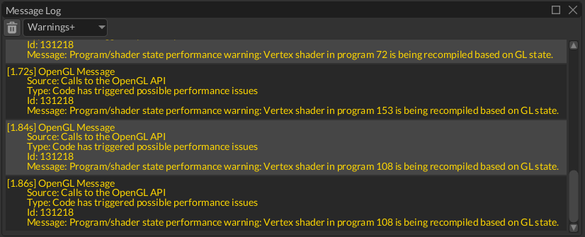

# Logging

The engine has a built-in logger that allows you to trace execution of your game by creating log entries when needed.



The window allows you to select the severity of the messages that will be put in the window:

- `Info+` will show all messages with `Info`, `Warning`, `Error` severities.
- `Warning+` will show all messages with `Warning` and `Error` severities.
- `Error` will show all messages with only `Error` severity.

Each log entry can be copied to the clipboard by right-clicking on it and pressing `Copy` in the context menu. You can
also clear the log using `Clear` button.

## Setting up the logging

By default, the engine does not write to the log until you call one of the following methods:

```rust,no_run
{{#include ../code/snippets/src/misc/mod.rs:setup_logging}}
```

Keep in mind, every project generated by the project manager has logging turned on. It can be disabled (or modified)
in one of the executors for target platforms (check `executor`, `executor-wasm`, `executor-android` crates in the
generated projects).

## Writing to the log

There are three macros that can be used for writing to the log: `info!`, `warn!`, `err!`. Alternatively, you can use 
one of `Log::info`, `Log::warn`, `Log::err` methods, or use `Log::writeln` with severity specified. 

```rust,no_run
{{#include ../code/snippets/src/misc/mod.rs:printing_to_the_log}}
```

It is also possible to write only once to the log per some event that may occur in a loop by using macros/functions
with the suffix `_once`:

```rust,no_run
{{#include ../code/snippets/src/misc/mod.rs:printing_once}}
```

The functions accept the message id as the first argument, it must be unique per the event type.

## Verbosity Level

It is also possible to select the desired verbosity level of logging:

```rust,no_run
{{#include ../code/snippets/src/misc/mod.rs:set_verbosity}}
```