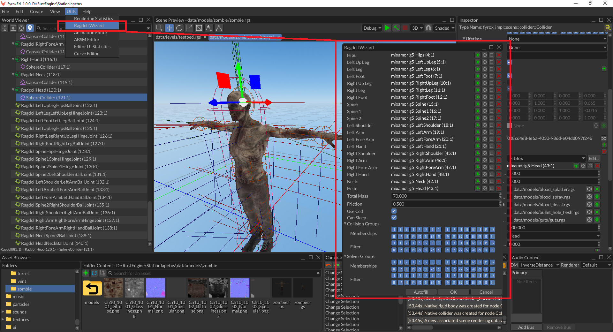

# Ragdoll

Ragdoll physics is a sort of procedural animation, that allows you to create naturally looking death animations and 
body physics in general. Ragdoll is just an arbitrary combination of rigid bodies, colliders, joints. Rigid bodies and 
colliders define physical "boundaries" for limbs of your character, while joints restrict relative motion (linear and 
rotational).

## How To Create

Creating a ragdoll manually is a very tedious procedure, you need to create rigid bodies and colliders for every body 
part of your character, place them correctly, adjust their size, etc. Then you need to create a set of joints, that 
connects body parts, and then setup linear and angular limits. To save time, Fyrox has a special tool called 
`Ragdoll Wizard`:

It can be opened from `Utils` menu and contains quite a lot of node handle fields that needs to be filled. Thankfully, 
there's an `Autofill` button, by pressing which, the wizard will try to find respective bones of the skeleton and put their
handles in the respective fields in the wizard. For now, it is configured to work with [mixamo](https://www.mixamo.com) 
skeletons.

Other parameters are listed below:

- `Total Mass` - total mass of the ragdoll, it will be used to configure masses of rigid bodies of body parts. 
- `Use CCD` - a flag, that defines whether the continuous collision detection (CCD) for body parts should be used or not.
It is advised to keep this flag on, otherwise body parts might get stuck or fall through the floor, leading to "explosive"
ragdoll behaviour.
- `Can Sleep` - a flag, that defines whether the body parts can "sleep" or not. Sleep in this case means, that a body
part can be excluded from physical simulation if it is not moving for some time.
- `Collision Groups` and `Solver Groups` could be used to configure [collision filtering](collider.md#collision-filtering).
It is very important in case if your character has a physical capsule, that is used to "standard" character physics. In
this case body parts must ignore physical capsule (and vice versa), otherwise your ragdoll will "explode".

After everything is filled in, you can click `OK` button and if everything is correct, you should see a bunch of new 
scene nodes in the world viewer, located under a `Ragdoll` scene node:

As you can see, the amount of entities you'd have to create and configure manually is quite high. Keep in mind, that 
ragdoll wizard can't generate perfect ragdoll, because of lack of information. The generated ragdoll will most likely
require some minor tweaks (mostly joint angular limits).

## Video Tutorials

There's one video tutorial about ragdoll wizard, it also shows the final results in game:

<iframe width="560" height="315" src="https://youtube.com/embed/TxSlqGhCxYc" title="YouTube video player" frameborder="0" 
allow="accelerometer; autoplay; clipboard-write; encrypted-media; gyroscope; picture-in-picture" allowfullscreen></iframe>
