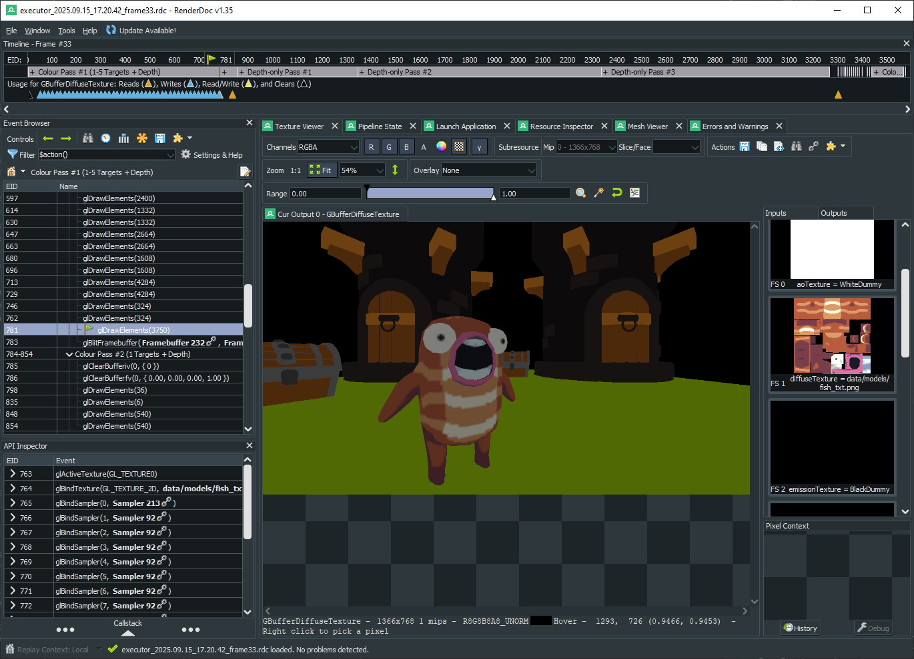

# Graphics Debugging and Profiling

Fyrox does not have any special tools for graphics debugging and profiling yet, such tools are planned for Fyrox 2.0.
For now, you can use third-party tools for this, such as [RenderDoc](https://renderdoc.org/),
[NVIDIA Nsight](https://developer.nvidia.com/nsight-systems), [AMD Radeon GPU Profiler](https://gpuopen.com/rgp/), etc.

## Names for Graphics Entities

The engine has an ability to assign meaningful names for entities of underlying graphical API for the ease of
debugging.

```rust,no_run
{{#include ../code/snippets/src/engine/executor_named_objs.rs:executor_named_objects}}
```

Recompile your game and run a graphics debugger (RenderDoc, for instance) and you should see that now GPU entities
have meaningful names:



## Profiling

Accurate GPU profiling is a hard task, because GPUs work independently of CPUs and any attempt to measure how
much time is spent on GPU from the CPU side will only measure how much time was spent to prepare and issue
commands for a GPU. That being said, profiling requires specialized tools for target GPUs. Use  
[NVIDIA Nsight](https://developer.nvidia.com/nsight-systems) or [AMD Radeon GPU Profiler](https://gpuopen.com/rgp/),
depending on the GPU you're using. [RenderDoc](https://renderdoc.org/) also has _some_ ability to measure
GPU times, but its precision is not very high.
