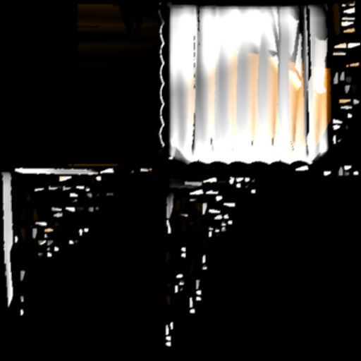
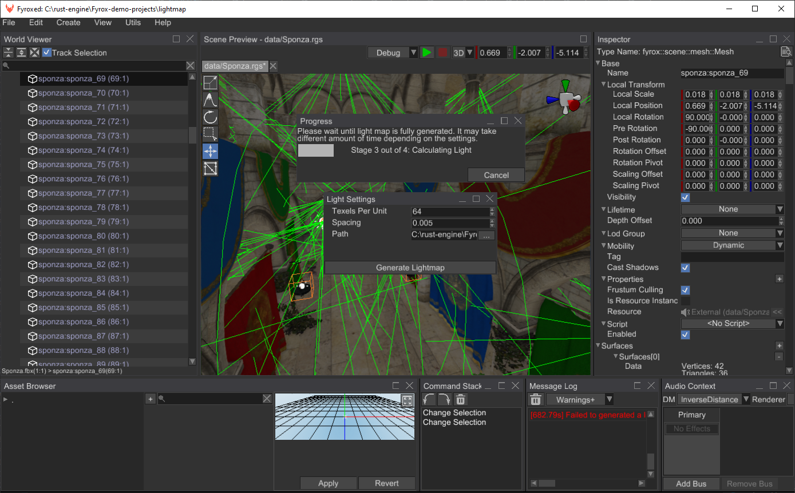

# Light Maps

Fyrox supports light maps for static lighting, that allows you to pre-compute the lighting, store it into a texture
and use this texture for rendering. This makes lighting very fast to render, but requires additional pre-processing
step and slightly increases memory usage. Light maps are very useful for static lights and static level geometry; they
do not work with dynamic objects and lights. Light maps could be used on mobile devices, to significantly increase 
performance. This is how "baked" light looks like:



This is light map for one of the curtains in the scene on screenshot below. As you can see, there are quite a lot of
parts on this texture, this is because the engine generates second texture coordinates for the light map, and sometimes
it cannot generate one big chunk, and it has to add seams. Despite the look of it, the light map is actually tightly
packed, it contains a lot of black pixels because the ambient color is black and not all pixels on it are actually lit.

## How to generate

There are two major ways of generating a light map: from the editor and from code. Usually, using the editor is preferable,
because you can immediately see the results. Code-based approach could be used if you're making your own tool for light
maps.

### From editor

You can generate a light map from the editor in just a few clicks, go to `View -> Light Panel` and the Light Panel should
open:


There's not many settings in this window, but all of them are very important. At first, choose a folder in which the editor
will store the generated light map by clicking `...` button. The last two parameters are the following:

- Texels per unit - it defines 'pixels density' per unit of area (square meters). The more the value, the more detailed 
the produced light map will be and vice versa. This value **directly** affects performance in quadratic manner, which 
means that if you change it from 32 to 64, the time needed to generate the light map won't double, but it will be 4 times 
more. Default value is 64 which is a good balance between quality and generation speed.
- Spacing - relative spacing between UV elements generated by the built-in UV mapper. The more the value, the more the 
distance between the UV elements will be. This parameter is used to prevent seams from occurring, when rendering meshes 
with bilinear filtration. Default value is 0.005, which is a good balance between size of the light maps and their quality 
(lack of seams).

Usually the default values are fine for most cases, but you can tweak them and compare the results. Now you can click
the `Generate Light Map` button and wait until the light map is fully generated.



You can cancel the generation at any time, however in some cases there might be a small delay between cancel request 
and the actual generation cancellation. When the generation is done, you should immediately see the result:


Now if you save the scene, it will remember the generated light map and will load it automatically for you. 

### From code

The following example creates a simple scene and generates a light map for it, which is then saved to disk:

```rust,no_run
{{#include ../code/snippets/src/rendering/lightmap.rs:generate_lightmap}}
```

## Using the lightmap

You can ignore this section if you're generated a light map in the editor, because your scene already contains all 
required connections to the generated light map, and it will be loaded automatically with the scene. However, if you
need to change the light maps on the fly, you can use the following code:

```rust ,no_run
{{#include ../code/snippets/src/rendering/lightmap.rs:change_light_map}}
```

## Limitations

Fyrox uses CPU light map generator, which means that it is quite slow. Light sources that were baked into a light map
will also light up any surface with light map on - this essentially means double lighting. To fix that you need to 
disable light sources that were baked into the light map explicitly.