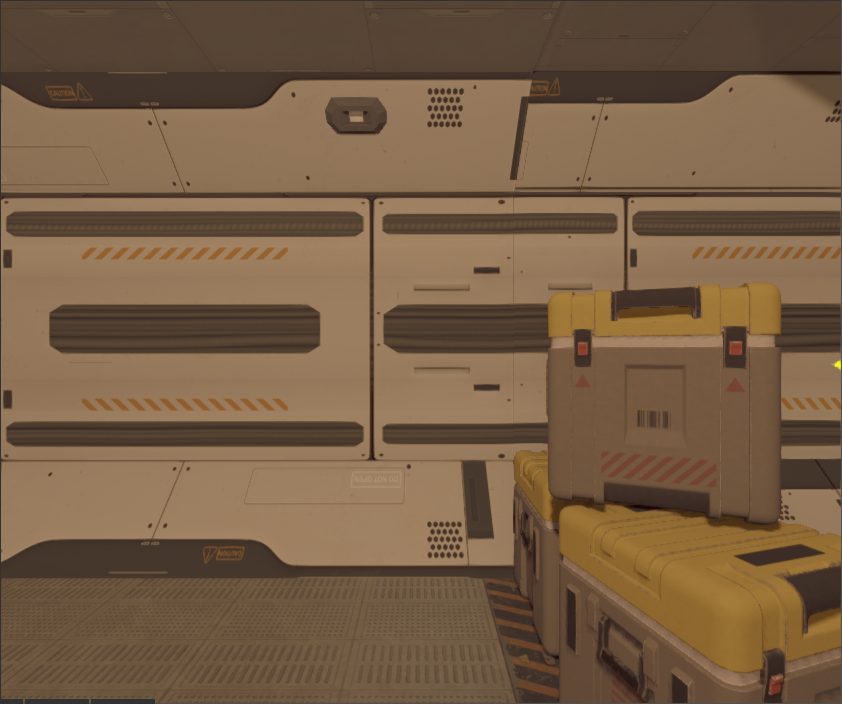

# Camera node

Camera is a special scene node that allows you to "look" at your scene from any point and with any orientation.
Currently, the engine supports only _perspective_ cameras, which could be represented as a frustum volume. Everything
that "intersects" with the frustum will be rendered. 


## How to create

An instance of camera node could be created using `CameraBuilder`: 

```rust
# extern crate rg3d;
# use rg3d::{
#     core::pool::Handle,
#     scene::{base::BaseBuilder, camera::CameraBuilder, node::Node, Scene},
# };

fn create_camera(scene: &mut Scene) -> Handle<Node> {
    CameraBuilder::new(BaseBuilder::new())
        // Set some properties.
        .with_fov(80.0f32.to_radians())
        .with_z_far(256.0)
        .build(&mut scene.graph)
}
```

Orientation and position should be set in `BaseBuilder` as usual.

## Performance

Each camera forces engine to re-render scene one more time, which can be very resource intensive (both CPU and GPU)
operation. 

To reduce GPU load, try to keep far clipping plane at lowest possible values. For example, if you're making a game
with closed environment (lots of corridors, small rooms, etc.) set far clipping plane to max possible distance that 
can be "seen" in your game - if the largest thing is a corridor, then set far clipping plane to slightly exceed the 
length. This will force the engine to clip everything that is out of bounds and do not draw such objects.

## Skybox

Outdoor scenes usually have distant objects that can't be reached, these can be mountains, sky, distant forest, etc.
such objects can be pre-rendered and then applied to a huge cube around camera, it always be rendered first and will
be the background of your scene. To create a skybox and set it to a camera, you can use following code:

```rust,edition2018
# extern crate rg3d;
# use rg3d::{
#     core::{futures::executor::block_on, pool::Handle},
#     engine::resource_manager::ResourceManager,
#     resource::texture::TextureWrapMode,
#     scene::{
#         base::BaseBuilder,
#         camera::{CameraBuilder, SkyBox, SkyBoxBuilder},
#         node::Node,
#         Scene,
#     },
# };

async fn create_skybox(resource_manager: ResourceManager) -> SkyBox {
    // Load skybox textures in parallel.
    let (front, back, left, right, top, bottom) = rg3d::core::futures::join!(
        resource_manager.request_texture("path/to/front.jpg", None),
        resource_manager.request_texture("path/to/back.jpg", None),
        resource_manager.request_texture("path/to/left.jpg", None),
        resource_manager.request_texture("path/to/right.jpg", None),
        resource_manager.request_texture("path/to/up.jpg", None),
        resource_manager.request_texture("path/to/down.jpg", None)
    );

    // Unwrap everything.
    let skybox = SkyBoxBuilder {
        front: Some(front.unwrap()),
        back: Some(back.unwrap()),
        left: Some(left.unwrap()),
        right: Some(right.unwrap()),
        top: Some(top.unwrap()),
        bottom: Some(bottom.unwrap()),
    }
    .build()
    .unwrap();

    // Set S and T coordinate wrap mode, ClampToEdge will remove any possible seams on edges
    // of the skybox.
    let skybox_texture = skybox.cubemap().unwrap();
    let mut data = skybox_texture.data_ref();
    data.set_s_wrap_mode(TextureWrapMode::ClampToEdge);
    data.set_t_wrap_mode(TextureWrapMode::ClampToEdge);

    skybox
}

fn create_camera(scene: &mut Scene, resource_manager: ResourceManager) -> Handle<Node> {
    CameraBuilder::new(BaseBuilder::new())
        .with_skybox(block_on(create_skybox(resource_manager)))
        .build(&mut scene.graph)
}
```

## Color grading look-up tables

Color grading look-up tables (LUT) allows you to transform color space of your frame. Probably everyone saw the
famous "mexican" movie effect when everything becomes yellow-ish when action takes place in Mexico, this is done
via color grading LUT effect. When used wisely, it can significantly improve perception of your scene.

Here is the same scene with no color correction and with "mexico" color correction:

| Scene                                                  | Look-up-table
|--------------------------------------------------------|-------------------
|       | 
|   | 

To use color grading LUT you could do something like this:

```rust
# extern crate rg3d;
# use rg3d::{
#     core::{futures::executor::block_on, pool::Handle},
#     engine::resource_manager::ResourceManager,
#     scene::{
#         base::BaseBuilder,
#         camera::{CameraBuilder, ColorGradingLut},
#         node::Node,
#         Scene,
#     },
# };

fn create_camera_with_lut(
    scene: &mut Scene,
    resource_manager: ResourceManager,
) -> Handle<Node> {
    CameraBuilder::new(BaseBuilder::new())
        .with_color_grading_enabled(true)
        .with_color_grading_lut(
            block_on(ColorGradingLut::new(
                resource_manager.request_texture("path/to/lut.jpg", None),
            ))
            .unwrap(),
        )
        .build(&mut scene.graph)
}
```

## Exposure and HDR

(WIP)