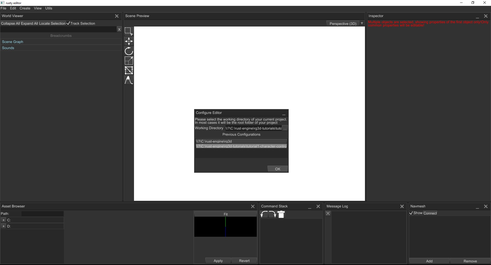
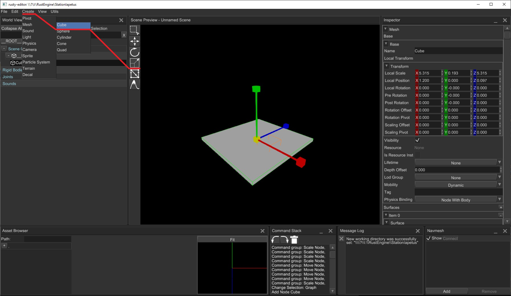
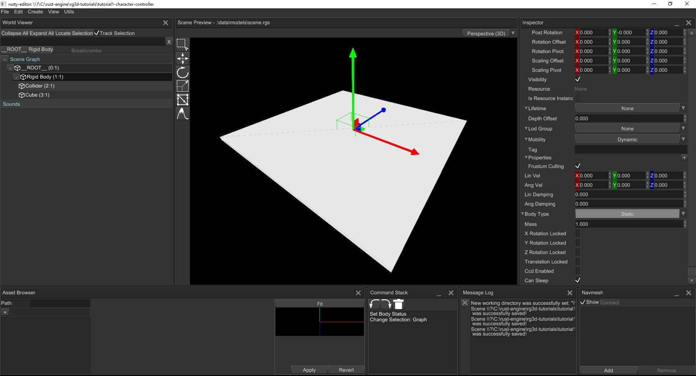
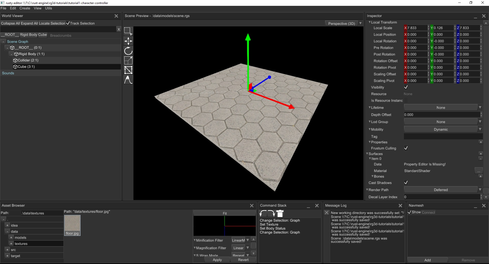
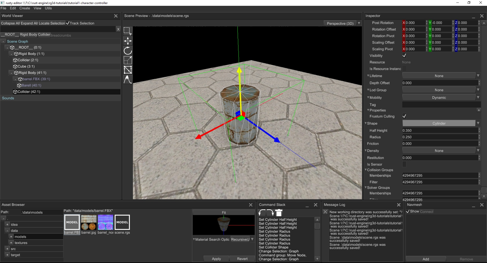
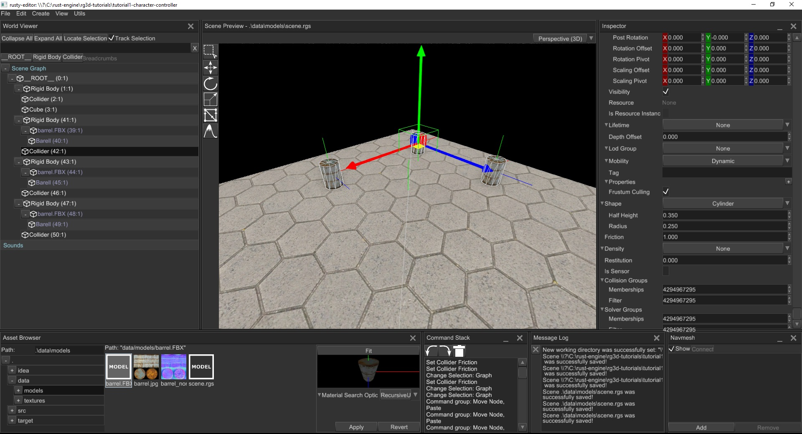
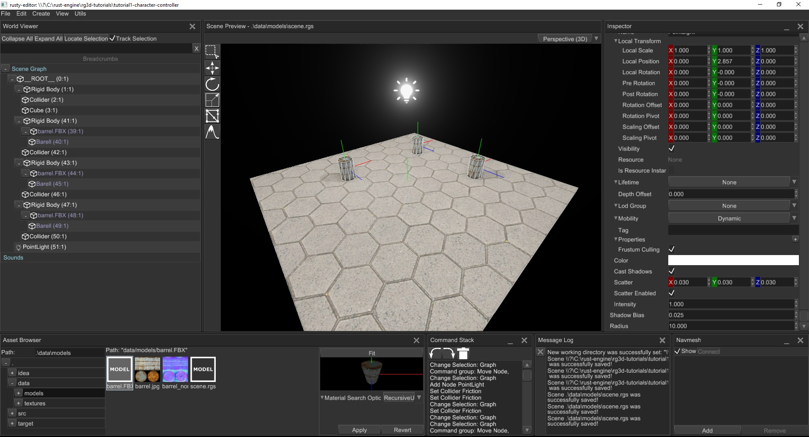
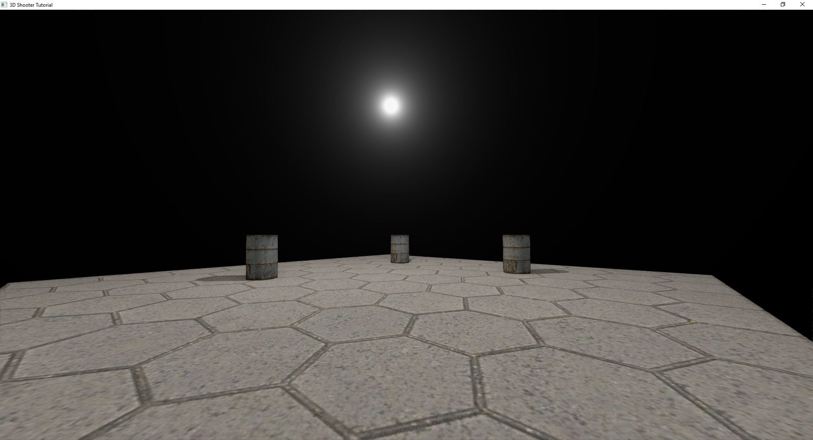
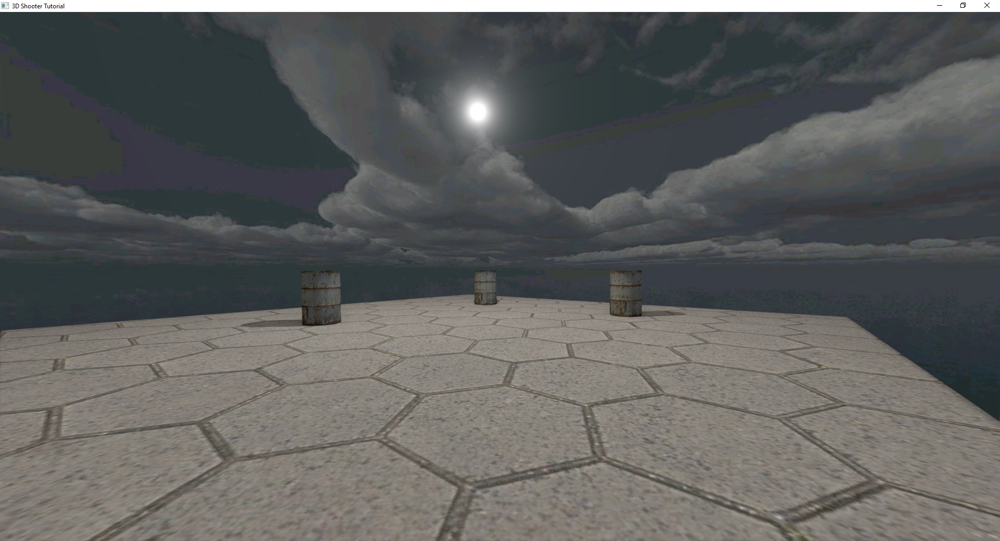

**Source code**: [GitHub](https://github.com/rg3dengine/rg3d-tutorials/tree/main/tutorial1-character-controller)

## Table of contents

- [Introduction](#introduction)
- [Creating a window](#creating-a-window)
- [Creating your first scene](#creating-your-first-scene)
- [Using the scene](#using-the-scene)
- [Character controller](#character-controller)
- [Finishing touch](#finishing-touch)
- [Conclusion](#conclusion)

## Introduction

rg3d is a general purpose 3D engine, it allows creating any kind of 3D game, but today we'll focus on classic 3D shooter.
In this tutorial we'll write a simple character controller. This is what we're aiming for:

<iframe width="560" height="315" src="https://www.youtube.com/embed/VcN3NUdfg3E" title="YouTube video player" frameborder="0" allow="accelerometer; autoplay; clipboard-write; encrypted-media; gyroscope; picture-in-picture" allowfullscreen></iframe>

Let's start by creating a new cargo project, make a folder and execute this:

```bash
cargo init --bin
```

Open Cargo.toml and add `rg3d` dependency:

```toml
[dependencies]
# Use specific version from GitHub, because engine changes rapidly and we must use specific version
# to make sure it compiles.
rg3d = { git = "https://github.com/rg3dengine/rg3d", rev = "a3c3d678c361aa72fc44c36f3e37adc20a54f311" }
```

### Creating a window

Great! Now we can start writing the game. Let's start from something very simple - a window and a main loop. Just copy 
and paste this code in the `main.rs`:

```rust,no_run
# extern crate rg3d;
use rg3d::{
    core::{
        algebra::{UnitQuaternion, Vector3},
        pool::Handle,
    },
    engine::{
        resource_manager::{MaterialSearchOptions, ResourceManager},
        Engine,
    },
    event::{DeviceEvent, ElementState, Event, VirtualKeyCode, WindowEvent},
    event_loop::{ControlFlow, EventLoop},
    physics3d::{
        rapier::{dynamics::RigidBodyBuilder, geometry::ColliderBuilder},
        RigidBodyHandle,
    },
    resource::texture::TextureWrapMode,
    scene::{
        base::BaseBuilder,
        camera::{CameraBuilder, SkyBox, SkyBoxBuilder},
        node::Node,
        transform::TransformBuilder,
        Scene,
    },
    window::WindowBuilder,
};
use std::time;

// Our game logic will be updated at 60 Hz rate.
const TIMESTEP: f32 = 1.0 / 60.0;

struct Game {
    // Empty for now.
}

impl Game {
    pub fn new() -> Self {
        Self {}
    }

    pub fn update(&mut self) {
        // Game logic will be placed here.
    }
}

fn main() {
    // Configure main window first.
    let window_builder = WindowBuilder::new().with_title("3D Shooter Tutorial");
    // Create event loop that will be used to "listen" events from the OS.
    let event_loop = EventLoop::new();

    // Finally create an instance of the engine.
    let mut engine = Engine::new(window_builder, &event_loop, false).unwrap();

    // Initialize game instance. It is empty for now.
    let mut game = Game::new();

    // Run the event loop of the main window. which will respond to OS and window events and update
    // engine's state accordingly. Engine lets you to decide which event should be handled,
    // this is a minimal working example of how it should be.
    let clock = time::Instant::now();

    let mut elapsed_time = 0.0;
    event_loop.run(move |event, _, control_flow| {
        match event {
            Event::MainEventsCleared => {
                // This main game loop - it has fixed time step which means that game
                // code will run at fixed speed even if renderer can't give you desired
                // 60 fps.
                let mut dt = clock.elapsed().as_secs_f32() - elapsed_time;
                while dt >= TIMESTEP {
                    dt -= TIMESTEP;
                    elapsed_time += TIMESTEP;

                    // Run our game's logic.
                    game.update();

                    // Update engine each frame.
                    engine.update(TIMESTEP);
                }

                // Rendering must be explicitly requested and handled after RedrawRequested event is received.
                engine.get_window().request_redraw();
            }
            Event::RedrawRequested(_) => {
                // Render at max speed - it is not tied to the game code.
                engine.render().unwrap();
            }
            Event::WindowEvent { event, .. } => match event {
                WindowEvent::CloseRequested => *control_flow = ControlFlow::Exit,
                WindowEvent::KeyboardInput { input, .. } => {
                    // Exit game by hitting Escape.
                    if let Some(VirtualKeyCode::Escape) = input.virtual_keycode {
                        *control_flow = ControlFlow::Exit
                    }
                }
			    WindowEvent::Resized(size) => {
                    // It is very important to handle Resized event from window, because
                    // renderer knows nothing about window size - it must be notified
                    // directly when window size has changed.
                    engine.set_frame_size(size.into()).unwrap();
                }
                _ => (),
            },
            _ => *control_flow = ControlFlow::Poll,
        }
    });
}
```

Wow! There is lots of code for such a simple task. Fear not, everything here is pretty straightforward, let's dive into
this code and disassemble it line by line. Just skip imports, it's too boring. Let's look at this line:

```rust
const TIMESTEP: f32 = 1.0 / 60.0;
```

Here we define a rate of update for logic of our future game, just sticking to common 60 FPS. Next goes the skeleton of
the game, just a struct with two methods. It will be filled later in this tutorial.

```rust
struct Game {
    // Empty for now.
}

impl Game {
    pub fn new() -> Self {
        Self {}
    }

    pub fn update(&mut self) {
        // Game logic will be placed here.
    }
}
```

Finally, we at the point where the interesting stuff happens - `fn main()`. We're starting by creating a window builder:

```rust,compile_fail
let window_builder = WindowBuilder::new().with_title("3D Shooter Tutorial");
```

The builder will be used later by the engine to create a window. Next we're creating our event loop: 

```rust,compile_fail
let event_loop = EventLoop::new();
```

The event loop is a "magic" thing that receives events from the operating system and feeds your application, this is a very 
important part which makes the application work. Finally, we're creating an instance of the engine:

```rust,compile_fail
let mut engine = Engine::new(window_builder, &event_loop, false).unwrap();
```

The first two parameters are the window builder and the event loop, the last one is a boolean flag that is responsible for vertical
synchronization (VSync). In this tutorial we'll have VSync disabled, because it requires specific platform-dependent
extenstions which are not always available and callind `.unwrap()` might result in panic on some platforms. Next we're 
creating an instance of the game, remember this line, it will be changed soon:

```rust,compile_fail
let mut game = Game::new();
```

Next we define two variables for the game loop: 

```rust,compile_fail
let clock = time::Instant::now();
let mut elapsed_time = 0.0;
```

At first, we "remember" the starting point of the game in time. The next variable is used to control the game loop. Finally, we run the
event loop and start checking for events coming from the OS:

```rust,compile_fail
event_loop.run(move |event, _, control_flow| {
    match event {
        ...
    }
});
```

Let's look at each event separately starting from `Event::MainEventsCleared`:

```rust,compile_fail
Event::MainEventsCleared => {
    // This main game loop - it has fixed time step which means that game
    // code will run at fixed speed even if renderer can't give you desired
    // 60 fps.
    let mut dt = clock.elapsed().as_secs_f32() - elapsed_time;
    while dt >= TIMESTEP {
        dt -= TIMESTEP;
        elapsed_time += TIMESTEP;

        // Run our game's logic.
        game.update();

        // Update engine each frame.
        engine.update(TIMESTEP);
    }

    // Rendering must be explicitly requested and handled after RedrawRequested event is received.
    engine.get_window().request_redraw();
}
```

This is the heart of game loop - it stabilizes update rate of game logic by measuring time from last update call
and performs a various amount of iterations based on an amount of time since last update. This makes the game logic update
rate independent of FPS - it will be always 60 Hz for game logic even if FPS is 10. The `while` loop contains 
`game.update()` and `engine.update(TIMESTEP)` calls to update game's logic and engine internals respectively. After the
loop we're asking the engine to render the next frame. In the next match arm `Event::RedrawRequested` we're handing our request: 

```rust,compile_fail
Event::RedrawRequested(_) => {
    // Render at max speed - it is not tied to the game code.
    engine.render().unwrap();
}
```

As you can see rendering happens in a single line of code. Next we need to handle window events:

```rust,compile_fail
Event::WindowEvent { event, .. } => match event {
    WindowEvent::CloseRequested => *control_flow = ControlFlow::Exit,
    WindowEvent::KeyboardInput { input, .. } => {
        // Exit game by hitting Escape.
        if let Some(VirtualKeyCode::Escape) = input.virtual_keycode {
            *control_flow = ControlFlow::Exit
        }
    }
	WindowEvent::Resized(size) => {
		// It is very important to handle Resized event from window, because
		// renderer knows nothing about window size - it must be notified
		// directly when window size has changed.
		engine.set_frame_size(size.into()).unwrap();
	}
    _ => (),
},
```

Here we're just checking if the player has hit Escape button and exit game if so. Also, when `WindowEvent::Resized` is 
received, we're notifying renderer about that, so it's render targets will be resized too. The final match arm is for 
every other event, nothing fancy here - just asking engine to continue listening for new events.

```rust,compile_fail
_ => *control_flow = ControlFlow::Poll,
```

So far so good. This small piece of code just creates a new window and fills it with black color, now we can start 
writing the game. 


Let's start by creating a simple scene where we'll test our character controller. This is the time when 
[rusty-editor](https://github.com/mrDIMAS/rusty-editor) comes into play - rusty-editor is a native scene editor of the
engine. It is worth mentioning what "scene editor" means: unlike many other engines (Unity, UnrealEngine, etc.),
rusty-editor does **not** allow you to run your game inside it, instead you just edit your scene, save it in the editor and load it in
your game. Being able to run a game inside the editor was a very huge task for one person, and I just chose the 
easiest way. Alright, back to the interesting stuff. Build the editor first using instructions from its
[GitHub page](https://github.com/mrDIMAS/rusty-editor) using specific commit stated in the beginning of the article.

## Creating your first scene 

This section is completely optional, if you eager to make the game - just use a 
[pre-made scene](./data.zip) (download it and unpack in the folder of your game) and go to
the [next section](#using-the-scene). Open rusty-editor, it should look like this:



It will ask you to choose a working directory.


The working directory is simply a path to your game's executable, in most cases it will be the root folder of your
project.

Next, click `File -> CreateScene`. Now you can start modifying your scene. All we need for now is a floor and maybe 
some decorations. To do that, you can either create everything from simple objects (cubes, cones, cylinders,
etc.) or load some assets made in 3D editors (like Blender, 3Ds max, etc.). Here we combine two approaches: floor will 
be just a squashed cube and decorations will be 3D models. Let's start from the floor. Click `Create -> Mesh -> Cube`, 
select the cube and use Scale tool from the toolbar to squash it to form the floor.



Next we need to add physical body to the floor to not fall through it. This is very simple, click `Create -> Physics -> Rigid Body`
then right-click on the rigid body in the World Viewer and click `Add Trimesh Collider`. The last step is to bind the 
floor 3D model with the rigid body, to do that drag'n'drop the rigid body on the floor entry in the World Viewer.



Ok, good, but it looks awful, let's add some texture to it, to do that, 
[download floor texture](./floor.jpg), place it to `data/textures` and apply it to the floor. 
To do that, use the asset browser: at its left side it shows file system of your project, locate `data/textures` folder 
and select `floor.jpg`. Now just drag-n-drop the texture to the floor, this is what you should get.



Now let's add some decorations, to do that [download 3D model](./barrel.zip) I prepared for
this tutorial and unpack it in `data/models`. Now go to the `data/models` in the asset browser and just drag-n-drop the
`barrel.FBX` to the scene. When you'll release the mouse button after dragging, the editor will ask you where to search 
textures for your model, leave everything as is and click "ok". You can find more info about import options 
[here](https://docs.rs/rg3d/0.23.1/rg3d/engine/resource_manager/enum.MaterialSearchOptions.html). Now use the Scale and 
Move tools to adjust scale and position of the barrel, it should look like this: 


Barrel does not have any rigid body yet, and it won't interact with world. Let's fix this. As usual, click `Create -> Physics -> Rigid Body` 
then click on the added rigid body and add a cylinder collider by right-click on it and selecting `Add Cylinder Collider`.
Now select the collider and adjust its height and radius. As a final step drag'n'drop the body on the `barrel.FBX` scene 
node. Keep in mind that every physical body **must** be assigned to "root" node of an object, in case of barrel it will
be `barrel.FBX` node. Why so? Physical bodies operate in **global** coordinates, and if you'll assign a body to a child node,
rg3d will apply global coordinates of the body as **local** coordinates of the child node. This will result in a desync of
coordinates of the body and the node. This a common mistake made by editor's users.



Now clone some barrels, to do that select a `barrel.FBX` in the `World Outliner`, right-click on the scene preview and
press `Ctrl+C` to copy the barrel and `Ctrl+V` to paste. Repeat multiple times.



Also add a light source, to do that go to `Create -> Light -> Point` and adjust its position using the Move tool.



The final step: save your scene in `data/models`, to do that go to `File -> Save` and select the folder and type name 
of the scene in the field it should be `scene.rgs`.

## Using the scene

Now it's the time to load the scene we've made earlier in the game. This is very simple, all we need to do is to load
scene as resource and create its instance. Change `fn new()` body to:

```rust,compile_fail
pub async fn new(engine: &mut GameEngine) -> Self {
    let mut scene = Scene::new();

    // Load a scene resource and create its instance.
    engine
        .resource_manager
        .request_model("data/models/scene.rgs", MaterialSearchOptions::UsePathDirectly)
        .await
        .unwrap()
        .instantiate_geometry(&mut scene);

    // Next create a camera, it is our "eyes" in the world.
    // This can also be made in editor, but for educational purpose we'll made it by hand.
    let camera = CameraBuilder::new(
        BaseBuilder::new().with_local_transform(
            TransformBuilder::new()
                .with_local_position(Vector3::new(0.0, 1.0, -3.0))
                .build(),
        ),
    )
    .build(&mut scene.graph);

    Self {
        camera,
        scene: engine.scenes.add(scene),
    }
}
```

You may have noticed that the `Game` structure now has two new fields: 

```rust,compile_fail
struct Game {
    scene: Handle<Scene>, // A handle to the scene
    camera: Handle<Node>, // A handle to the camera
}
```

These fields are just handles to the "entities" we've created in the `Game::new()`. Also, change `let mut game = Game::new();` to this:

```rust,compile_fail
let mut game = rg3d::core::futures::executor::block_on(Game::new(&mut engine));
```

Here we execute async function `Game::new()` and it creates game's instance with the scene we've made previously.
Run the game and you should see this:



Cool! Now let's disassemble `fn new()` line by line. First, we're creating an empty scene:

```rust,compile_fail
let mut scene = Scene::new();
```

The next few lines are the most interesting:

```rust,compile_fail
engine
    .resource_manager
    .request_model("data/models/scene.rgs", MaterialSearchOptions::UsePathDirectly)
    .await
    .unwrap()
    .instantiate_geometry(&mut scene);
```

Here we're asking the resource manager to load the scene we've made previously, awaiting while it loads and then instantiating
it on the `scene`. What does "instantiation" mean? In short, it means that we're creating a copy of a scene and adding the copy
to some other scene, the engine remembers connections between clones and original entities and is capable of restoring data
from resource for the instance. At this point we've successfully instantiated the scene. However, we won't see anything
yet - we need a camera:

```rust,compile_fail
let camera = CameraBuilder::new(
    BaseBuilder::new().with_local_transform(
        TransformBuilder::new()
            .with_local_position(Vector3::new(0.0, 1.0, -3.0))
            .build(),
    ),
)
.build(&mut scene.graph);
```

Camera is our "eyes" in the world, here we're just creating a camera and moving it a bit up and back to be able to see the 
scene. Finally, we're adding the scene to the engine's container for scenes, and it gives us a handle to the scene. Later
we'll use the handle to borrow scene and modify it.

```rust,compile_fail
Self {
    camera,
    scene: engine.scenes.add(scene),
}
```

## Character controller

We've made a lot of things already, but still can't move in the scene. Let's fix this! We'll start writing the character
controller which will allow us to walk in our scene. Let's start with a chunk of code as usual:

```rust,compile_fail
#[derive(Default)]
struct InputController {
    move_forward: bool,
    move_backward: bool,
    move_left: bool,
    move_right: bool,
    pitch: f32,
    yaw: f32,
}

struct Player {
    pivot: Handle<Node>,
    camera: Handle<Node>,
    rigid_body: RigidBodyHandle,
    controller: InputController,
}

impl Player {
    fn new(scene: &mut Scene) -> Self {
        // Create a pivot and attach a camera to it, move it a bit up to "emulate" head.
        let camera;
        let pivot = BaseBuilder::new()
            .with_children(&[{
                camera = CameraBuilder::new(
                    BaseBuilder::new().with_local_transform(
                        TransformBuilder::new()
                            .with_local_position(Vector3::new(0.0, 0.25, 0.0))
                            .build(),
                    ),
                )
                .build(&mut scene.graph);
                camera
            }])
            .build(&mut scene.graph);

        // Create rigid body, it will be used for interaction with the world.
        let rigid_body_handle = scene.physics.add_body(
            RigidBodyBuilder::new_dynamic()
                .lock_rotations() // We don't want the player to tilt.
                .translation(Vector3::new(0.0, 1.0, -1.0)) // Offset player a bit.
                .build(),
        );

        // Add capsule collider for the rigid body.
        scene.physics.add_collider(
            ColliderBuilder::capsule_y(0.25, 0.2).build(),
            &rigid_body_handle,
        );

        // Bind pivot with rigid body. Scene will automatically sync transform of the pivot
        // with the transform of the rigid body.
        scene.physics_binder.bind(pivot, rigid_body_handle);

        Self {
            pivot,
            camera,
            rigid_body: rigid_body_handle.into(),
            controller: Default::default(),
        }
    }

    fn update(&mut self, scene: &mut Scene) {
        // Set pitch for the camera. These lines responsible for up-down camera rotation.
        scene.graph[self.camera].local_transform_mut().set_rotation(
            UnitQuaternion::from_axis_angle(&Vector3::x_axis(), self.controller.pitch.to_radians()),
        );

        // Borrow the pivot from the graph.
        let pivot = &mut scene.graph[self.pivot];

        // Borrow rigid body from physics.
        let body = scene
            .physics
            .bodies
            .get_mut(&self.rigid_body)
            .unwrap();

        // Keep only vertical velocity, and drop horizontal.
        let mut velocity = Vector3::new(0.0, body.linvel().y, 0.0);

        // Change the velocity depending on the keys pressed.
        if self.controller.move_forward {
            // If we moving forward then add "look" vector of the pivot.
            velocity += pivot.look_vector();
        }
        if self.controller.move_backward {
            // If we moving backward then subtract "look" vector of the pivot.
            velocity -= pivot.look_vector();
        }
        if self.controller.move_left {
            // If we moving left then add "side" vector of the pivot.
            velocity += pivot.side_vector();
        }
        if self.controller.move_right {
            // If we moving right then subtract "side" vector of the pivot.
            velocity -= pivot.side_vector();
        }

        // Finally new linear velocity.
        body.set_linvel(velocity, true);

        // Change the rotation of the rigid body according to current yaw. These lines responsible for
        // left-right rotation.
        let mut position = *body.position();
        position.rotation =
            UnitQuaternion::from_axis_angle(&Vector3::y_axis(), self.controller.yaw.to_radians());
        body.set_position(position, true);
    }

    fn process_input_event(&mut self, event: &Event<()>) {
        match event {
            Event::WindowEvent { event, .. } => {
                if let WindowEvent::KeyboardInput { input, .. } = event {
                    if let Some(key_code) = input.virtual_keycode {
                        match key_code {
                            VirtualKeyCode::W => {
                                self.controller.move_forward = input.state == ElementState::Pressed;
                            }
                            VirtualKeyCode::S => {
                                self.controller.move_backward =
                                    input.state == ElementState::Pressed;
                            }
                            VirtualKeyCode::A => {
                                self.controller.move_left = input.state == ElementState::Pressed;
                            }
                            VirtualKeyCode::D => {
                                self.controller.move_right = input.state == ElementState::Pressed;
                            }
                            _ => (),
                        }
                    }
                }
            }
            Event::DeviceEvent { event, .. } => {
                if let DeviceEvent::MouseMotion { delta } = event {
                    self.controller.yaw -= delta.0 as f32;

                    self.controller.pitch =
                        (self.controller.pitch + delta.1 as f32).clamp(-90.0, 90.0);
                }
            }
            _ => (),
        }
    }
}
```

This is all the code we need for character controller, quite a lot actually, but as usual everything here is pretty
straightforward.

```rust,compile_fail
// Also we must change Game structure a bit too and the new() code.
struct Game {
    scene: Handle<Scene>,
    player: Player, // New
}

impl Game {
    pub async fn new(engine: &mut GameEngine) -> Self {
        let mut scene = Scene::new();

        // Load a scene resource and create its instance.
        engine
            .resource_manager
            .request_model("data/models/scene.rgs", MaterialSearchOptions::UsePathDirectly)
            .await
            .unwrap()
            .instantiate_geometry(&mut scene);

        Self {
            player: Player::new(&mut scene), // New
            scene: engine.scenes.add(scene),
        }
    }

    pub fn update(&mut self, engine: &mut Engine) {
        self.player.update(&mut engine.scenes[self.scene]); // New
    }
}
```

We've moved camera creation to `Player`, because now the camera is attached to the player's body. Also, we must add this line
in the beginning of `event_loop.run(...)` to let `player` handle input events:

```rust,compile_fail
game.player.process_input_event(&event);        
```

So, let's try to understand what happens in this huge chunk of code. Let's start from the `InputController` struct,
it holds the state of the input for a single frame and rotations of player "parts". 

```rust
#[derive(Default)]
struct InputController {
    move_forward: bool,
    move_backward: bool,
    move_left: bool,
    move_right: bool,
    pitch: f32,
    yaw: f32,
}
```

Next goes the `Player::new()` function. First, we're creating a simple chain of nodes of different kinds in the
[scene graph](https://en.wikipedia.org/wiki/Scene_graph). 

```rust,compile_fail
let camera;
let pivot = BaseBuilder::new()
    .with_children(&[{
        camera = CameraBuilder::new(
            BaseBuilder::new().with_local_transform(
                TransformBuilder::new()
                    .with_local_position(Vector3::new(0.0, 0.25, 0.0))
                    .build(),
            ),
        )
        .build(&mut scene.graph);
        camera
    }])
    .build(&mut scene.graph);
```

Basically we're making something like this:


As you can see, the camera is attached to the pivot and has a **relative** position of `(0.0, 0.25, 0.0)`. So when we'll
move pivot, the camera will move too (and rotate of course). Next we're adding a rigid body with a capsule collider and
link it with the pivot.

```rust,compile_fail
// Create rigid body, it will be used for interaction with the world.
let rigid_body_handle = scene.physics.add_body(
    RigidBodyBuilder::new_dynamic()
        .lock_rotations() // We don't want the player to tilt.
        .translation(Vector3::new(0.0, 1.0, -1.0)) // Offset player a bit.
        .build(),
);

// Add capsule collider for the rigid body.
scene.physics.add_collider(
    ColliderBuilder::capsule_y(0.25, 0.2).build(),
    rigid_body_handle,
);

// Bind pivot with rigid body. Scene will automatically sync transform of the pivot
// with the transform of the rigid body.
scene.physics_binder.bind(pivot, rigid_body_handle);
```

Comments should clarify what is going on here. Finally, we're creating Player instance and return it:

```rust,compile_fail
Self {
    pivot,
    camera,
    rigid_body: rigid_body_handle.into(),
    controller: Default::default(),
}
```

Next goes the `fn update(...)` function, it is responsible for movement of the player. It starts from these lines:

```rust,compile_fail
// Set pitch for the camera. These lines responsible for up-down camera rotation.
scene.graph[self.camera].local_transform_mut().set_rotation(
    UnitQuaternion::from_axis_angle(&Vector3::x_axis(), self.controller.pitch.to_radians()),
);
```

We're borrowing the camera from the graph (`scene.graph[self.camera]`) and modifying its **local** rotation, using a 
[quaternion](https://en.wikipedia.org/wiki/Quaternions_and_spatial_rotation) built from an axis, and an angle.
This rotates camera in vertical direction. Let's talk about borrowing in the engine. Almost every object in the 
engine "lives" in generational arenas (pool in rg3d's terminology). Pool is a contiguous chunk of memory, to be
able to "reference" an object in a pool rg3d uses handles. Almost every entity has a single owner - the engine,
so to mutate or read data from an entity your have to borrow it first, like this:

```rust,compile_fail
// Borrow the pivot from the graph.
let pivot = &mut scene.graph[self.pivot];

// Borrow rigid body from physics.
let body = scene
    .physics
    .bodies
    .get_mut(self.rigid_body.into())
    .unwrap();
```

This piece of code `scene.graph[self.pivot]` borrows `pivot` as either mutable or shared, depending on the context (basically
it is just an implementation of Index + IndexMut traits). Once we've borrowed objects, we can modify them. As the next
step we calculate new horizontal speed for the player:

```rust,compile_fail
// Keep only vertical velocity, and drop horizontal.
let mut velocity = Vector3::new(0.0, body.linvel().y, 0.0);

// Change the velocity depending on the keys pressed.
if self.controller.move_forward {
    // If we moving forward then add "look" vector of the pivot.
    velocity += pivot.look_vector();
}
if self.controller.move_backward {
    // If we moving backward then subtract "look" vector of the pivot.
    velocity -= pivot.look_vector();
}
if self.controller.move_left {
    // If we moving left then add "side" vector of the pivot.
    velocity += pivot.side_vector();
}
if self.controller.move_right {
    // If we moving right then subtract "side" vector of the pivot.
    velocity -= pivot.side_vector();
}

// Finally new linear velocity.
body.set_linvel(velocity, true);
```

We don't need to modify vertical speed, because it should be controlled by the physics engine. Finally, we're setting
rotation of the rigid body:

```rust,compile_fail
// Change the rotation of the rigid body according to current yaw. These lines responsible for
// left-right rotation.
let mut position = *body.position();
position.rotation = UnitQuaternion::from_axis_angle(&Vector3::y_axis(), self.controller.yaw.to_radians());
body.set_position(position, true);
```

The next piece of code is a bit boring, but still should be addressed - it is input handling. In the `process_input_event`
we check input events and configure input controller accordingly. Basically we're just checking if W, S, A, D keys were 
pressed or released. In the `MouseMotion` arm, we're modifying yaw and pitch of the controller according to mouse 
velocity. Nothing fancy, except this line:

```rust,compile_fail
self.controller.pitch = (self.controller.pitch + delta.1 as f32).clamp(-90.0, 90.0);
```

Here we're just restricting pitch to [-90; 90] degree range to not let flipping camera upside-down. Now let's run the 
game, you should see something like this and be able to walk and turn the camera.


## Finishing touch

One more thing before we end the tutorial. Black "void" around us isn't nice, let's add skybox for the camera to improve
that. Skybox is a very simple effect that significantly improves scene quality. To add a skybox, add this code first
somewhere before `impl Player`:

```rust,compile_fail
async fn create_skybox(resource_manager: ResourceManager) -> SkyBox {
    // Load skybox textures in parallel.
    let (front, back, left, right, top, bottom) = rg3d::core::futures::join!(
        resource_manager.request_texture("data/textures/skybox/front.jpg", None),
        resource_manager.request_texture("data/textures/skybox/back.jpg", None),
        resource_manager.request_texture("data/textures/skybox/left.jpg", None),
        resource_manager.request_texture("data/textures/skybox/right.jpg", None),
        resource_manager.request_texture("data/textures/skybox/up.jpg", None),
        resource_manager.request_texture("data/textures/skybox/down.jpg", None)
    );

    // Unwrap everything.
    let skybox = SkyBoxBuilder {
        front: Some(front.unwrap()),
        back: Some(back.unwrap()),
        left: Some(left.unwrap()),
        right: Some(right.unwrap()),
        top: Some(top.unwrap()),
        bottom: Some(bottom.unwrap()),
    }
        .build()
        .unwrap();

    // Set S and T coordinate wrap mode, ClampToEdge will remove any possible seams on edges
    // of the skybox.
    let skybox_texture = skybox.cubemap().unwrap();
    let mut data = skybox_texture.data_ref();
    data.set_s_wrap_mode(TextureWrapMode::ClampToEdge);
    data.set_t_wrap_mode(TextureWrapMode::ClampToEdge);

    skybox
}
```

Then modify signature of `Player::new` to 

```rust,compile_fail
async fn new(scene: &mut Scene, resource_manager: ResourceManager) -> Self
```

We just added resource manager parameter here, and made the function async, because we'll load a bunch of textures 
in the `create_skybox` function. Add following line at camera builder (before `.build`):

```rust,compile_fail
.with_skybox(create_skybox(resource_manager).await)
```

Also modify player creation in `Game::new` to this

```rust,compile_fail
player: Player::new(&mut scene, engine.resource_manager.clone()).await,
```

Next, download skybox textures from [here](./skybox.zip) and extract the archive in 
`data/textures` (all textures from  the archive must be in `data/textures/skybox`). Now you can run the game, and you
should see something like this:



This was the last step of this tutorial.

## Conclusion

In this tutorial we've learned how to use the engine and the editor. Created simple character controller and walked on
the scene we've made in the editor. I hope you liked this tutorial, and if so, please consider supporting the project on 
[Patreon](https://patreon.com/mrdimas) or [LiberaPay](https://liberapay.com/mrDIMAS). Source code is available on
[GitHub](https://github.com/mrDIMAS/rg3d-tutorials). In the next tutorial we'll start adding weapons.

Discussion: [Reddit](https://www.reddit.com/r/rust/comments/lyj1tq/writing_a_3d_shooter_using_rg3d_game_engine_1/),
[Discord](https://discord.gg/xENF5Uh).

