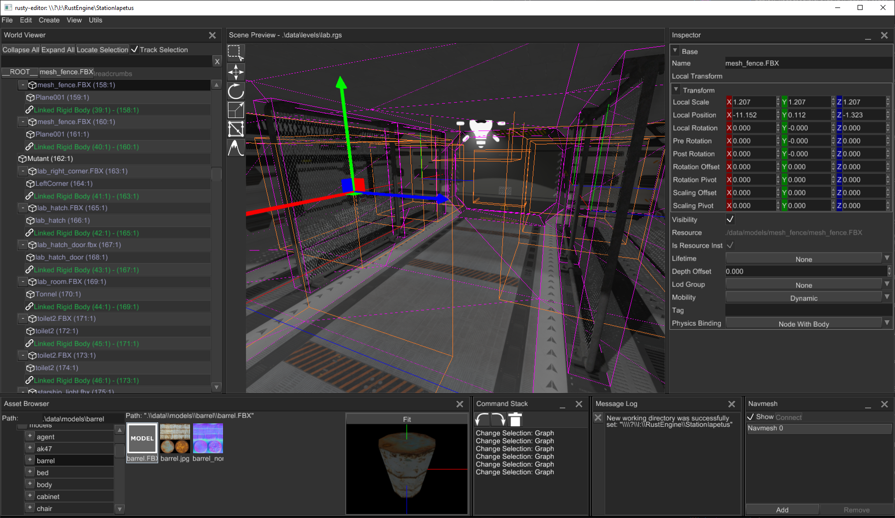

# Overview

The editor has lots of windows with various purposes. Typical look of the editor could be something like this
(please note that it can change over time, because the development is quite rapid and image can become outdated
pretty easily):

Lets do a brief overview what window is responsible for what, there will be a separate chapter for each window.

1) **World viewer** - shows every object in the scene and their relations. It allows you to inspect the contents
of the scene in structured form.
2) **Scene preview** - renders your scene with debug info and various editor-specific objects (like gizmos and
stuff). Allows you to select, move, rotate, scale, delete, etc. various entities.
3) **Tool bar** - shows available context-dependent tools.
4) **Inspector** - allows you to modify various properties of selected object.
5) **Message log** - shows the important messages from the editor.
6) **Navmesh panel** - allows you to create/delete and edit navigational meshes.
7) **Command stack** - shows the most recent actions you've done, allows you to undo and redo the changes on demand.
8) **Asset browser** - inspects the assets of your game, allows you to instantiate resources in the scene and so on.