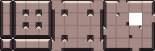
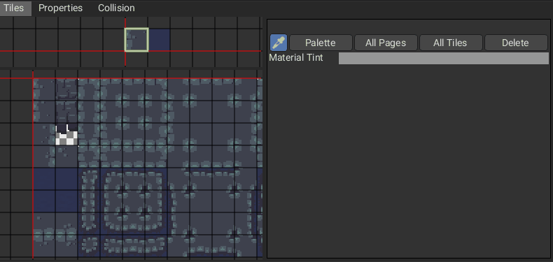
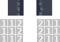
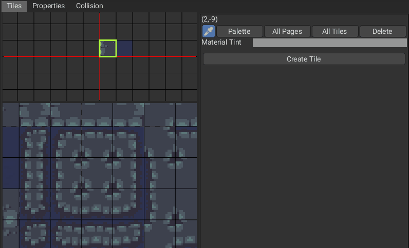
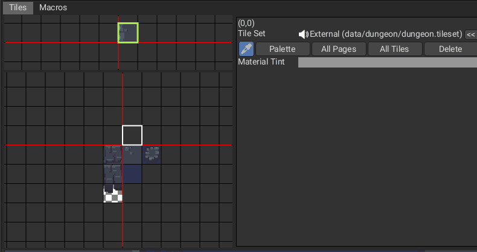
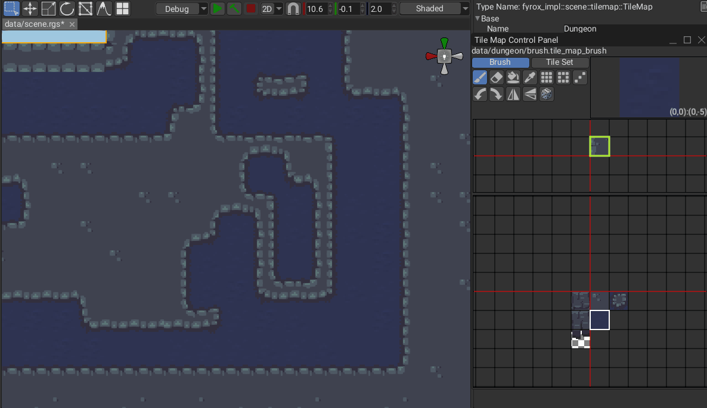
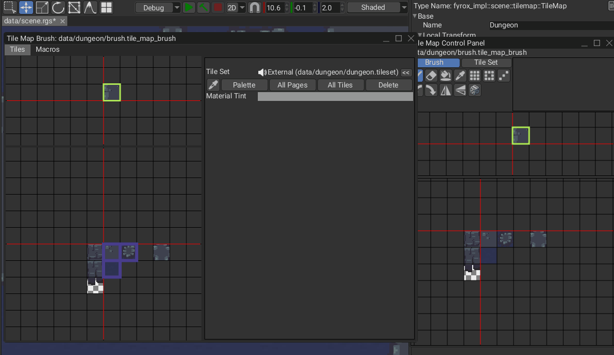

# Autotiling

An advanced feature of tile map brushes is the ability to create macros that can automate some aspects of tile map editing. These macros include *Autotile* and *Wave Function Collapse*.

## The Autotile Macro

To make a tile map look more natural, there will often be tiles that seamlessly blend with their neighboring tiles, and many versions of a tile may be created depending on its which neighbors it is to be used with. A set of tiles that represent various versions of the same tile for this purpose is sometimes called a *terrain*, and each tile in a terrain will have a pattern which specifies which other tiles it may be adjacent to when creating a seamless tile map.

A simple case is when a tile set has just two terrains, such as land and water. In this case each land tile may have a water along its edges depending on whether there is a water tile in each of the eight directions. If there is no water in a direction, then the land tile can smoothly blend with the land tile in that direction. In order to have land tiles that account for both possibilities in all eight directions, 47 land tiles are required.

Here is a template that illustrates the 47 required tiles:

And here is an example tile set created using the above template:

Even more tiles are required if three or more different terrains are involved. Selecting the right tile from such large tile sets can be time-consuming for an artist while editing a tile map unless we automate the task.

The Autotile macro can search the tile set to automatically find the right tile for any terrain, but first we must specify the pattern for every tile in the terrain. To do this we need a nine-slice property in the tile set. A nine-slice property gives every tile a 3x3 array of 8-bit values, and this array will be the tile's pattern that determines which other tiles it may be adjacent to.

The center of the 3x3 array is a number that represents the tile's terrain. Every tile with the same center value is considered to be part of the same terrain. The default value of 0 is treated specially and any tile with a 0 value is not part of any terrain and will be ignored by the autotiler.

The surrounding eight values in the 3x3 array are called *peering bits* because they specify which neighbors this tile may be adjancent to. Only neighbors with the same peering bits along the matching edge may be adjacent to this tile.

The 3x3 pattern with zeroes in every cell is reserved to represent the empty tile. When a peering bit is 0, that indicates that this tile may be adjacent to an empty tile in that that direction.

Named values can be used to make it easier to remember the meaning of each value in the 3x3 grid.

Even though the center value is not part of the process of determining whether to two tiles may be adjacent, it is important that the center value matches the peering bits when appropriate because the autotiler compares the center value against the surrounding peering bits in its heuristic to decide which tile it will choose. The autotiler prioritizes choosing tiles where more peering bits are equal to the center value.

This heuristic is important because tiles like this technically match along their shared edge:

Because the right side of the left pattern is all 2s and the left side of the right pattern is all 2s, the autotiler might choose these two tiles to be adjacent to each other, but since these tiles are in the 1 terrain, the heuristic will cause the autotiler to prefer patterns with more 1s and avoid creating unnecessary seams.

Now that we have a nine-slice property to store our patterns and we understand what values should go in each tile's pattern, we can use the tile set editor to fill in the patterns for each tile.

Select one of the tiles in the terrain, then go to the property and click the brush tool beside the property. This puts the tile set editor into property drawing mode and allows you to paint property values onto tile tiles. Enter the number you wish to draw in the property field, then click and drag the mouse on the tiles to apply that value to any cell of any tile.

If you do not already have a float property to represent the frequency of each tile, you may want to add one because the autotiler can optionally use that property when it is forced to randomly choose a tile. The autotiler is intended to deterministically choose the best tile in any situation, but when two tiles share exactly the same pattern, the autotiler will use randomness to pick between the tiles.

Once the tile set is ready, all that remains is to add an autotile macro to the tile map's brush. Open the brush in the tile set editor and switch to the "Macros" tab.

Click the "Autotile" button to add an autotile macro to the brush's list of macros. On the right side you will see the macro's name field and the settings that control how the macro will modify your tile map drawing operations. Choose a name for the macro, as this may help later.

Set the pattern property to whichever nine-slice property you used to store the patterns using the dropdown list. If the dropdown list is empty, go back to the "Tiles" tab and ensure that the brush is set to use the correct tile set.

You may choose to leave the frequency property as "None." In that case, all tiles will be assumed to have equal frequency, just as if you gave them all a frequency of 1.0.

Finally, return to the "Tiles" tab and add some terrain tiles alongside whatever normal tiles you may be using. Add a tile from the tile set or select an existing tile, then find the name of the autotile macro that you created in the tile properties on the right. Click the "+" button to add this tile to the macro.

Once the tile is added to the macro, the macro will know to activate whenever you attempt to draw this tile into the tile map. As soon as the "+" is pressed, additional settings will appear for the tile: "Terrain", "Adjacent", and "Diagonal".

"Terrain" is the center value of the pattern of the tiles you wish to draw. Whenever you draw with this tile, the autotile macro will attempt to replace the tile with the best available tile from the tile set with this center value. If no appropriate tile is available, then the autotiler will not replace the tile. If "Terrain" is set to 0, the autotiler will attempt to replace the tile you draw with the empty tile.

The "Adjacent" toggle indicates that the autotiler should also try to replace the four orthogonally adjacent tiles surrounding the tile you drew. This allows nearby tiles to dynamically adapt as you draw. The "Diagonal" toggle is similar, but for the four tiles that surround the tile diagonally.

Turning "Adjacent" and "Diagonal" on makes the autotiler more aggressive in that it will modify tiles even if you have not explicitly drawn on them, which is often desired, but turning "Adjacent" and "Diagonal" off can give the artist more control.

Once you have added all the terrains you will need to the brush, close the tile set editor and select the tile map you want to edit. Activate the tile map interaction mode and open the brush in the tile map control panel, then select one of the terrain tiles you created and draw something.

## The Wave Function Collapse Macro

Wave function collapse is much like autotiling, but instead of always trying to choose the best tile for the artist's chosen terrain, wave function collapse randomly chooses the terrain for each cell and randomly chooses the tile for each terrain. In this way wave function collapse is a tool for randomly generating tile maps.

Start by creating a pattern property and filling in its values for every tile you want to use, just as for the Autotile macro.

Next, open the brush in the tile set editor and open the "Macros" tab. Click the "Wave Function Collapse" button to add a wave function collapse macro to the list of macros and give the macro a name.

The wave function collapse macro has far more settings than autotile:

- **Pattern Property:** Just like for autotile, the wave function collapse macro needs a pattern for each tile so that it knows which tiles may be placed adjacent to which other tiles.

- **Frequency Property:** This float property lets the wave function collapse know how often it should use each tile. Higher numbers mean that the tile will be chosen more often. 0 or less will cause a tile to never be chosen. If this property is set to "None" then all tiles will be given a frequency of 1.0.

- **Contrain Edges:** This toggle indicates that the macro will ensure that the tiles it is placing will match the surrounding tiles that were already in the tile map. For example, if you were to draw a filled rectangle using a wave function collapse tile, the macro would be forced to choose tiles that match the existing tiles around the edges of the rectangle. If this toggle is off, then the wave function collapse will ignore surrounding tiles.

- **Max Attempts:** Due to the random nature of the algorithm, wave function collapse can create situations where it becomes impossible to find a tile that satisfies all the requirements. Simply starting again and repeating the algorithm from the beginning can resolve this issue. This field determines the maximum number of tiles the macro will run the wave function collapse algorithm before giving up.

- **Terrain:** This lets you add terrains to the list of terrains that wave function collapse may randomly choose. Any terrain that is not on this list will never be chosen. If 0 is on the list, then the empty tile may sometimes be chosen. Each terrain on the list has a weight value that lets you control how often that terrain is chosen.

Once you have configured the wave function collapse, go to the "Tiles" tab to add a wave function collapse tile to the brush. When you draw with this tile, the wave function collapse macro will wait until you have finished drawing, then attempt to replace everything you have drawn with random tiles from your chosen terrains.

