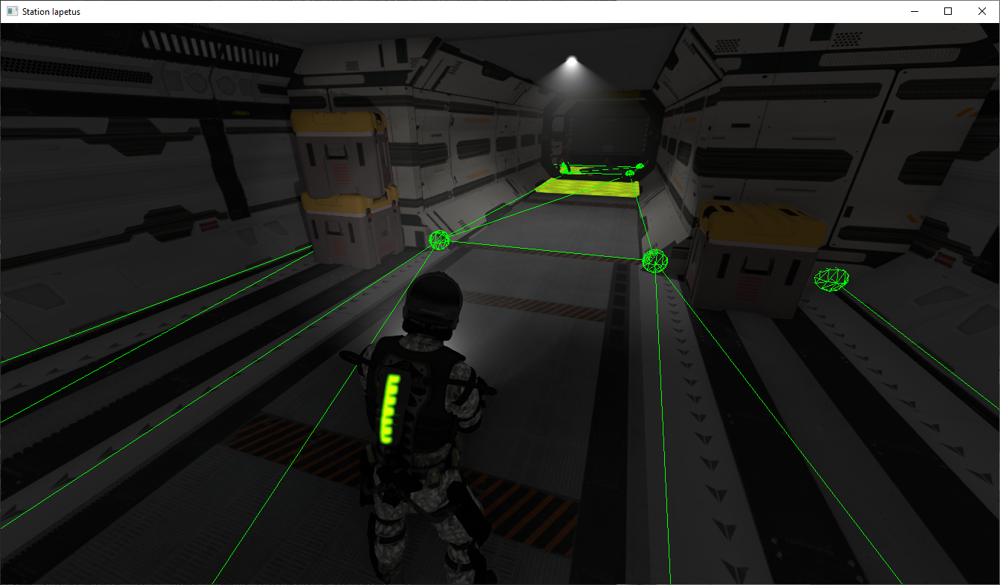

# Debugging

This section of the book explains how to debug various aspects of scenes.

## Debug Drawing

Sometimes you may need to visualize some objects, that are normally invisible. The engine has built-in debug drawing 
context exactly for this purpose. For example, to visualize a point use the following code:

```rust
{{#include ../code/snippets/src/scene/debug.rs:debug_drawing}}
```

This code will draw a wireframe sphere at the position of an object, to which the script is attached to.
Keep in mind, that all drawing is performed in world-space coordinates. It is important to note, that 
the code above will just add the wireframe sphere line-by-line to internal list of lines, which you must
clear at least once per frame. This is not done automatically, because having a "ghosting" effect could 
be useful for debugging to see trajectories and to trace short events. To clear the buffer call the 
`clear_lines` method somewhere in your plugin's `update` method:

```rust
{{#include ../code/snippets/src/scene/debug.rs:update_begin}}
{{#include ../code/snippets/src/scene/debug.rs:clear}}
{{#include ../code/snippets/src/scene/debug.rs:update_end}}
```

Drawing context provides a wide variety of helper methods to draw various shapes, starting from lines and ending
by cones, cylinders, etc. The full list of methods is provided below:

- `draw_frustum` - draws a frustum, which could be obtained, for instance, from a Camera node. 
- `draw_aabb` - draws an axis-aligned bounding box.
- `draw_oob` - draws an object-oriented bounding box.
- `draw_transform` - draws three basis vectors of an arbitrary transformation 4x4 matrix.
- `draw_triangle` - draws a triangle by 3 vertices.
- `draw_pyramid` - draws a pyramid, using vertices for its top, and four vertices for the base.
- `draw_wire_sphere` - draws a wireframe sphere.
- `draw_circle` - draws a circle.
- `draw_circle_segment` - draws a circle segment using angles range.
- `draw_rectangle` - draws a rectangle.
- `draw_sphere` - draws a sphere.
- `draw_sphere_section` - draws a sphere section. 
- `draw_cone` - draws a cone.
- `draw_cylinder` - draws a cylinder.
- `draw_flat_capsule` - draws a flat capsule (axial slice).
- `draw_capsule` - draws a volumetric capsule.
- `draw_segment_flat_capsule` - draws a segment of a flat capsule
- `draw_segment_capsule` - draws a segment of volumetric capsule.
- `draw_arrow` - draws an arrow.
- `add_line` - draws a single line from point to point.

## Nodes

Scene nodes could draw their own debug info to the scene drawing context by overriding `debug_draw` method
provided by `NodeTrait`. For example, navigational meshes are normally invisible and only used to calculate 
paths, however it could be very useful to actually see them when debugging game's AI:



You can debug draw either all scene nodes at once:

```rust
{{#include ../code/snippets/src/scene/debug.rs:update_begin}}
{{#include ../code/snippets/src/scene/debug.rs:node_debug_drawing_all}}
{{#include ../code/snippets/src/scene/debug.rs:update_end}}
```

Or filter out only specific ones:

```rust
{{#include ../code/snippets/src/scene/debug.rs:update_begin}}
{{#include ../code/snippets/src/scene/debug.rs:node_debug_drawing_specific}}
{{#include ../code/snippets/src/scene/debug.rs:update_end}}
```

## Physics

You can enable debug visualization of physics using built-in drawing methods. All that is needed is to call the `draw()`
method of a physics world (2D or 3D) like so:

```rust
{{#include ../code/snippets/src/scene/debug.rs:update_begin}}
{{#include ../code/snippets/src/scene/debug.rs:physics_drawing}}
{{#include ../code/snippets/src/scene/debug.rs:update_end}}
```

2D physics can be drawn the same way, just replace `.physics` with `.physics2d`. The result should look like this:

