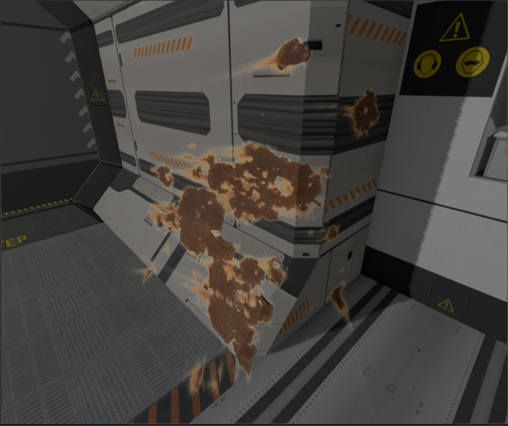

# Decal node

Decal nodes allow you to "project" a texture onto your scene within some specific bounds. It is widely used for
bullet holes, blood splatter, dirt, cracks and so on. Here is the example of the decal applied to the scene:



The rust marks are applied on existing geometry of the scene by projecting a rust texture in specific direction.

## How to create

A decal instance can be created using DecalBuilder:

```rust,no_run
{{#include ../code/snippets/src/scene/decal.rs:create_decal}}
```

## Textures

You can specify which textures the decal will be projecting, currently there is only diffuse and normal maps
supported.

## Rendering

Currently, the engine supports only _deferred decals_, which means that decals modify the information stored in
G-Buffer. This fact means that decals will be lit correctly with other geometry in the scene. However, if you 
have some objects in your scene that uses forward rendering path, your decals won't be applied to them.

## Bounds

Decal uses Object-Oriented Bounding Box (OOB) to determine pixels on which decal's textures will be projected,
everything that got into OOB will be covered. Exact bounds can be set by tweaking local transform of a decal.
If you want your decal to be larger, set its scale to some large value. To position a decal - use local position,
to rotate - local rotation.

A decal defines a cube that projects a texture on every pixel of a scene that got into the cube. Exact cube size 
is defined by decal's local scale. For example, if you have a decal with scale of (1.0, 2.0, 0.1) then the size of 
the cube (in local coordinates) will be width = 1.0, height = 2.0 and depth = 0.1. The decal can be rotated as any 
other scene node. Its final size and orientation are defined by the chain of transformations of parent nodes.

## Layers

There are situations when you want to prevent some geometry from being covered with a decal, to do that the engine
offers a concept of layers. A decal will be applied to a geometry if and only if they have matching layer index. This 
allows you to create environment damage decals, and they won't affect dynamic objects since they're located on 
different layers.

## Performance

Current implementation of decals is relatively cheap, this allows you to create many decals on scene. However, you
should keep the amount of decals at a reasonable level. 