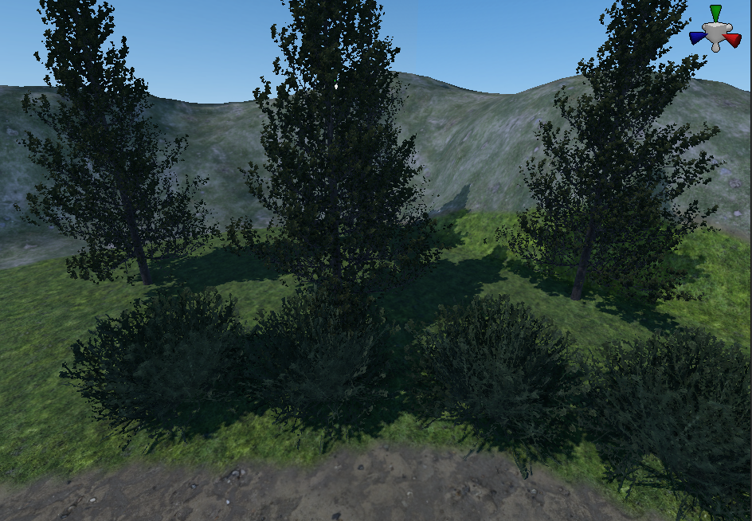
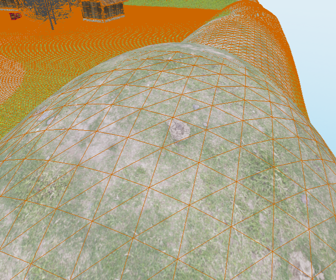
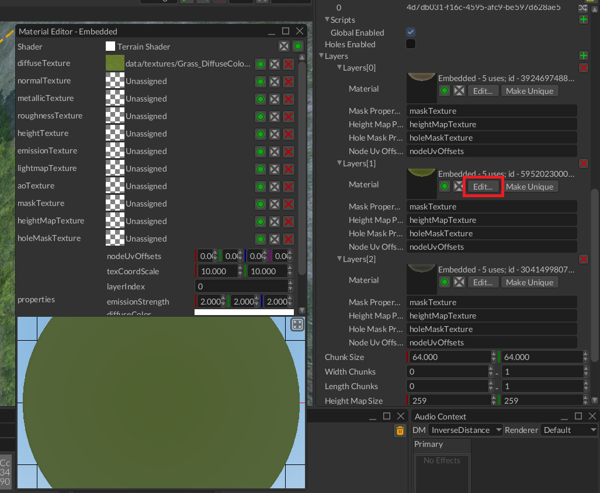

# Terrain

Terrain is a scene node that represents uniform grid of cells where each cell can have different height. Other, commonly
known name for terrain is heightmap. Terrains used to create maps for open-world games, it is used to create hills,
mountains, plateau, roads, etc.



## Basic concepts

There are few basic concepts that you should understand before trying to use terrains. This will help you to understand
design decisions and potential use cases.

### Heightmap

As it was already mentioned, terrain is a uniform grid where X and Z coordinates of cells have fixed values, while Y
can change. In this case we can store only width, height and resolution numerical parameters to calculate X and Z coordinates,
while Y is stored in a separate array which is then used to modify heights of cells. Such array is called _heightmap_.



### Layers

Layer is a material + mask applied to terrain's mesh. Mask is a separate, greyscale texture that defines in which parts
of the terrain the material should be visible or not. White pixels in the mask makes the material to be visible, black -
completely transparent, everything between helps you to create smooth transitions between layers. Here's a simple 
example of multiple layers:


There are 3 layers: 1 - dirt, 2 - grass, 3 - rocks and grass. As you can see, there are smooth transitions between each
layer, it is achieved by layer's mask.

Each layer uses separate material, which can be edited from respective property editor in the Inspector:



## Creating terrain in the editor

You can create a terrain node by clicking `Create -> Terrain`. It will create a terrain with fixed width, height, 
and resolution (see [limitations](./terrain_node.md#limitations-and-known-issues)). Once the terrain is created, select
it in the World Viewer and click on Hill icon on the toolbar. This will enable terrain editing, brush options panel 
should also appear. See the picture below with all the steps:


The green rectangle on the terrain under the cursor represents current brush. You can edit brush options in the 
`Brush Options` window:


- *Shape:* Select a circular brush or a rectangular brush. When a circular brush is selected, a control to adjust its
radius appears. When a rectangular brush is select, controls for its width and length appear. The size of the green
rectangle changes to reflect the size of the brush based on these controls.
- *Mode:* Select the terrain editing operation that the brush should perform.
    - *Raise or Lower:* Modifies the existing value by a fixed amount. When the amount is positive, the value is
    increased. When the amount is negative, the value is decreased. When the brush target is "Height Map", this can be
    to raise or lower the terrain. When the `Shift` key is held at the start of a brush stroke, the amount of raising or lowering
    is negated, so a raise operation becomes a lowering operation.
    - *Assign Value:* Replaces the existing value with a given value. For example, if you want to create a plateau
    with land of a specific height, you can select this mode and type in the height you want as the brush value.
    - *Flatten:* Levels terrain by spreading the value of the terrain from point where you click across wherever
    you drag the brush. It works just like *Assign Value* except you do not need to specify the desired value because it
    is taken automatically from the value of the terrain where the brush stroke starts.
    - *Smooth:* For each point of the terrain touched by the brush, replace that value with an average of the nearby values.
    This tends to diminish sharp transitions in terrain value.
- *Target:* There are multiple aspects of terrain that can be edited by a brush, and this control allows you to select which
one you will be editing. Setting it to "Height Map" causes the brush to change the terrain elevation.
Setting it to "Layer Mask" causes it to change the transparency of the layer with a chosen index.
Masks are always clamped to be between 0 and 1, regardless of what brush mode is selected, since 0 represents fully transparent
and 1 represents the layer being fully opaque.
- *Transform:* This is a 2x2 matrix that is applied to the brush's shape, allowing linear transformations such as rotating
a rectangular brush, or skewing, or stretching.
For most purposes the identity matrix of $\begin{bmatrix}1&0\\0&1\end{bmatrix}$ works well, since that is the default that applies no modification to the brush's shape.
If the matrix is not invertable, then it will be ignored.
- *Hardness:* The effect of a brush does not need to be applied equally across its entire area. The *hardness*
of a brush controls how much of a brush gets its full effect.
When hardness is 0, only the exact center of the brush receives the full effect, while the rest of the brush fades from
full effect to no effect at the edges.
When hardness is 1 or greater, the entire brush gets the full effect.
If the value is less than 0, then even the center of the brush does not receive the full effect.
- *Alpha:* The $\alpha$ value linearlly interpolates between the current value of the terrain and the value that would be
produced by the full effect of the brush.
If $v_0$ is the current value of a point on the terrain and and $v_1$ is the full effect of the brush, then the actual
effect that the brush will apply will be $(1 - \alpha) * v_0 + \alpha * v_1$.
There is no requirement that $\alpha$ must be between 0 and 1. Values less than 0 will invert the effect of the brush,
while values greater than 1 will exaggerate the effect of the brush.
Values close to 0 can be used to make fine adjustments by applying an effect incrementally across multiple brush strokes.

Each brush stroke is treated as an independent operation starting from when the mouse button is pressed and ending when
the mouse button is released. Repeatedly dragging the mouse across the same area of terrain will not increase the effect
of the brush as it is all part of the same brush stroke, but repeatedly pressing and releasing the mouse button will
cause the brush's effect to be applied repeatedly since that is counted as multiple brush strokes.

## Creating terrain from code

Terrain brushes can also be used to edit terrain from code by using `fyrox::scene:terrain::Brush` and `fyrox::scene::terrain::BrushContext`.

The `Brush` structure has fields for each of the brush options, and the `BrushContext` structure has methods for accepting a `Brush` and
applying it to a terrain. BrushContext allows you to start a new stroke, perform stamps and smears during the stroke, then end the stroke
to write the constructed brush stroke to the terrain. It is also possible to `flush` a partially finished stroke to the terrain, so that
a brush stroke may be animated across multiple frames instead of appearing on the terrain all at once.

Here is a list of methods provided by `BrushContext`:

```rust,no_run
fn start_stroke(&mut self, terrain: &Terrain, brush: Brush)
```

Call this to choose the brush that will be used for the rest of the stroke. At this point the `BrushContext` records which textures the
terrain is using to represent the data for the given brush's target. and those textures are the ones that will finally be modified
when `end_stroke` is eventually called.

```rust,no_run
fn stamp(&mut self, terrain: &Terrain, position: Vector3<f32>)
```

Call this to stamp the brush at a single point on the terrain. A stroke should already have been started, as this is potentially just
one operation out of many that could make up a stroke.

The terrain is not modified; it is only being used to translate the the given position from world space to terrain texture space.
In order to actually see the results of this stamp in the terrain, `flush` or `end_stroke` must be called.

The y-coordinate of the position is ignored as the position is projected onto the terrain.

```rust,no_run
fn smear(&mut self, terrain: &Terrain, start: Vector3<f32>, end: Vector3<f32>)
```

A smear is just like a stamp, except it continuously paints with the brush along a line from `start` to `end`.
Again, a stroke should already have been started in order to select the brush to paint with, and the results will not
appear immediately on the terrain.

```rust,no_run
fn flush(&mut self)
```

Call this to force the terrain to update to include the modifications due to a partially completed brush stroke.
If a stroke is being drawn across multiple frames, it would make sense to call `flush` at the end of each frame.
The `flush` method does not require the terrain to be passed in because `BrushContext` already knows which textures
need to be modified in order to update the terrain.

```rust,no_run
fn end_stroke(&mut self)
```

Call this to update the terrain to include the modifications due to the stroke, and clear all data for that stroke
so that the context is ready to begin a new stroke.

```rust,no_run
fn shape(&mut self) -> &mut BrushShape
```

This provides mutable access to the brush's shape, making it possible to change the shape without starting a new stroke.

```rust,no_run
fn hardness(&mut self) -> &mut f32
```

This provides mutable access to the brush's hardness, making it possible to change the hardness without starting a new stroke.

There are also similiar methods for changing the brush's alpha and mode in the middle of a stroke, but these are unlikely to serve
any practical use as brush strokes do not tend to react well to such changes. It is best to start a new stroke if a new brush mode
is needed. It is particularly not possible to change the brush's target in the middle of a stroke, because that would require
updating other details of the internal state of the `BrushContext`.

Here is an example of `BrushContext` in use:

```rust,no_run
{{#include ../code/snippets/src/scene/terrain.rs:create_random_two_layer_terrain}}
```

As you can see there is quite a lot of code, ideally you should use editor all the times, because handling everything
from code could be very tedious. The result of its execution (if all textures are set correctly) could be something 
like this (keep in mind that terrain will be random everytime you run the code):


## Physics

By default, terrains does not have respective physical body and shape, it should be added manually. Create a static 
rigid body node with a collider with Heightmap shape ([learn more about colliders](../physics/collider.md)). Then attach
the terrain to the rigid body. Keep in mind that terrain's origin differs from Heightmap rigid body, so you need to offset 
the terrain to match its physical representation. Enable physics visualization in editor settings to see physical shapes 
and move terrain. Now to move the terrain you should move the body, instead of the terrain (because of parent-child 
[relations](../beginning/scene_and_scene_graph.md#local-and-global-coordinates)).

## Performance 

Terrain rendering complexity have linear dependency with the amount of layers terrain have. Each layer forces the engine
to re-render terrain's geometry with different textures and mask. Typical amount of layers is from 4 to 8. For example,
a terrain could have the following layers: dirt, grass, rock, snow. This is a relatively lightweight scheme. In any case,
you should measure frame time to understand how each new layer affects performance in your case.

## Chunking

Terrain itself does not define any geometry or rendering data, instead it uses one or more chunks for that purpose. Each
chunk could be considered as a "sub-terrain". You can "stack" any amount of chunks from any side of the terrain. To do 
that, you define a range of chunks along each axis. This is very useful if you need to extend your terrain in a particular 
direction. Imagine that you've created a terrain with just one chunk (`0..1` range on both axes), but suddenly you found
that you need to extend the terrain to add some new game locations. In this case you can change the range of chunks at 
the desired axis. For instance, if you want to add a new location to the right from your single chunk, then you should 
change `width_chunks` range to `0..2` and leave `length_chunks` as is (`0..1`). This way terrain will be extended, and 
you can start shaping the new location.

## Level-of-detail

Terrain has automatic LOD system, which means that the closest portions of it will be rendered with the highest
possible quality (defined by the resolution of height map and masks), while the furthest portions will be
rendered with the lowest quality. This effectively balances GPU load and allows you to render huge terrains with
low overhead.

The main parameter that affects LOD system is `block_size` (`Terrain::set_block_size`), which defines size of the patch 
that will be used for rendering. It is used to divide the size of the height map into a fixed set of blocks using 
quad-tree algorithm.

Current implementation uses modified version of CDLOD algorithm without patch morphing. Apparently it is not needed, 
since bilinear filtration in vertex shader prevents seams to occur.

Current implementation makes it possible to render huge terrains (64x64 km) with 4096x4096 heightmap resolution in about a 
millisecond on average low-to-middle-end GPU.

## Limitations and known issues

There is no way to cut holes in the terrain yet, it makes impossible to create caves. There is also no way to create 
ledges, use separate meshes to imitate this. See [tracking issue](https://github.com/FyroxEngine/Fyrox/issues/351) for
more info.