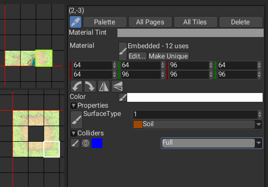
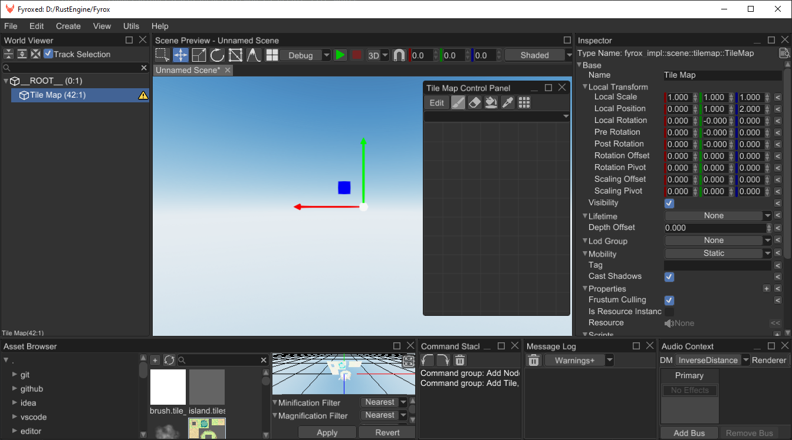
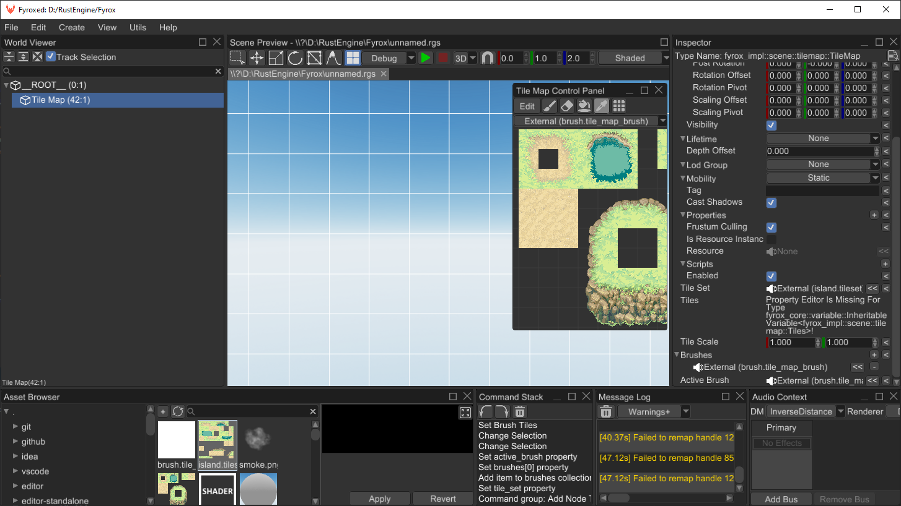
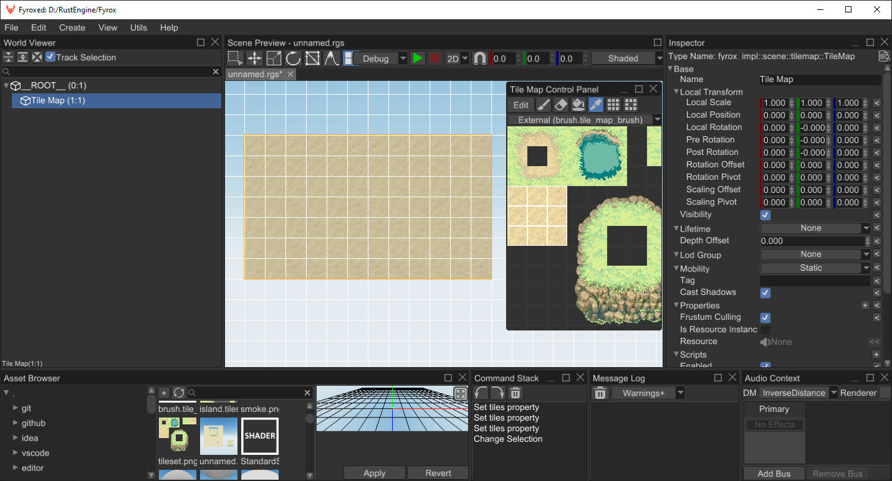
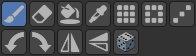
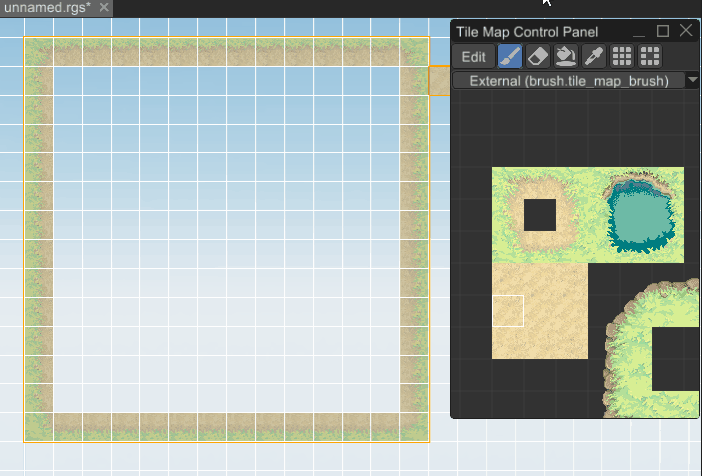
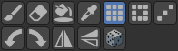
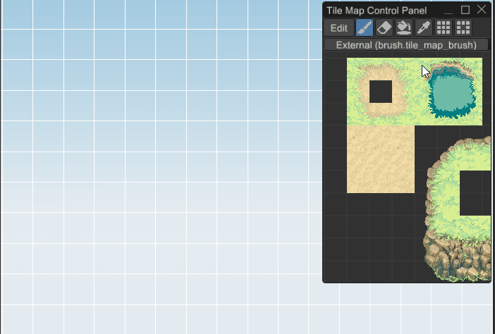
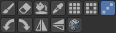

# Tile Map

Tile map is a 2D "image", made out of a small blocks called tiles. Tile maps used in 2D games to build game worlds 
quickly and easily. An example of a tile map could be something like this:


## How to Create

A tile map comes in two pieces: A `TileMap` node that can be added to a scene, and a `TileSet` resource that holds the
data required to render each tile.

Tiles in a tile set are organized into pages. Each page has a position on a 2D grid along with all the other pages in the
tile set, and each page contains another 2D grid where the tiles are arranged. Pages and tiles can be positioned anywhere
on their grids according to whatever organizational principles you please. The chosen position for each tile becomes its
handle, called a `TileDefinitionHandle`, and this handle is what will be stored in the tile map to determine how to render
the tiles.

Here is an example handle: `(0,2):(-3,5)`. This handle means that the tile is on the page at coordinates
(0,2) and the tile data is at (-3,5) within that page's grid. Once a handle like this has been put into a tile map cell,
the tile map rendering process will look for a page at that position and a tile at that position within the page.
If it fails to find a page at that position, or the tile position is empty in the page, then a pink texture will be
rendered to indicate a missing tile texture. Be aware of this if you are considering changing the position of
pages or tiles in the tile set.

**Warning:** If you change the position of a page, tile maps *will not be automatically updated to find the
page at its new position.* It may be best to choose the positions of pages carefully and never change them.

Tile set pages come in multiple varieties depending on what data will be stored in each grid cell of the page.

* **Atlas:** An atlas page renders all of its tiles using a single shared material that acts as a sprite sheet.
  The material starts at the upper-left corner of tile (0,-1) and extends down into negative-y cells and right
  into positive-x cells. Any tiles that you add to an atlas page will be rendered with their UV-coordinates based
  on their position on the page
  relative to the material.
* **Freeform:** A freeform page is a collection of tiles with their own independent materials and UV-coordinate positions.
  Unlike an atlas page, the positions of tiles in a freeform page does not matter, but each tile needs to have its
  material and UV-coordinates specified manually. Tile UV-coordinates are measured in pixels of the texture, not
  from 0.0 to 1.0.
* **Transform:** A transform set page stores handles to tiles on other pages and represents how tiles may be flipped
  or rotated. The page is divided into 2x4 sets of cells. Within each set, the left 2x2 cells hold tiles that may be
  transformed into each other by 90-degree rotations. The right 2x2 cells represent same tiles horizontally mirrored.
  The tile set resource can search its transform pages to convert any handle into the handle of a flipped or rotated
  version of the tile.
* **Animation:** An animation page stores handles to tiles on other pages and represents how tiles change their appearance
  over time. Each animation on the page is represented by a horizontal sequence of tile handles. Any tile whose handle
  is on an animation page becomes an animated tile, and its appearance will cycle from left-to-right along its row
  until it comes to an empty cell, then it will will start again from the first non-empty cell to its left.
  When tiles animate through an animation page, the tile map data does not actually change over time; only the rendering changes.

  If the same handle appears in more than one cell on an animation page, then the animation starts at the first occurrence
  of the handle, when reading the page from left-to-right and top-to-bottom, as one would read a book.

Once we have a tile set resource, we can create a tile map node and set its `tile_set` field to point to our resource.
Then we can fill the tile map node with the handles for whatever tiles we want to render.

As usual, there are two major ways of creating a tile map - via code or via the editor. Code-based approach is ideal for
procedural worlds, while the editor-based approach is good for hand-crafted worlds.

### Code

The following example creates a simple tile map with two tile types - grass and stone. It creates stone foundation and 
lays grass on top of it.

```rust
{{#include ../code/snippets/src/scene/tilemap.rs:create_tile_map}}
```

Please refer to the API docs for more info about each method.

### Editor

Editor-based approach requires a bit of preparation, yet it is still simple. First you need a tile set, something like this:


It is a 11x11 sprite sheet for a top-down game. Now you need to create a tile set resource from this tile set. Navigate
the asset browser and click on `+` button near the search bar. Select `TileSet` resource and click `OK`. Find the resource
you've just created in the asset browser, then double-click on it to open the tile set editor.


#### Creating an Atlas Page

Now it is time to create the first page for our new tile set. Click anywhere in the upper grid to select the position for
the page, then click the "Tile Atlas" button under "Create New Page" on the right side of the editor.

Because the selected page position is no longer empty, the "Create New Page" menu is replaced by an inspector for the
properties of the new atlas page. Here you can edit the material for the tiles and change the size of the tiles as measured
in texture pixels. These properties can be changed at any time, and the resulting changes will affect all the tiles of the page.

Once you have set your sprite sheet as the texture for the material, the texture will become visible in the lower grid of the
editor. Use the scroll wheel to zoom and pan if necessary to see all of it. This is only a *preview* of what the tiles might
look like; the tiles have not yet been created, and the texture is faded to distinguish it from actual tiles.
You can adjust the fade using the "Material Tint" color field in the top-right of the editor. This has no affect on the tile
set resource; it is purely cosmetic within the editor.

To actually create some tiles, left-click and drag on the lower grid to select whatever areas of the material should have
tiles. Holding shift will allow you to select multiple areas at once. Once you are satisfied with your selection,
press the "Create Tile" button on the right side of the editor. This will fill any empty selected cells with new tiles,
covering the faded material preview with the full-color of actual tiles.

#### Creating a Freeform Page

Select any empty cell in the upper grid to cause the "Create New Page" menu to appear. Click "Free Tiles" button to
start creating freeform tiles on your tile set's new page. Unlike the atlas page, a freeform page has very few properties
to edit in the inspector. This is because each tile has its own material and size fields.



Select any empty cell in the lower grid and click "Create Tile" to begin editing the properties for a new freeform tile.
At the top is a field for choosing the material for the tile. It will initially be a blank material with the
standard tile shader. Below that are four pairs of coordinates that represent for points on the material's texture as
measured in texture pixels. The left-top point represents the left-top corner of the tile, and so on around all four
corners of the tile.

Below the tile corners are four buttons for performing flips and rotations on the corner coordinates. By changing the
coordinates of the corners of the tile, the tile can be rotated by 90 degrees and flipped horizontally and vertically.

Next there is the tile's color which can be used to apply tinting or transparency to the tile.

It is also possible to add tiles to a freeform page by painting them with tools on the Tile Map Control Panel which will
be discussed later.

#### Creating a Transform Page

Once you have prepared a library of tiles with your tile set, you may want to specify which tiles are mirrored or rotated
versions of other tiles. This will allow the tile set to produce a flipped or rotated version of a tile just by giving it
the handle of the tile and the desired transformation. Start by selecting an empty page cell and clicking "Transform"
under "Create New Page."

In the lower grid area you should see that the cells have been divided into 2x4 groups. Each cell of these groups can store
a `TileDefinitionHandle` and the eight handles together will specify all possible combinations of flips and 90-degree rotations
that may be needed for a tile. The left 2x2 tiles are supposed to be a horizontal reflection of the right 2x2 tiles,
and within each 2x2 the tiles are supposed to rotate as you look clockwise or counter-clockwise around the square, as illustrated below.


In order to fill this page with tile handles, click the "Palette" button in the upper-right to open the "Tile Map Control Panel" window,
if it is not already open. This is the same window that you will use to edit a tile map, and so it has tools designed for selecting
tile handles and putting them wherever you want them. The panel should already be showing the grid of pages from your tile set.
If the panel is showing something else, then find your tile set in the asset browser and drag it onto the panel.

Use the panel to select a page from your tile set, and then select a tile that you want to put into your transform page.
Click the button with the paint brush icon to activate the brush tool, then click in the tile set editor to paint the handle
for the selected tile into a cell of the transform page. The tools available for painting, moving, copying, and deleting
tile handles will be discussed in more detail later.

#### Creating an Animation Page

In order to make your tiles move over time, first create a sequence of animation frames for your tile, and make a tile
for each from using an atlas page or a freeform page. Now we are ready to create an animation page.


While the animation page is selected, choose the frame rate for animations on this page, measured in frames per second.
All animations on the same page share the same frame rate.

Editing an animation page is just like editing a transform page, but instead of organizing the tile handles in groups of eight,
we are creating horizontal sequences of tiles. These sequences can start and end anywhere on the page, so long as there is an
empty cell immediately to the left and right of the sequence to indicate where the sequence begins and ends. The editor will
draw a mark in the empty cells to confirm where the animation starts and ends. When an animation reaches the end of the sequence
it automatically repeats.

As soon as you have finished making your animation page, your tile set will already be animating. The editor may not draw frames
as smoothly as a running game, so put some animated tiles in your tile map and then run your game to see the full effect of the animation.

#### Creating the Tile Map Node

Now we have the tile set, and we can start creating a tile map using it. Click `Create -> 2D -> Tile Map` and you should
see something like this:



If you look closely, the editor warns us about a missing tile set. Find the tile set you've just made and drag'n'drop it 
from the asset browser to the `Tile Set` field in the inspector.

## Tile Map Brush

There's one more step before we start editing the tile map—we may want a brush to paint on the tile map.
Click `+` button in the asset browser and select `TileMapBrush`, set a name for it and click `OK`.
Now select the tile map scene node and drag'n'drop the brush you've just created to "Active Brush" property.
This will make it the default brush whenever you edit this tile map node.

Double-click the brush asset in the asset browser to open the tile set editor again. This time the editor will be
in brush-editing mode, which is simpler because a brush has only one kind of page and it has no tabs for properties
or collision. The purpose of a brush is just to create convenient arrangements of tile handles from some tile set
to streamline the process of tile map editing.

Drag the tile set asset from the asset browser into the "Tile Set" field in the upper-right of the tile set editor to
store a reference to the tile set in the brush asset. The brush needs to know which tile set its tile handles refer to.

Click some empty cell in the upper grid of the editor and then click "Add Page" to add your first page to the brush.

Next, press the "Palette" button to open the Tile Map Control Panel so that you can paint some tile handles into the
new brush. Initially the control panel will show the tiles and pages of the brush you are currently editing, which
is no help when the brush is empty, so click the "Tile Set" button in the control panel to switch to showing the pages
and tiles of the tile set. Select some tiles and paint them into the brush in whatever arrangement is most convenient
for editing.

Unlike a tile set resource, the content of a brush resource is only used in the editor, so you can re-arrange the pages
and tiles of your brush or even delete your brush without any consequences for your tile map or for the running game.
While you can draw tiles to the tile map directly from the tile set, using a brush offers far more flexibility in
how you arrange your tiles, allowing you to create multiple copies of tiles and arrange tiles in convient groups that
gather your most-often-used tiles.

At this point everything is ready for painting. Select the tile map node and click tile map interaction mode button
at the top of the Scene Preview window. You should now see the tile map grid in the Scene Preview. The Tile Map Control Panel
should automatically open if it is not already open, and it should be showing the pages and tiles of your brush.



Select some tiles on the control panel and start drawing:



## Drawing Tools

There are number of tools that could be useful while editing tile maps when in the tile map interaction mode.

### Brush Tool



The brush tool takes whatever tiles are selected and puts the handles for those tiles wherever you click on the selected tile map.
The selected tiles are called the stamp, and the stamp will be used in one way or another by each of the drawing tools.
You can select any number of tiles and their handles will be drawn in the same relative positions where you click, or you can use
the flip and rotation buttons to flip and rotate the stamp before drawing it. The preview area of the Tile Map Control Panel
shows approximately what the tiles should look like when they are drawn.

### Erase Tool


Erases tiles using the shape of the current stamp. Activate it using the `2` key or by clicking on the
button with eraser icon.


### Flood Fill Tool


Fills a region with the same tile kind (or empty space) using the tiles of the current stamp.
Activate it using the button with paint bucket icon.

Unlike the other tools, the flood fill tool is not implemented for use in the Tile Set Editor,
so in the Tile Set Editor the flood tool will just act like the brush tool.



### Pick Tool


Picks a rectangular region of tiles from the tile map itself and turns them into the current stamp.
Hold shift to add additional rectangular regions to the stamp.
Activate it using the `1` key or by clicking the button with pipette icon.

Hold alt to drag the currently selected tiles and move them to a different location in the tile map,
or tile set editor page. You can also use this to change the position of a page in the tile set editor,
but beware that the position of a tile set page is part of a tile's handle, so moving a page can invalidate
any handle that refers to a tile on that page. Handles are not destroyed when they are invalidated this way;
they merely fail to render correctly until a page is added to the tile set with a tile where the handle
is expecting to find tile data.

### Rectangular Fill Tool



Fills a rectangular region with the tiles from the current stamp. It tiles the given region using the
tiles from current stamp. Could be activated using `3` key or by clicking on the button with the tiles icon.

To randomize the order of the tiles within the rectangle, toggle the on the dice button.



### Nine Slice Tool


Fills a rectangular region using a rectangluer stamp divided into nine sections: four corners, four sides, and the center.
The corners of the stamp will be placed at the corners of the selected region. The sides of the stamp will fill the sides
of the selected reation, and the center of the stamp will fill the center of the selected region.

To randomize the order of the tiles within the rectangle, toggle the on the dice button.


### Line Tool



Drag the mouse from one cell to another to draw a line of tiles between the two cells using the tiles of the current brush.

## Physics

Tile maps support physics for tiles, if collision shape data is included in the tile set. Start by opening the
tile set editor, then click on the "Collison" tab at the top of the window. This will allow you to edit
the list of collision layers of the tile set. Each layer allows a collision shape to be added to the tiles,
so with multiple layers a tile may have multiple collison shapes.

Each layer has a name and a color, and in code it can be identified by a UUID. The color is cosmetic, and
controls how the shapes on that layer appear when they are visible. The name is used to identify the layer
for a 2D rigid body.

There are currently three different ways to set the collision shape for each tile:

* **None:** The tile has no collision shape, the default.

* **Full:** The tile's full square is covered by a collision shape.

* **Custom:** The user supplies a list of triangles to construct a collision shape.

In code, custom collision shapes are created using a `fyrox::scene::tilemap::CustomTileCollider` which is a simple struct like so:

```rust
pub struct CustomTileCollider {
    /// The vertices of the triangles, with the boundaries of the tile being between (0,0) and (1,1).
    pub vertices: Vec<Vector2<f32>>,
    /// The indices of the vertices of each triangle
    pub triangles: Vec<TriangleDefinition>,
}
```

To create a custom tile collider in the editor, it is currently required that the user manually types in the information
as a list of vertices and triangle indices, such as "(0,0) (1,1) (1,0) \[0,1,2\]". This would create a triangle covering the
bottom right half of the tile. The parentheses and brackets are optional and are ignored; only the numbers and commas are parsed
to understand the user's intended triangles.


Click the eye button next to the collision layer to toggle visibility of collision shapes for that layer.
Collisions shapes will be drawn over the tiles in the color you have chosen for that collision layer,
so it is best to choose an alpha value with some transparency.

### Adding a 2D Rigid Body

Enable physics for a tile map by using the collider shape called `TileMap` and specifying the name of the layer.
In code it could be done something like this:

```rust
{{#include ../code/snippets/src/scene/tilemap.rs:tile_map_physics}}
```

In the editor it could be done by creating a static 2D rigid body with a 2D collider that has the `TileMap` shape.
Give the shape the tile map and the name of the collision layer that the rigid body is supposed to represent.


## Layers

Tile map does not support any layers on its own, but layers can be added very easily by simply creating another tile 
map with its own tile set and shifting this new layer by Z axis towards camera by some small value. 

## Tile Properties

Tile set could contain custom properties for each tile, these properties could be used to attach additional information
to the tiles in your game. This could include surface type (water, lava, dirt, etc.), physics properties (friction, 
restitution, etc.) and any other you need.

In the tile set editor, create properties using the "Properties" tab which gives you access to a list of property layers.
Each property layer has a data type, and the type must be chosen when the layer is created, since changing the type of
an already existing layer could cause tiles to have the wrong type of value for the property.


Each property may also have a list of pre-defined values. Each pre-defined value has a name and a color to help the user
visualize which tiles have that value for the property and to help keep track of the meaning of that value.
Once a property has been created in the Properties tab, the value for that property can be set for each tile in the
Tiles tab.

In code, properties can be created, set, and accessed like this:

```rust
{{#include ../code/snippets/src/scene/tilemap.rs:create_tile_map_with_props}}
```

Here we have two types of tiles - soil and slime, soil does not have any effect on player's movement speed, while the
slime slows down the player by 30%. This code does not actually use any physical contact information and just uses tile
position, but it could be fixed pretty easily - supply physical contact position to it, and it will return correct results.
