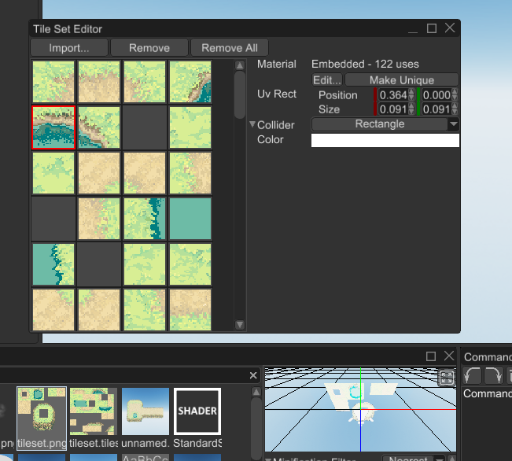
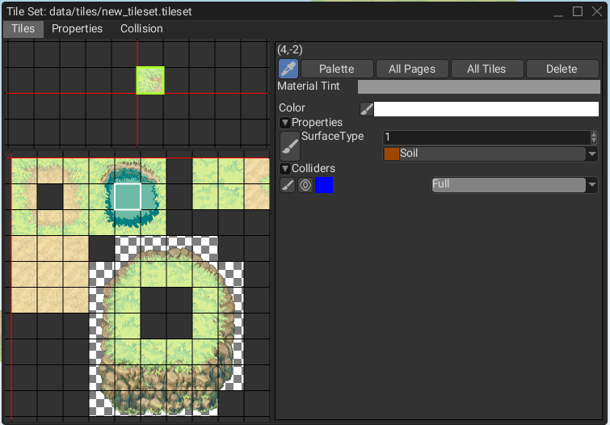

# Tile Map

Tile map is a 2D "image", made out of a small blocks called tiles. Tile maps used in 2D games to build game worlds 
quickly and easily. 

> ⚠️ This functionality is available only on nightly version of the engine and will be a part of the next stable release.
> If you want to use it, read [this chapter](../beginning/scripting.md#using-the-latest-engine-version) to learn how to
> switch to the nightly version of the engine.

An example of a tile map could be something like this:


## How to Create

As usual, there are two major ways of creating a tile map - via code or via the editor. Code-based approach is ideal for
procedural worlds, while the editor-based approach is good for hand-crafted worlds.

### Code

The following example creates a simple tile map with two tile types - grass and stone. It creates stone foundation and 
lays grass on top of it.

```rust
{{#include ../code/snippets/src/scene/tilemap.rs:create_tile_map}}
```

Please refer to the API docs for more info about each method.

### Editor

Editor-based approach requires a bit of preparation, yet it is still simple. At first, create a scene, then you need a 
tile set, something like this:


It is a 11x11 sprite sheet for a top-down game. Now you need to create a tile set resource from this tile set. Navigate
the asset browser and click on `+` button near the search bar. Select `TileSet` resource and click `OK`. Find the resource
you've just created in the asset browser, double-click on it, and you should see something like this:


At this point you could add tiles individually, or import them all at once from a sprite sheet. Keep in mind, that unlike 
other game engine, Fyrox allows you to specify not just textures, but materials for each tile. This is much more flexible
solution, since it allows you to have custom shaders for each tile. To sum everything up there are three ways of adding
tiles to the tile set:

1) Import from a sprite sheet - this way the engine will create a unique embedded material (based on standard 2D shader), 
that will use the sprite sheet as diffuse texture. Sprite sheet will be split into a number of tiles and each tile will
have its own portion (texture coordinates) of the sprite sheet.
2) Drag and drop a texture to the tile set - almost the same as the previous option, but the texture coordinates will 
take the entire image.
3) Drag and drop a material to the tile set - the most flexible way, since it allows you to specify your own material for
tile.

For simplicity, we'll use the sprite sheet. Click on `Import` button and drop the sprite sheet to the region with 
checkerboard, set the appropriate number of rows and columns:


Now click `Import` and you should see something like this:



At this point you can select desired tiles and edit their properties in the inspector on the right side. As you can see
you can change tile's material, texture coordinates, collider (more on this below), color.

Now we have the tile set, and we can start creating a tile map using it. Click `Create -> 2D -> Tile Map` and you should
see something like this:


If you look closely, the editor warns us about missing tile set. Find the tile set you've just made and drag'n'drop it 
from the asset browser to the `Tile Set` field in the inspector. There's one more step before we can start editing the
tile map - we need a brush to paint on the tile map. Click `+` button in the asset browser and select `TileMapBrush`,
set a name for it and click `OK`. Now select the tile map scene node and click on `+` sign in the `Brushes` field, drag'n'drop
the brush you've just created to the newly created property. Navigate to the `Tile Map Control Panel` and select the
brush from the dropdown list. For now the brush is empty, the simplest way to fill it is to just drag'n'drop the tile set
to it:


At this point everything is ready for painting, click `Edit` button on the `Tile Map Control Panel` and you should see the
grid:


Select some tiles on the palette and start drawing:


## Drawing Tools

There are number of tools (apart from the drawing itself) that could be useful while editing tile maps. 

### Erase


Erases tiles using the shape of the current brush, could be activated using `Shift` key or by clicking on the
button with eraser icon.

### Flood fill


Fills a region with the same tile kind (or empty space) using random tiles from the current brush. Could
be activated using the button with paint bucket icon.

### Pick


Picks a rectangular region of tiles from the tile map itself and turns them into the current brush. Could be
activated using `Alt` key or by clicking the button with pipette icon.

### Rectangular fill


Fills a rectangular region with the tiles from the current brush. It tiles the given region using the
tiles from current brush. Could be activated using `Ctrl` key of by clicking on the button with the tiles icon.

### Nine slice 


Fills a rectangular region using a 3x3 brush (the size limitation could be dropped in the future). The
corners of the brush will be placed at the corners of the selected region, the middle tiles between corners will be 
duplicated from corner to corner. The center tile will be used to fill the rest of the rectangle.

## Physics

Tile maps supports physics for tiles, and it could be enabled by using special collider shape called `TileMap`. In code
it could be done something like this:

```rust
{{#include ../code/snippets/src/scene/tilemap.rs:tile_map_physics}}
```

In the editor it could be done by creating a static 2D rigid body with a 2D collider that has `TileMap` shape: 


## Layers

Tile map does not support any layers on its own, but layers could be added very easy by simply creating another tile 
map with its own tile set and shifting this new layer by Z axis towards camera on some small value. 

## Tile Properties

Tile set could contain custom properties for each tile, these properties could be used to attach additional information
to the tiles in your game. This could include surface type (water, lava, dirt, etc.), physics properties (friction, 
restitution, etc.) and any other you need. This is how it could be used in a game:

```rust
{{#include ../code/snippets/src/scene/tilemap.rs:create_tile_map_with_props}}
```

Here we have two types of tiles - soil and slime, soil does not have any effect on player's movement speed, while the
slime slows down the player by 30%. This code does not actually use any physical contact information and just uses tile
position, but it could be fixed pretty easily - supply physical contact position to it, and it will return correct results. 

Tile custom properties could be edited in the tile set editor:

