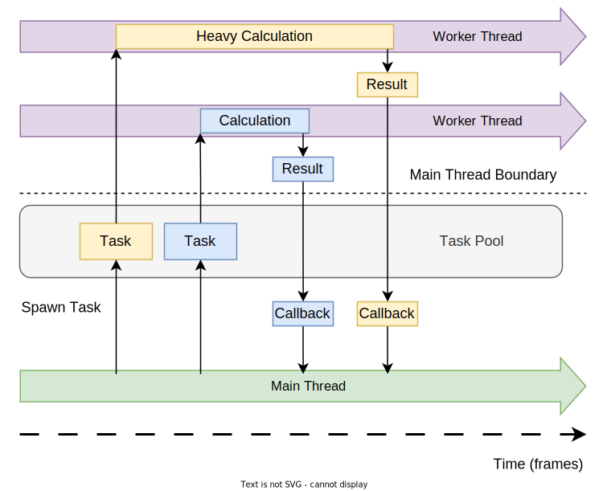

# Tasks

Fyrox supports task-based programming for both scripts and plugins. Task is a closure that does something in a separate
thread and then the result of it is returned back to the main thread. This is very useful technique, that allows you to
perform heavy calculations using all available CPU power, not just one CPU core with a single main thread. Tasks could
be used for pretty much anything, that can be done as a separate piece of work. 

## How it works

Main thread spawns a task which is then sent to the task pool. There's a fixed set of worker threads, that extracts
tasks from the task pool when there's any. Task's code is then executed in one of the worker thread, which may take
any amount of time. When the task is completed, its result is sent to the main thread and then a callback closure is
executed to do a desired action on task completion. Usually it's something relatively fast - for example you may 
spawn a task that calculates a path on a large navigational mesh and when it is done, you store that path in one of your
script instance from which the task was spawned. As you can see, there are two major parts - the task itself and the
closure. Graphically it can be represented like this:



Green line represents the main thread and the two purple lines are the worker threads. There could be any number of
worker threads, and usually it is a worker thread per each CPU core. Let's take a look at a typical task path on
this image (yellow-ish one). At first, we spawn a task, and it is immediately put in the task pool (in the same thread),
after this if we have a free worker thread it extracts our task from the pool and sends it to execution. As you can
see any task must implement `Send` trait, otherwise you'll get a _compilation error_. When the task is complete, the
worker thread sends the result (again, the result must be `Send`) to the main thread and an associated callback closure
is executed to do something with the result. While the task is being executed, the main thread is not blocked, and it 
can do other useful stuff. 

## Examples

The following example calculates a path on a navigational mesh in using task-based approach described above. At first,
it prepares the "environment" for the task by cloning a shared navigational mesh (`Arc<RwLock<NavMesh>>`) into a 
local variable. Then it spawns a new task (`async move { .. }` block) which reads the shared navigational mesh
and calculates a long path, that could take a few frames to compute (imagine a huge island, and we need to get
a path from one corner to another). As the last argument to the `spawn_script_task` method we pass a closure that
will be executed on the main thread when the task is complete. It just saves the computed path in the script's 
field which is then used for visualization.

```rust ,no_run
# extern crate fyrox;
# use fyrox::{
#     core::{
#         algebra::Vector3, log::Log, pool::Handle, reflect::prelude::*, uuid::Uuid,
#         visitor::prelude::*,
#     },
#     impl_component_provider,
#     scene::{debug::Line, navmesh::NavigationalMesh, node::Node},
#     script::{ScriptContext, ScriptTrait},
# };
# 
#[derive(Visit, Default, Reflect, Debug, Clone)]
struct MyScript {
    navmesh: Handle<Node>,
    path: Option<Vec<Vector3<f32>>>,
}

# impl_component_provider!(MyScript);
# 
impl ScriptTrait for MyScript {
    fn on_start(&mut self, ctx: &mut ScriptContext) {
        // Borrow a navigational mesh scene node first.
        if let Some(navmesh_node) = ctx
            .scene
            .graph
            .try_get_of_type::<NavigationalMesh>(self.navmesh)
        {
            // Take a shared reference to the internal navigational mesh.
            let shared_navmesh = navmesh_node.navmesh();

            // Spawn a task, that will calculate a long path.
            ctx.task_pool.spawn_script_task(
                ctx.scene_handle,
                ctx.handle,
                async move {
                    let navmesh = shared_navmesh.read();

                    if let Some((_, begin_index)) =
                        navmesh.query_closest(Vector3::new(1.0, 0.0, 3.0))
                    {
                        if let Some((_, end_index)) =
                            navmesh.query_closest(Vector3::new(500.0, 0.0, 800.0))
                        {
                            let mut path = Vec::new();
                            if navmesh
                                .build_path(begin_index, end_index, &mut path)
                                .is_ok()
                            {
                                return Some(path);
                            }
                        }
                    }

                    None
                },
                |path, this: &mut MyScript, _ctx| {
                    this.path = path;

                    Log::info("Path is calculated!");
                },
            );
        }
    }

    fn on_update(&mut self, ctx: &mut ScriptContext) {
        // Draw the computed path.
        if let Some(path) = self.path.as_ref() {
            for segment in path.windows(2) {
                ctx.scene.drawing_context.add_line(Line {
                    begin: segment[0],
                    end: segment[1],
                    color: Default::default(),
                })
            }
        }
    }
    # 
    # fn id(&self) -> Uuid {
    #     todo!()
    # }
}
```

Plugins could also spawn tasks, which operates on application scale basis, unlike script tasks which operates with
separate script instances. A plugin task is a bit easier to use:

```rust ,no_run
# extern crate fyrox;
# use fyrox::plugin::{Plugin, PluginConstructor, PluginContext};
# use std::{fs::File, io::Read};
#
struct MyGameConstructor;

impl PluginConstructor for MyGameConstructor {
    fn create_instance(
        &self,
        _scene_path: Option<&str>,
        context: PluginContext,
    ) -> Box<dyn Plugin> {
        Box::new(MyGame::new(context))
    }
}

struct MyGame {
    data: Option<Vec<u8>>,
}

impl MyGame {
    pub fn new(context: PluginContext) -> Self {
        context.task_pool.spawn_plugin_task(
            // Emulate heavy task by reading a potentially large file. The game will be fully
            // responsive while it runs.
            async move {
                let mut file = File::open("some/file.txt").unwrap();
                let mut data = Vec::new();
                file.read_to_end(&mut data).unwrap();
                data
            },
            // This closure is called when the future above has finished, but not immediately - on
            // the next update iteration.
            |data, game: &mut MyGame, _context| {
                // Store the data in the game instance.
                game.data = Some(data);
            },
        );

        // Immediately return the new game instance with empty data.
        Self { data: None }
    }
}

impl Plugin for MyGame {
    fn update(&mut self, _context: &mut PluginContext) {
        // Do something with the data.
        if let Some(data) = self.data.take() {
            println!("The data is: {:?}", data);
        }
    }
}
```

## Performance

You should avoid task-based approach for small (in time terms) tasks, because each task has additional cost which
might be larger than the actual task executed in-place. This is because you need to send your task to a separate 
thread using a channel, then the callback closure is stored as a trait object which involves memory allocation. 
Since tasks uses type erasure technique, they perform dynamic type casting which is not free. Also, there could be
any other implementation-defined "slow" spots.

A general advice would be: run a profiler first to find hot spots in your game, then try to optimize them. If you
hit the optimization limit, use tasks. Do not use tasks until you really need them, try to optimize your game first!
If you're working on a simple 2D game, you'll never need to use tasks. You might need to use tasks when your have,
for instance, a procedurally generated world that should be generated on the fly. For example, if you're making a
dungeon crawler with infinite world. Tasks are also very useful for large games with loads of content and activities.
You could off-thread AI, world manipulation (for example if you have a destructible world), etc. In other words -
do not use a sledgehammer to hammer nails, unless you have a _huge_ nail.