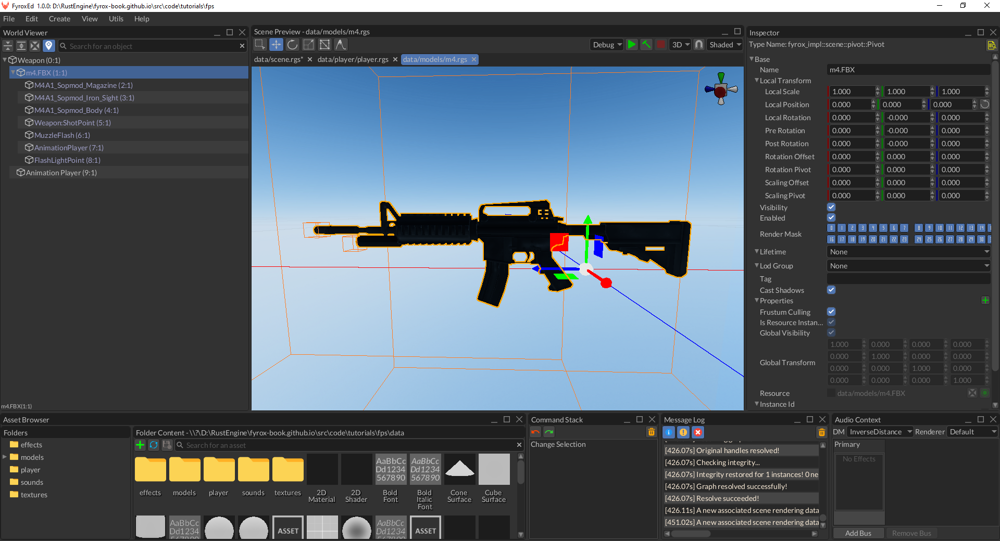
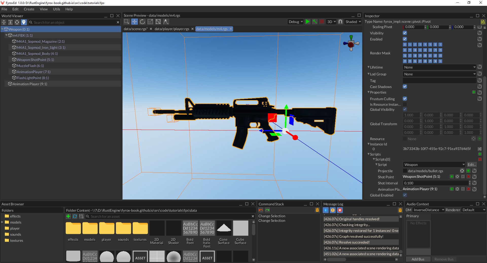
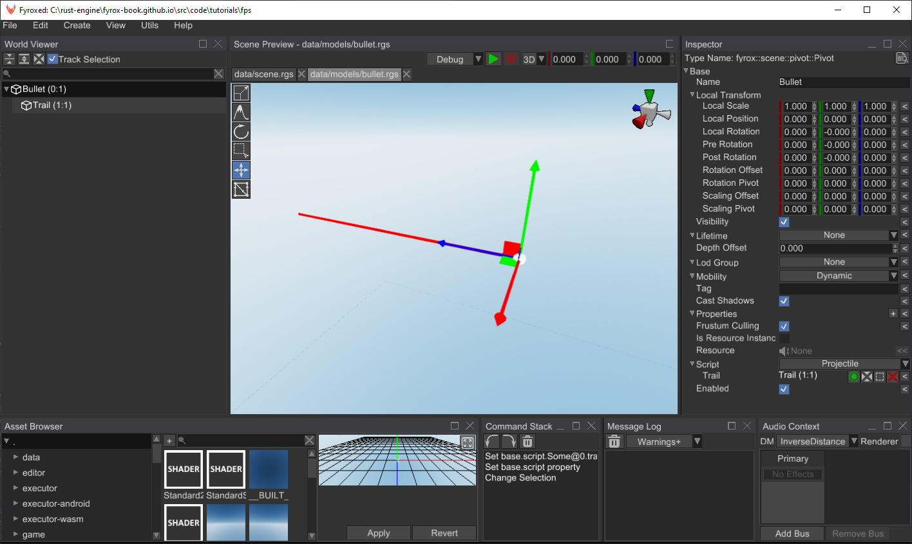
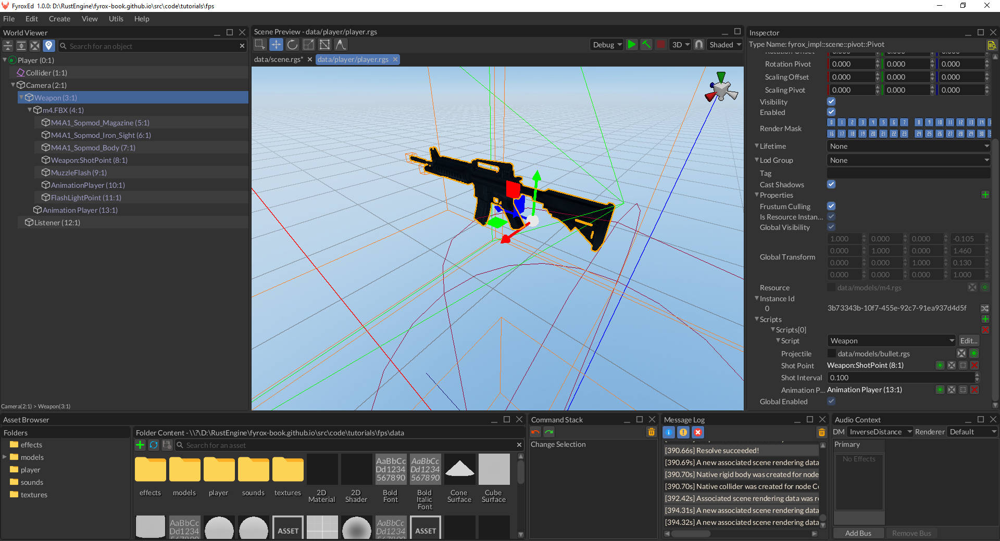
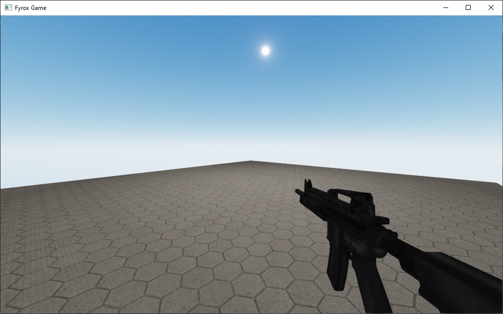
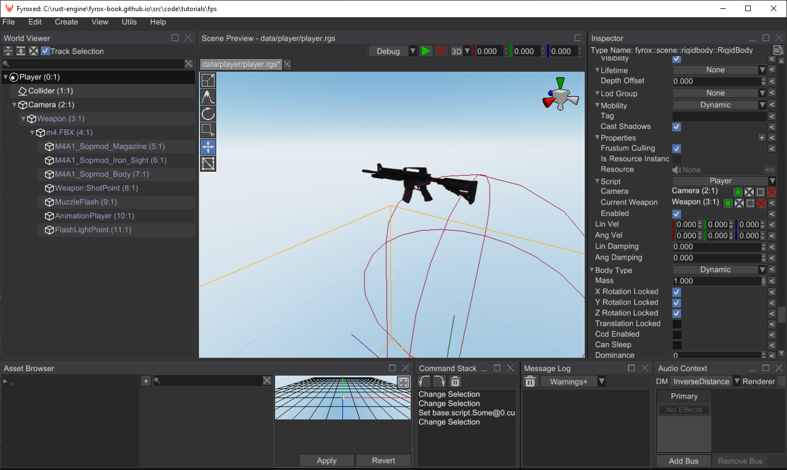
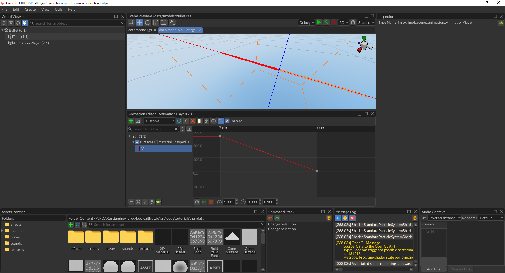
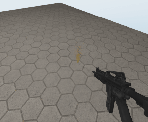

# Weapons

In the [previous tutorial](../tutorial-1/fps-tutorial.md) we've added basic character controller, but what is a 
first-person shooter without weapons? Let's add them. 

## Weapon Prefab

At first, we need a 3D model for our weapon -  use this [ZIP-archive](m4.zip) - it contains an M4 rifle 3D model that is 
prepared for direct usage in the engine. Unzip this archive in `data/models` folder. Now we can start by making a prefab 
for our weapon. Create a new scene (`File -> NewScene`) and find the `m4.FBX` 3D model in the Asset Browser and instantiate
it in the scene by dragging it using mouse. Make sure to set location position of the weapon to `(0, 0, 0)`. You
should get something like this:



This prefab is almost ready, all we need to do is to create a script for it that will contain a code for shooting.

## Code

As usual, we need a script that will "drive" our weapons, run the following command at the root folder of your game:

```shell
fyrox-template script --name=weapon
```

Add the `weapon` mod to the `lib.rs` module using `pub mod weapon;`. This script will spawn projectiles and play shooting 
animation when we'll shoot the weapon. Let's add a "reference" to our projectile prefab that will be used for shooing:

```rust
{{#include ../../../code/tutorials/fps/game/src/weapon.rs:projectile_field}}
```

This field has quite complex type: `InheritableVariable` is used for [property inheritance](../../../scene/inheritance.md),
`Option` is used to allow the field to be unassigned, and finally `ModelResource` is a reference to some projectile prefab.
We'll assign this field later in the tutorial. 

Next thing we need to define is a point from which the weapon will shoot. We can't just use the position of the weapon,
because it will look unnatural if a projectile appear at a handle of the weapon or at some other place other than the 
barrel of the weapon. We'll use a child scene node of the weapon to define such point. Let's add the following field 
to the `Weapon` struct.

```rust
{{#include ../../../code/tutorials/fps/game/src/weapon.rs:shot_point}}
```

We'll assign this field later in the tutorial as well as projectile prefab. 

Now we need some mechanism to "tell" the weapon to shoot, we could directly access the weapon script and call some `shoot`
method, but in more or less complex game would almost certainly lead to lots of complaints from borrow checker. Instead
of this, we'll use [message passing mechanism](../../../scripting/script.md#message-passing) - this will allow us to
send a request for the weapon to shoot and the weapon will shoot when it will receive the message. Let's add a message
for shooting in `weapon.rs`:

```rust
{{#include ../../../code/tutorials/fps/game/src/weapon.rs:shoot_message}}
```

To actually be able to receive this message, we need to explicitly "subscribe" out script to it. Add the following code
to the `on_start` method:

```rust
{{#include ../../../code/tutorials/fps/game/src/weapon.rs:on_start}}
```

Every script has `on_message` method that is used for a message processing, we'll use it for shooting. Add the following
code in the `impl ScriptTrait for Weapon`:

```rust
{{#include ../../../code/tutorials/fps/game/src/weapon.rs:on_message_begin}}
{{#include ../../../code/tutorials/fps/game/src/weapon.rs:on_message_end}}
```

This code is pretty straightforward: at first, we're checking the message type, then we're checking if we have a prefab
for projectiles. If so, we're fetching a position of the shot point scene node and finally instantiating the projectile
prefab.

All is left to do is to register this script and assign it in the editor. To register the script, add the following 
code to the `register` method in `lib.rs`:

```rust
{{#include ../../../code/tutorials/fps/game/src/lib.rs:weapon_script_reg}}
```

Start the editor and open `m4.rgs` prefab that we made at the beginning. Select the root node of the scene add `Weapon`
script to it. Assign a `Weapon:ShotPoint` node to the `Shot Point` property:



The next thing we need to do is to create a prefab for projectile, that will be used for shooting.

## Projectile

You mask ask - why we need a prefab for projectiles, why not just make a ray-based shooting? The answer is very simple -
flexibility. Once we'll finish with this "complex" system, we'll get very flexible weapon system that will allow you 
to create weapons of any kind - it could be simple bullets, grenades, rockets, plasma, etc. 

As usual, we need a prefab for our projectile. Create a new scene and add a Cylinder mesh scene node there, make sure
to orient it along the Z axis (blue one) and adjust its XY scale to make it thin enough - this will be our "projectile".
It will represent a bullet trail, but in reality the "bullet" will be represented by a simple ray cast and the trail
will be extended to a point of impact. Overall your prefab should look like this:


Select the root node of the prefab and set its lifetime to `Some(0.1)` - this will force the engine to remove the 
projectile automatically after 100 ms.

The projectile also needs its own script which will do a ray casting and other actions later in the tutorial, such as
hit testing with enemies, etc. Create a new script by a well known command:

```shell
fyrox-template script --name=projectile
```

Add the `projectile` mod to the `lib.rs` module using `pub mod projectile;` and register it in `register` method:

```rust
{{#include ../../../code/tutorials/fps/game/src/lib.rs:projectile_script_reg}}
```

Go to `projectile.rs` and add the following field to the `Projectile` struct:

```rust
{{#include ../../../code/tutorials/fps/game/src/projectile.rs:trail_field}}
```

This field will hold a handle to the trail (the red cylinder on the screenshot about) and we'll use this handle to 
borrow the node and modify the trail's length after ray casting.

The ray casting itself is the core of our projectiles, add the following code to the `on_start` method:

```rust
{{#include ../../../code/tutorials/fps/game/src/projectile.rs:on_start_begin}}
{{#include ../../../code/tutorials/fps/game/src/projectile.rs:on_start_end}}
```

This code is pretty straightforward - at first we're borrowing the node of the projectile, saving its global position 
in a variable and then casting a ray from the position and in the "look" direction of the projectile. Finally, we're 
taking the first intersection from the list (it will be the closest one) and adjusting the trail's length accordingly.

The final step is to assign the script and its variables in the editor. Run the editor, open `bullet.rgs` (or how your
prefab is called) prefab and select the root node, set `Projectile` script to it and set `trail` field to the Trail node.
It should look like so:



## Gluing Everything Together

We have everything ready for final tuning - in this section of the tutorial we'll finish putting everything together and
will have a fully functioning weapon. Let's start from our weapon prefab, we need to "inform" it about the projectile
prefab we've just made. Open the `m4.rgs` prefab of our weapon and find `projectile` field in the Weapon script there.
Now find the `bullet.rgs` prefab of the projectile and drag'n'drop it onto the `projectile` field to set the value of it:


The last step is to add the weapon to the player. Open the `player.rgs` prefab and find the `m4.rgs` prefab in the 
Asset Browser, instantiate it in the scene and make it a child of the camera node. Overall it should look like this:



We almost finished our final preparations, you can even open `scene.rgs` and hit `Play` and see the weapon in game:



However, it won't shoot just yet - we need to send a message to the weapon for it to shoot. To do that, at first, we
need to know to which weapon we'll send a request to shoot. It is very easy to do by using weapon's node handle. Add
the following field to the `Player` struct:

```rust
{{#include ../../../code/tutorials/fps/game/src/player.rs:current_weapon_field}}
```

We'll send a request to shoot in reaction to left mouse button clicks. To do that, go to `player.rs` and add the 
following code to the `on_os_event`:

```rust
{{#include ../../../code/tutorials/fps/game/src/player.rs:shooting}}
```

And the following code to the `on_update`:

```rust
{{#include ../../../code/tutorials/fps/game/src/player.rs:shooting_on_update}}
```

The last step is to assign the handle to the current weapon in the player's prefab. Open the `player.rgs` prefab in
the editor and in the Player script find the `Current Weapon` field and assign to the Weapon node like so:



Run the game, and you should be able to shoot from the weapon, but it shoots way too fast. Let's make the weapon to 
shoot with desired interval while we're holding the mouse button. Add the two timer variables to the `Weapon` struct:

```rust
{{#include ../../../code/tutorials/fps/game/src/weapon.rs:shot_timer}}
```

The `shot_timer` variable will be used to measure time between shots and the `shot_interval` will set the 
desired period of shooting (in seconds). We'll handle one of these variables in `on_update` method:

```rust
{{#include ../../../code/tutorials/fps/game/src/weapon.rs:on_update}}
```

This code is very simple - it just decreases the timer and that's all. Now let's add a new condition to the 
`on_message` method right after `if message.downcast_ref::<ShootWeaponMessage>().is_some() {` line:

```rust
{{#include ../../../code/tutorials/fps/game/src/weapon.rs:shooting_condition}}
```

Open the `m4.rgs` prefab in the editor and set the interval in the `Weapon` script to 0.1. Run the game and the
weapon should shoot less fast.

## Bells and Whistles

We can improve overall feeling of our weapon by adding various effects. 

### Trail Dissolving

Our shot trails disappear instantly and this looks unnatural. It can be fixed very easy by using animations.
Read the docs about the [animation editor](../../../animation/anim_editor.md) first to get familiar with it. 
Open the `bullet.rgs` prefab, add `Animation Player` node to the prefab and open the animation editor.
Add a new track that binds to the alpha channel of the color of the trail's material:



Also, make sure the `Unique Material` check box is checked in the material property of the trail's mesh. Otherwise,
all trails will share the same material and once the animation is finished, you won't see the trail anymore. 
Run the game and shot trails should disappear smoothly.

### Impact Effects

Right now our projectiles does not interact with world, we can improve that by creating sparks effect
at the point of impact. Download [this](bullet_impact.zip) pre-made effect and unzip it in `data/effects` folder. 

Add the following field to the `Projectile` struct:

```rust
{{#include ../../../code/tutorials/fps/game/src/projectile.rs:effect_field}}
```

This is a "link" to particle effect, that we'll spawn at the impact position. Let's add this code to the end
of `on_start` of `impl ScriptTrait for Projectile`:

```rust
{{#include ../../../code/tutorials/fps/game/src/projectile.rs:effect_spawn}}
```

The last thing we need to do is to assign `Impact Effect` property in `bullet.rgs` to the pre-made effect. 
Run the game, and you should see something like this when shooting:



### World Interaction 

In this section we'll add an ability to push physical objects by shooting. All we need to do is to add the 
following code to at the end of `on_start` of `impl ScriptTrait for Projectile`:

```rust
{{#include ../../../code/tutorials/fps/game/src/projectile.rs:object_pushing}}
```

This code is very straightforward: at first, we're taking the closest intersection and by using its info about
collider taking a reference to the rigid body we've just hit by the ray. Next, we're applying force at the point
of impact, which will push the rigid body.

To check how it works, unzip [this prefab](barrel.zip) to `data/models` and add some instances of it to the `scene.rgs` 
and run the game. You should see something like this:


### Recoil

Work-in-progress.

## Conclusion

In this tutorial part we've added weapons that can shoot projectiles, which in their turn can interact with the 
environment.