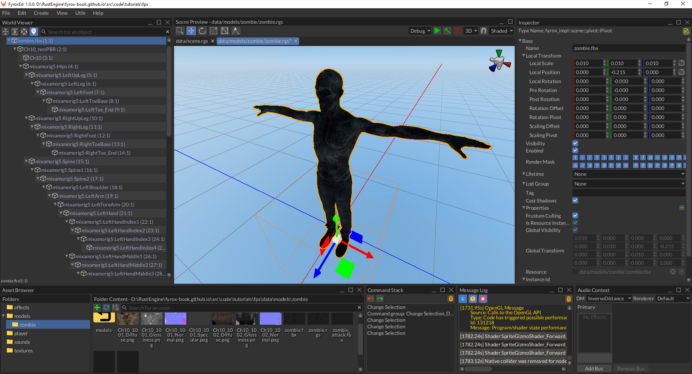
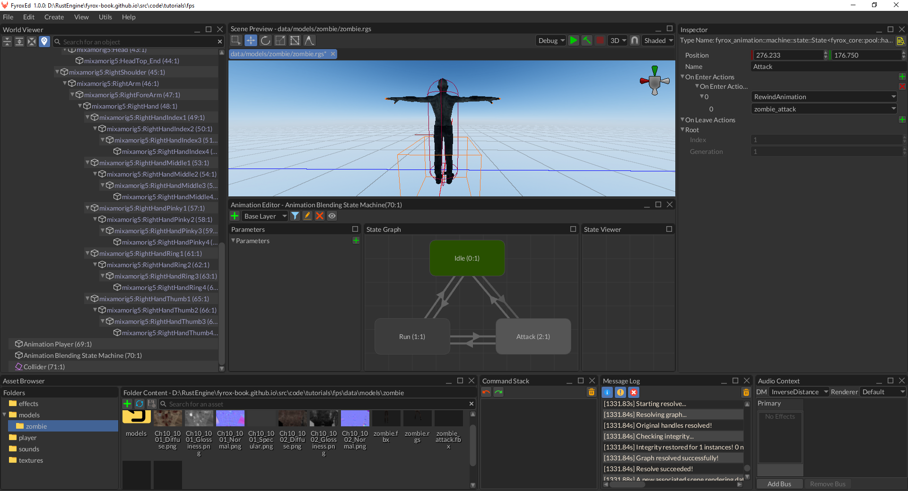
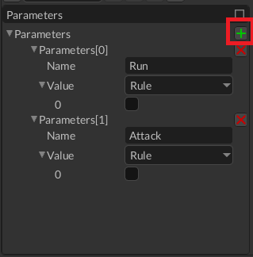
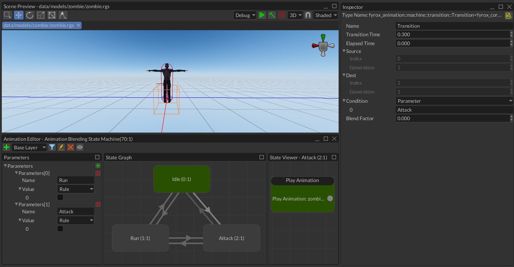
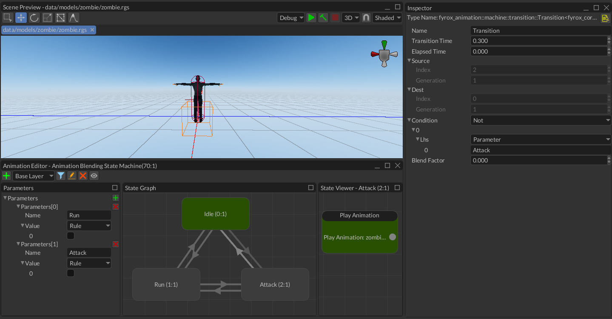
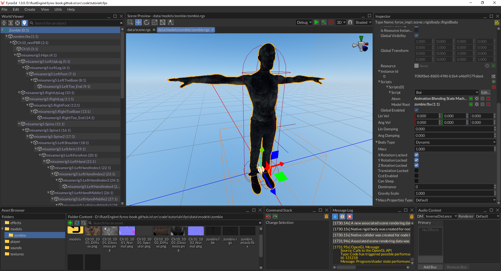
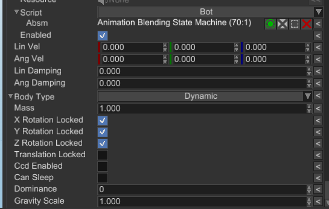

# Bots and AI

In the [previous](../tutorial-2/fps-tutorial-2.md) we've added weapons and projectiles, but we still do not have 
anything to shoot at. In this tutorial part we'll add bots with simple AI:


## Bot Prefab

Let's start by zombie 3D model and animations for it, grab it from [here](zombie.zip) and unpack into 
`data/models/zombie` folder. Open the editor and create `zombie.rgs` scene. Instantiate a `zombie.FBX` 3D model
in the scene and make sure it is located at (0, 0, 0) coordinates. Scale it down to have 0.01 scale in both axes.
You should get something like this:



Next thing that we'll add is animations. Create a new Animation Player scene node, open the animation editor 
and add three animations (use [this chapter](../../../animation/anim_editor.md#animation-importing) to learn how to 
do this) - `zombie_attack`, `zombie_idle`, `zombie_running`. You should get something like this:


Do not forget to disable looping for `zombie_attack` animation, otherwise our zombie will attack infinitely.
Also, make sure to set up the root motion for the `zombie_running` animation, read 
[this chapter](../../../animation/root_motion/root_motion.md) for more info. Root motion will allow us to get
nice animation of movement, which will also serve as a source velocity for our bot.

You can select each animation from the list and see how it plays by clicking the "Preview" check box at the 
toolbar. Animations by their own are not very useful for us, because our bot can be in multiple states in the
game:

- Idle - when there's no one around and the bot is just standing still; looking for potential targets.
- Run - when the bot spotted someone and walks towards it.
- Attack - when the bot is close enough to a target and can attack it.

We need to somehow manage all these states and do smooth transition between the states. Fyrox has a special
tool for this called [animation blending state machine](../../../animation/blending.md) (ABSM). Let's create a new 
ABSM scene node and add the three states mentioned above (if you don't know how - 
[read this chapter](../../../animation/absm_editor.md)):



Connect them with bidirectional transitions and set transition time for them to 0.3s. Select the Animation Blending 
State Machine node and assign `Animation Player` property in the Inspector. 

Now add `Play Animation` pose node for each of the states (double-click on a state, right-click, Play Animation)
and set an appropriate animation from the list in the inspector. For example, for `Idle` state it could look 
like this:


Click `Preview` check box, and you should see the bot with `Idle` animation playing. Let's add two parameters 
that will be used for transitions:



All we need to do now is to thoroughly set these variables in all six transitions. Select the `Idle -> Attack`
transition and in the Inspector find `Condition` property and type in `Attack` parameter name:



For the opposite transition you need to add almost the same, but with additional `Not` computational node:



Do the same for the rest of four transitions, all six transitions should have these values set:

- `Idle -> Attack` - Parameter(Attack)
- `Attack -> Idle` - Not(Parameter(Attack))
- `Idle -> Run` - And(Parameter(Run), Not(Parameter(Attack)))
- `Run -> Idle` - Not(Parameter(Run))
- `Run -> Attack` - And(Parameter(Run), Parameter(Attack))
- `Attack -> Run` - And(Parameter(Run), Not(Parameter(Attack)))

Click `Preview` and click on some parameters, you should see transitions between states.

You may probably notice that there's something off with `Attack` state, sometimes it enters it in mid-attack
state. This happens because the attack animation could be in arbitrary play time. It could be fixed by adding
a `Rewind Animation` action when entering `Attack` state. Select the `Attack` state, find `On Enter Actions` in
the Inspector and add a new action by clicking `+` button, select `Rewind Animation` and select `zombie_attack`
from the list.

Great, now we have all animations working, and now we can add a physical capsule for the bot, so it won't fall
through the ground. Replace the root node of the prefab with a Rigid Body, add a capsule collider child node to 
it, adjust its size to fully enclose the bot (we did the same in the first tutorial, but for player):



Do not forget to disable rotations for the rigid body (`X/Y/Z Rotation Locked` properties must be checked) and
disable sleeping for it (uncheck `Can Sleep`). For now, our prefab is more or less finished. As usual, we need to 
write some code, that will drive the bot.

## Code

Add a new script using the following command:

```shell
fyrox-template script --name=bot
```

Add this module to the `lib.rs` module as we did in the previous tutorials. Register the bot in the `register`
method like so:

```rust
{{#include ../../../code/tutorials/fps/game/src/lib.rs:bot_script_reg}}
```

At first, our bot needs an ability "to see". In games such ability can be represented by a simple frustum with 
its top at the head of the bot and the base oriented forward. We can construct such frustum from a pair of 
matrices - view and projection. After that the frustum can be used for simple frustum-point intersection check. 
We'll check if the player's position intersects with the bot's viewing frustum and if so, the bot will start 
chasing the player. On to the code we go, add the following field to the `Bot` struct:

```rust
{{#include ../../../code/tutorials/fps/game/src/bot.rs:frustum}}
```

To construct the frustum, add the following code somewhere in the `bot.rs`:

```rust
{{#include ../../../code/tutorials/fps/game/src/bot.rs:frustum_update}}
```

We'll call this method every frame to keep the frustum updated with the current location and orientation of
the bot. Add the following code to the `on_update` method:

```rust
{{#include ../../../code/tutorials/fps/game/src/bot.rs:on_update_1}}
{{#include ../../../code/tutorials/fps/game/src/bot.rs:on_update_2}}
```

Now we need to check if the player's position intersects with the frustum. Add the following code at the beginning
of `on_update`:

```rust
{{#include ../../../code/tutorials/fps/game/src/bot.rs:frustum_check}}
```

In this code we're iterating over the all available scene nodes and check if a node has `Player` script and
if the node's position intersects with the bot's frustum. If so, we're remembering this node as a target. 
Do not forget to add this code to the `Bot` struct:

```rust
{{#include ../../../code/tutorials/fps/game/src/bot.rs:target_field}}
```

Now we need to add movement for the bot, we'll use [root motion](../../../animation/root_motion/root_motion.md#how-to-use)
for that. Root motion will be extracted from the animation blending state machine we've made earlier. Let's
add this code to the `Bot` struct:

```rust
{{#include ../../../code/tutorials/fps/game/src/bot.rs:absm_field}}
```

The first field will hold a handle to the ABSM and the second - a handle to the 3D model root. We'll assign 
these field later, now we need to add the code that will extract velocity vector for the bot movement and apply
this vector to the rigid body of the bot:

```rust
{{#include ../../../code/tutorials/fps/game/src/bot.rs:root_motion_1}}
{{#include ../../../code/tutorials/fps/game/src/bot.rs:root_motion_2}}
```

At first, we're getting current world-space transform of the 3D model's root and saving it into a local variable.
Then we're borrowing the ABSM we've made earlier and extracting the root motion offset vector. As a final step
we're scaling it by `1.0 / dt` factor to convert it to velocity. This final velocity vector needs to be set to
the rigid body of the bot. To do that, add the following code at the end of the last `if` statement (where
we're borrowing the rigid body):

```rust
{{#include ../../../code/tutorials/fps/game/src/bot.rs:rigid_body_velocity}}
```

Next we need to somehow inform the ABSM about the current state of the bot. Remember that we have two parameters
in the ABSM? We need to set them from the code, it could be done like so:

```rust
{{#include ../../../code/tutorials/fps/game/src/bot.rs:rigid_body_velocity}}
```

Now it's time to do small adjustments to our prefabs. Open the `zombie.rgs` prefab and assign the `Bot` 
script to the root node of the prefab, set its properties like so:



Open the `scene.rgs`, find the `zombie.rgs` prefab in the asset browser and instantiate it in the scene:


Now you can run the game and walk in front of the bot, it should run, but it runs straight and does not follow
the target (the player). Let's fix that. At first, we need to calculate an angle between a target and the bot.
We'll calculate it using `atan2` trigonometric function, add the following code somewhere in `on_update`:

```rust
{{#include ../../../code/tutorials/fps/game/src/bot.rs:angle_calculation}}
```

This code calculates a vector between the bot's position and a target, and then calculates an angle in XZ plane,
using `atan2(x, z)` trigonometric function. Let's use this angle, add the following code the end of the 
last `if` statement (where we're borrowing the rigid body):

```rust
{{#include ../../../code/tutorials/fps/game/src/bot.rs:angle_usage}}
```

This code is trivial - we're making a rotation quaternion, that rotates the bot around Y axis using the angle
we've calculated.

Run the game and the bot should follow you as long as it sees you:


## Conclusion

In this tutorial part we've added bots with animation and simple AI. In the next tutorial we'll add an ability to 
kill the bots.