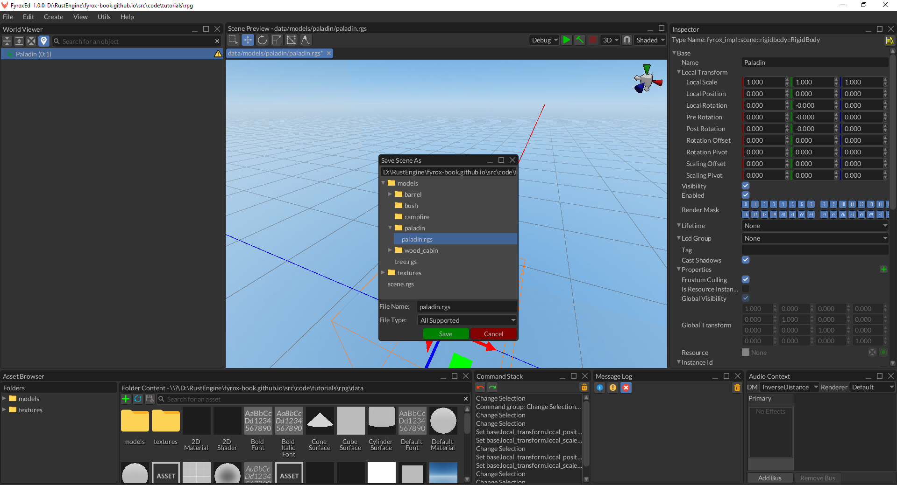
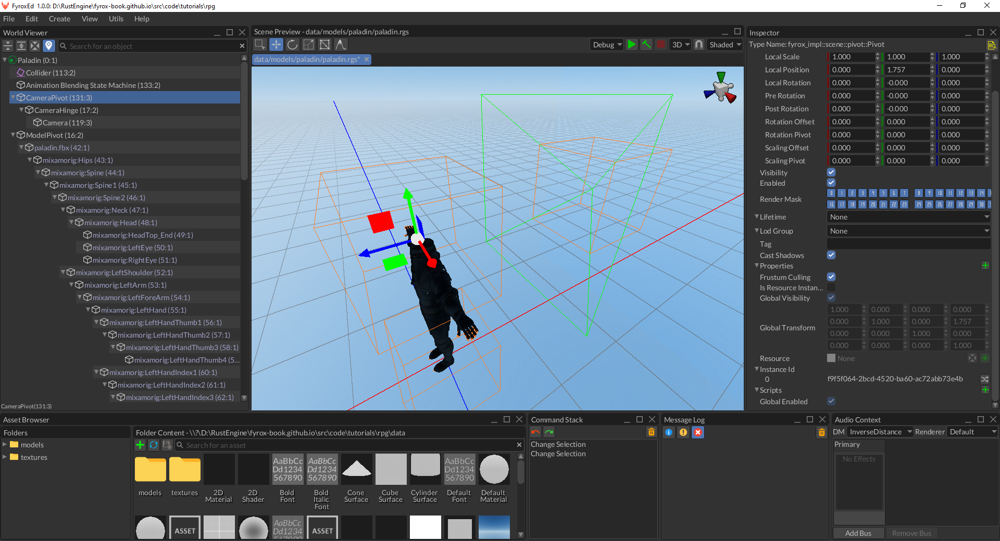
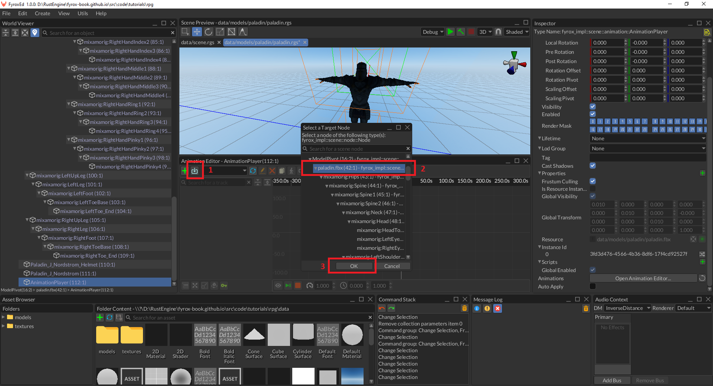
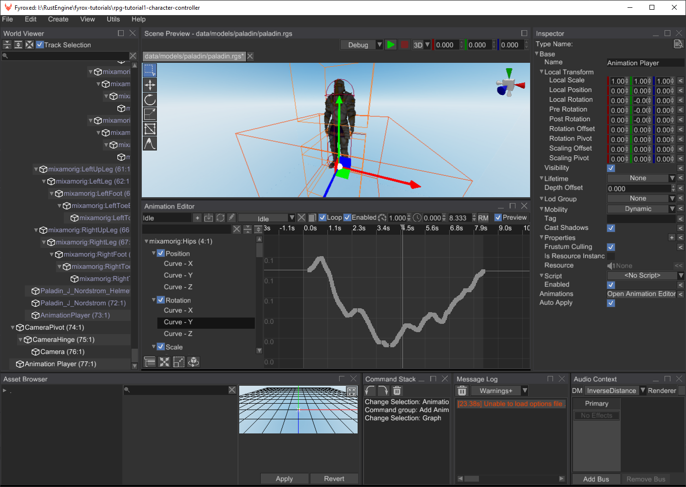
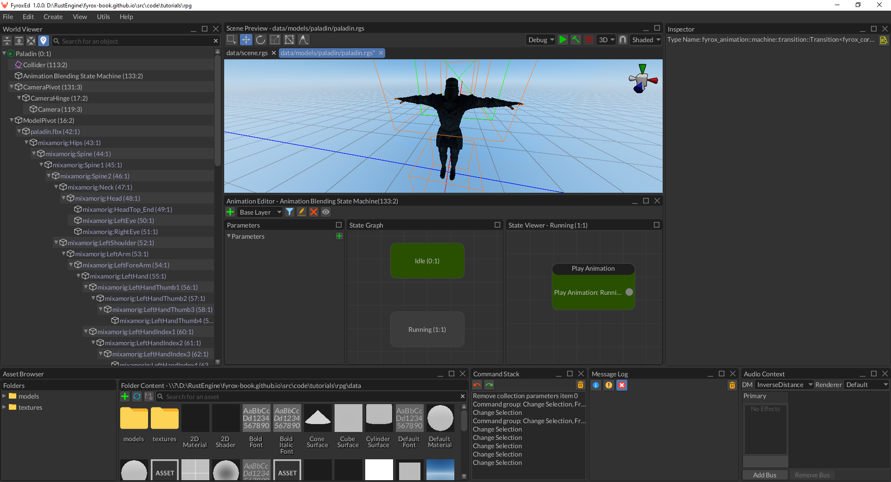
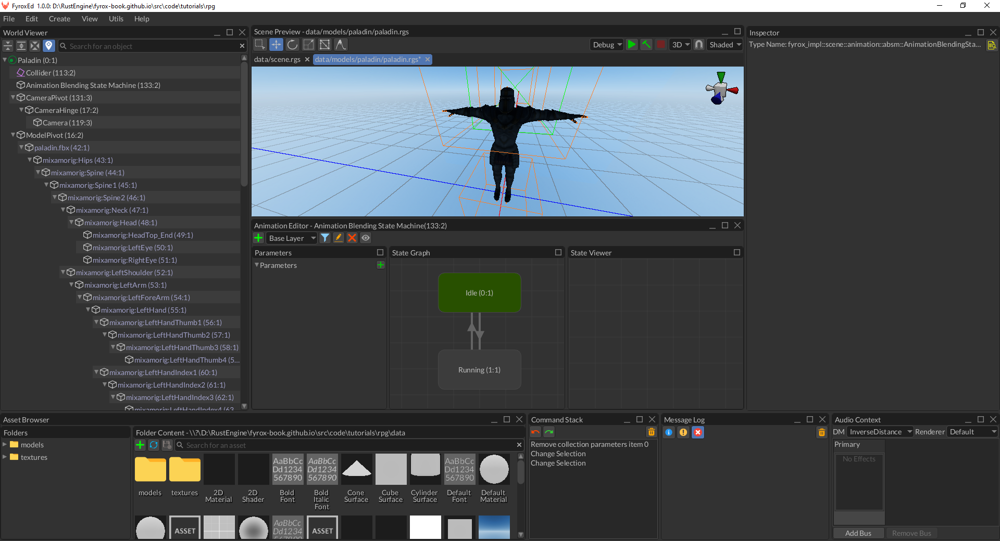
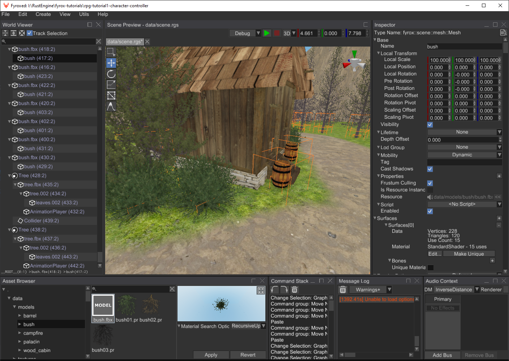
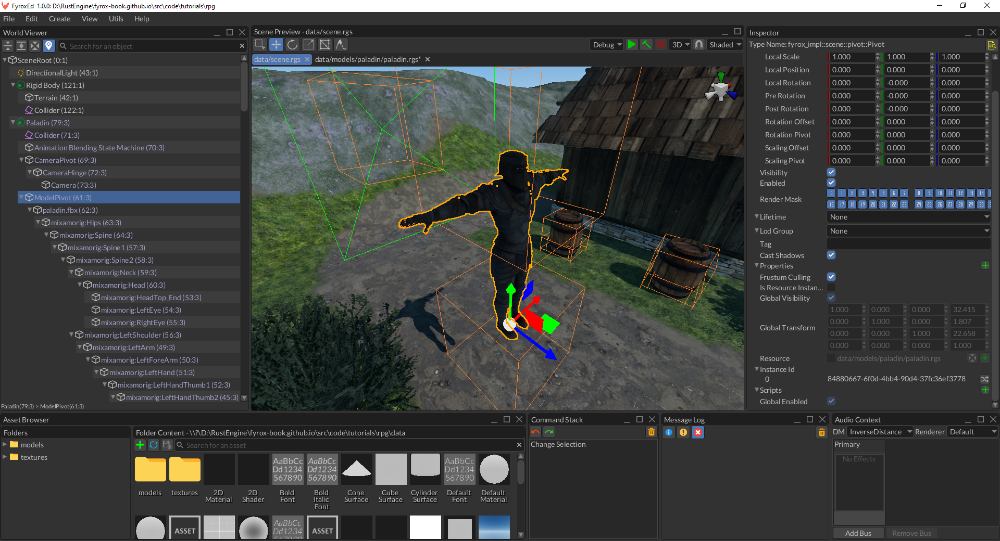

# RPG Tutorial Part 1 - Character Controller

**Source code**: [GitHub](https://github.com/FyroxEngine/Fyrox-tutorials/tree/main/rpg-tutorial1-character-controller)

## Table of contents

- [Introduction](#introduction)
- [Assets](#assets)
- [Player Prefab](#player-prefab)
  - [Camera](#camera)
  - [Animations](#animations)
- [Player Script](#player-script)
  - [Event Handling](#event-handling)
  - [Logic](#logic)
  - [Binding](#binding)
- [Level](#game-level)
- [Conclusion](#conclusion)

## Introduction

In this series of tutorials we will make a game similar to The Elder Scrolls series (but much, much smaller indeed),
we'll have a main character, a simple world with intractable items and a few kind of enemies. In this series you'll 
understand how to add an inventory, a quests journal, and the quests itself. This series should have at least 5 
tutorials, but this might change. At the end of the series we'll have a playable RPG which you will be able to use to 
continue making your own game. It is very ambitious, but totally doable with the current state of the engine.

Most of the role-playing games (RPGs for short) using 3rd person camera which allows you to see your character entirely.
In this tutorial we'll make something similar. Check the video with final result of the tutorial:

<iframe width="560" height="315" src="https://www.youtube.com/embed/l2ZbDpoIdqk" title="YouTube video player" frameborder="0" allow="accelerometer; autoplay; clipboard-write; encrypted-media; gyroscope; picture-in-picture" allowfullscreen></iframe>

As you can see, at the end of the tutorial we'll be able to walk and explore a small fantasy world. Let's start by 
creating a new game project, by running the following command:

`fyrox-template init --name=rpg --style=3d`

This command will create a new cargo workspace with a few projects inside, we're interested only in `game` folder
in this tutorial.

```text
rpg
├───data
├───editor
│   └───src
├───executor
│   └───src
├───executor-android
│   └───src
├───executor-wasm
│   └───src
└───game
    └───src
```

Learn more about `fyrox-template` command [here](../../../beginning/scripting.md). Now we can run
the game using `cargo run --package executor` command, and you should see a white cube floating in blue space. 

> ️⚠️ There are two important commands:  
> To run the game use: `cargo run --package executor` command  
> To run the editor use: `cargo run --package editor` command.

## Assets

For any kind of game you need a lot of various assets, in our case we need a 3D model for our character, a set of
animations, a level, a set of textures for terrain, trees and bushes, barrels, etc. I prepared all assets as a single
ZIP archive which can be downloaded [here](./data.zip). Once you've downloaded it, unpack it in `./data` folder.

## Player Prefab

Let's start from assembling our player prefab, that will also have a camera controller in it. At first, let's find out
what the prefab is - prefab a scene, that contains some scene nodes, which can be instantiated to some other scene 
while preserving "connection" between all properties of the nodes. It means, that if you change something in a prefab, 
the changes will be reflected on every instance of it; on those properties that weren't modified. This is a condensed 
explanation, that may look a bit complicated - [read this](../../../scene/prefab.md) to learn more about prefabs.

Now let's open the editor (`cargo run --package editor`) and start making our prefab by creating a new scene. Save the
scene to `data/models/paladin/paladin.rgs` by going to `File -> Save`. In the opened window, find the path and click 
`Save`:



Let's rename the root node of the scene to `Paladin` and change its type to `RigidBody`:


We need this so out root node of the prefab could move in a scene to which it will be instantiated later. Make sure, that
the `X/Y/Z Rotation Locked` property is set to `true`. Also `Can Sleep` must be false, otherwise the rigid body will
be excluded from the physical simulation when it does not move. As you can see, the editor shows a small warning icon 
near the root node - it warns us, that the rigid body does not have a collider and won't be able to participate in 
physical simulation. Let's fix it by adding a capsule collider to it and setting its `Begin`, `End`, `Radius` properties
accordingly:


The next step is to add an actual character 3D model, this is very easy - find `paladin.fbx` in the asset browser using
its searching functionality and then drag'n'drop (click on the asset, and while holding the button, move the mouse in
the scene, then release the button) it to the scene:


Now we need to adjust its `Local Scale` property, because the model is too big. Set it to `0.01` for all 3 axes, like on
the screenshot above. Also, adjust position of the capsule collider, so it will fully enclose 3d model. Create a new 
`Pivot` node called `ModelPivot` and attach the `paladin.fbx` node to it by drag'n'dropping the `paladin.fbx` node onto
`ModelPivot`. The reason why we need to do this will be explained later in the tutorial.


### Camera

It is the time to add camera controller scene nodes. We need to add three nodes in a chain:



There are three nodes added:

1) `CameraPivot` (`Pivot` node type) - it will serve a pivot point around which we will rotate the camera around Y axis.
   (horizontal camera rotation). It should be placed right at the center of the Paladin's head.
2) `CameraHinge` (`Pivot` node type) - it will also be a pivot point, but for X axis (vertical camera rotation)
3) `Camera` (`Camera` node type) - the camera itself, it should be placed on some distance from the Paladin's back.

This nodes configuration will allow us to create some sort of "orbital" (also called arcball) camera as in many 3rd person
games nowadays. 

### Animations

The next step is to add animations. Create a new `Animation Player` node, click `Open Animation Editor` near its 
`Animations` property in the inspector to open the animation editor:


Dock the animation editor below the scene preview - this way it will be much comfortable to use. Now we need to import
two animations `run.fbx` and `idle.fbx` from the `data/models/paladin` folder. To do this, click on the button with
arrow at the tool strip in the animation editor: 



The editor asks us for the root node to which import the animation - it our case it is `paladin.fbx`. Select it in the
window and click `OK`. Another window opens and asks us about the animation we want to import - find `idle.fbx` in the
tree and click `Open`. You should see something like this as a result:



Click on `Preview` check box in the tool strip and the animation should play without artifacts. Now repeat the previous
steps and import `running.fbx`. Click `Preview` again, and you'll see that the character is running, but not in-place as
we'd like it to. Let's fix that by applying a Root Motion settings. Click on the `RM` button and set it up like so:


Now if you click on `Preview` again, you'll see that the character is now moving in-place. But what we did by applying 
the root motion? We forced the engine to extract movement vector from the hips of the character that could be later used
to move the capsule rigid body we've made early. This way the animation itself will drive the character and the actual
movement will perfectly match the physical movement.

At this point we have two separate animations that work independently. But what if we want to add a smooth transition
between the two (or more)? This is where animation blending state machines comes into play. Create a new state machine
and assign an animation player to it:


The animation player will be used as a source of animations for our state machine. Now open the `ABSM Editor` by clicking
the `Open ABSM Editor...` button in the inspector (right above the animation player property). Dock the editor and select 
a `Base Layer` in the dropdown list in the toolbar. Next, we need to add two states - `Idle` and `Running`. This can be 
done by right-clicking on in the `State Graph` and selecting `Create State`:



A state requires animation source to be usable, we can specify it by double-clicking on it (or right-click -> `Enter State`)
and creating a `Play Animation` pose node in the `State Viewer` (right-click -> `Play Animation`):


Select the `Play Animation` node and in the `Inspector` select the `Idle` animation from the dropdown list near the 
`Animation` property. Repeat the same steps for the `Running` state, but in this case set `Running` animation.

Now when we two states ready, we need to create transitions between the two. Transition is a "rule", that defines whether 
a current active state can be switched to another one. While doing so, the engine will blend an animation coming from
two states. To create a transition, right-click on a state and click `Create Transition`. Do the same in the opposite
direction. As a result, you should have something like this:



A transition requires a boolean value to "understand" whether an actual transition is possible or not. Let's add one
in the `Parameters` section of the editor. Click on the small `+` button and change the name to `Running` and the type
to the `Rule`:


Let's assign the rule to our transitions, select the `Idle -> Running` transition and in the Inspector set its condition
to the following:


`Running -> Idle` requires a reverse condition, the engine has a computational graph for this purpose (to compute 
boolean expressions). Set the condition of it to the following:


As you can see we negate (using the `Not` boolean operator) the value of the `Running` parameter and use it compute the
final value for the transition. At this point we can check how our animation blending works. Click on `Preview` check box,
and you should see that the character is currently being in the `Idle` state, now click at the checkbox in the `Running`
parameter, and you'll see that the `Idle -> Running` transition started and ended shortly after. If you uncheck the 
parameter, the character will switch back to idle.

This was the last step in this long procedure or making the prefab. As you can see, we haven't written a single line of
code and saw the results immediately, without a need to compile anything. 

## Player Script

Finally, we can start writing some code. There won't be much of it, but it is still required. Fyrox allows you to add
custom game logic to scene nodes using scripts. Scripts "skeleton" contains quite a lot of boilerplate code and to 
prevent this tedious work, `fyrox-template` offers a sub-command called `script`, which allows you to generate a script
skeleton in a single command. Go to root folder of your project and execute the following command there:

```shell
fyrox-template script --name=player
```

The CLI tool will create the new module in `game/src` folder called `player.rs` and all you need to do is to register 
the module in two places. The first place is to add `mod player;` line somewhere at the beginning of the `game/src/lib.rs`.
The second place is `PluginConstructor::register` method - every script must be registered before use. Let's do so by adding
the following code to the method:

```rust,no_run
{{#include ../../../code/tutorials/rpg/game/src/lib.rs:register}}
```

Preparation steps are now finished, and we can start filling the script with some useful code. Navigate to the `player.rs`
and you'll see quite a lot of code. Most of the methods, however, can be removed, and we're only interested in `on_update` 
and `on_os_event`. But for now, let's add the following fields in the `Player` struct:

```rust,no_run
{{#include ../../../code/tutorials/rpg/game/src/player.rs:player_struct}}
```

There are quite a lot of them, but all of them will be in use. The first four fields will contain handles to scene nodes
we've made earlier, the `model_yaw` field contains a `SmoothAngle` which is used for smooth angle interpolation we'll
use later in tutorial. Please note that these fields marked with `#[visit(optional)]` attribute, which tells the engine
that these fields can be missing and should be replaced with default values in this case. This is very useful attribute
if you're adding new fields to some existing script, it will prevent serialization error. The rest of the fields contains 
runtime information about movement state (`move_forward`, `move_backward`, `walk_left`, `walk_right`) and the 
camera orientation (`yaw` and `pitch` fields).

A few notes why the first five fields are wrapped in the `InheritableVariable` - it is to support property inheritance
mechanism for these fields. The engine will save the values for these variables only if they're manually modified, on
loading, however, it will replace non-modified values with the ones from parent prefab. If it sounds too complicated for
you, then you should probably read [this chapter](../../../scene/prefab.md#property-inheritance). 

Let's start writing player controller's logic. 

### Event Handling

We'll start from keyboard and mouse event handling, add the following code to the `impl ScriptTrait for Player`:

```rust,no_run
{{#include ../../../code/tutorials/rpg/game/src/player.rs:on_os_event}}
```

This code consists of two major sections: `KeyboardInput` event handling and `MouseMotion` event handling. Let's start
from `KeyboardInput` event. At the beginning of it we're checking if a key was pressed or not and saving it to the
`pressed` flag, then we check for `W`, `S`, `A`, `D` keys and set each movement flag accordingly.

The `MouseMotion` event handling is different: we're using mouse movement delta to calculate new yaw and pitch values
for our camera. Pitch calculation also includes angle clamping in `-90.0..90.0` degree range.

### Logic

The next important step is to apply all the data we have to a bunch of scene nodes the player consists of. Let's fill
the `on_update` method with the following code:

```rust,no_run
{{#include ../../../code/tutorials/rpg/game/src/player.rs:on_update}}
```

That's a big chunk of code, but it mostly consists of a set of separate steps. Let's try to understand what each step does.

Step 1 extracts the root motion vector from the animation blending state machine: at first, we're getting the current 
transformation matrix of the Paladin's model. Then we're trying to borrow the ABSM node from the scene. If it is
successful, then we're trying to extract the root motion vector from the final pose of the ABSM. If we have one, then
we need to transform it from the local space to the world space - we're doing this using matrix-vector multiplication.
And as the last step, we're scaling the vector by delta time to get the final velocity in world coordinates that can
be used to move the rigid body.

Step 2 uses the root motion vector to move the rigid body. The body is the node to which the script is assigned to,
so we're using `ctx.handle` to borrow a "self" reference and setting the new linear and angular velocities.

Step 3 is the largest (code-wise) step, yet very simple. All we do here is rotating the camera and the model pivot in 
according to pressed keys. The code should be self-explanatory.

Step 4 feeds the animation blending state machine with the variables it needs to perform state transitions. Currently,
we have only one variable - `Running` and to set it, we're trying to borrow the ABSM using its handle, then we're
using the state of four of our movement variable to combine them into one and use this flag to set the value in the 
ABSM.

### Binding

Now, when we have finished coding part, we can open `paladin.rgs` in the editor again and assign the script to it: 


Make sure to correctly set the script fields (as on the screenshot above), otherwise it won't work correctly.

## Game Level

Use your imagination to create a game level (or just use the one from the assets pack for this tutorial). Level design
is not covered by this tutorial. You can create a simple level using a Terrain, a few 3D models from the assets pack:



The most important part, however, is to add a player instance to the level:



Now all you need to do is to click on the green `>` button and run the game. "Production" build could be created by
running `cargo run --package executor --release`.

## Conclusion

In this tutorial we've learned how to set up physics for humanoid characters, how to create simple 3rd person camera
controllers, how to import and blend multiple animation into one, how to use root motion to extract motion vector from
animations. We also learned how to create prefabs and use them correctly. Finally, we have created a simple level and
instantiated the character prefab on it.  