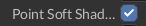

# Check box

Checkbox is a UI widget that have three states - `Checked`, `Unchecked` and `Undefined`. In most cases it is used
only with two values which fits in `bool` type. Third, undefined, state is used for specific situations when your
data have such state. 

## How it looks

Checkbox in `Checked` state:



Checkbox in `Unchecked` state:


## How to create

To create a checkbox you should do something like this:

```rust,no_run
{{#include ../../code/snippets/src/ui/check_box.rs:create_checkbox}}
```

The above code will create a checkbox without any textual info, but usually checkboxes have some useful info
near them. To create such checkbox, you could use `.with_content(..)` method which accepts any widget handle.
For checkbox with text, you could use `TextBuilder` to create textual content, for checkbox with text - use 
`ImageBuilder`. As already said, you're free to use any widget handle there.

Here's an example of checkbox with textual content.

```rust,no_run
{{#include ../../code/snippets/src/ui/check_box.rs:create_checkbox_with_text}}
```

## Message handling

Checkboxes are not static widget and have multiple states. To handle a message from a checkbox, you need to handle
a `CheckBoxMessage::Check` message. To do so, you can do something like this:

```rust,no_run
{{#include ../../code/snippets/src/ui/check_box.rs:usage_example}}
```

Keep in mind that checkbox (as any other widget) generates `WidgetMessage` instances. You can catch them too and
do a custom handling if you need.

## Theme

Checkbox can be fully customized to have any look you want, there are few methods that will help you with 
customization:

1) `.with_content(..)` - sets the content that will be shown near the checkbox. 
2) `.with_check_mark(..)` - sets the widget that will be used as checked icon. 
3) `.with_uncheck_mark(..)` - sets the widget that will be used as unchecked icon.
4) `.with_undefined_mark(..)` - sets the widget that will be used as undefined icon.