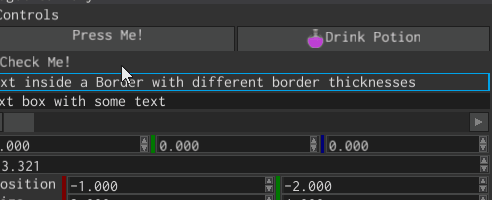

# Message box



Message box is a window that is used to show standard confirmation/information dialogues, for example, closing a
document with unsaved changes. It has a title, some text, and a fixed set of buttons (Yes, No, Cancel in different
combinations).

## Examples

A simple message box with two buttons (Yes and No) and some text can be created like so:

 ```rust
{{#include ../code/snippets/src/ui/message_box.rs:create_message_box}}
 ```

To "catch" the moment when any of the buttons will be clicked, you should listen for `MessageBoxMessage::Close`
message:

```rust
{{#include ../code/snippets/src/ui/message_box.rs:on_ui_message}}
 ```

To open an existing message box, use `MessageBoxMessage::Open`. You can optionally specify a new title and a text for
the message box:

 ```rust
{{#include ../code/snippets/src/ui/message_box.rs:open_message_box}}
 ```

## Styling

There's no way to change the style of the message box, nor add some widgets to it. If you need a custom message box,
then you need to create your own widget. This message box is meant to be used as a standard dialog box for standard
situations in the UI.
