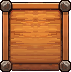
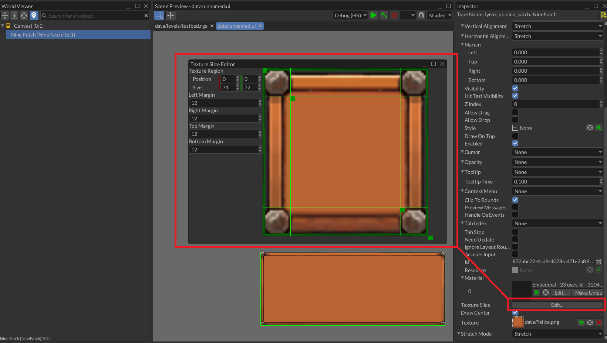
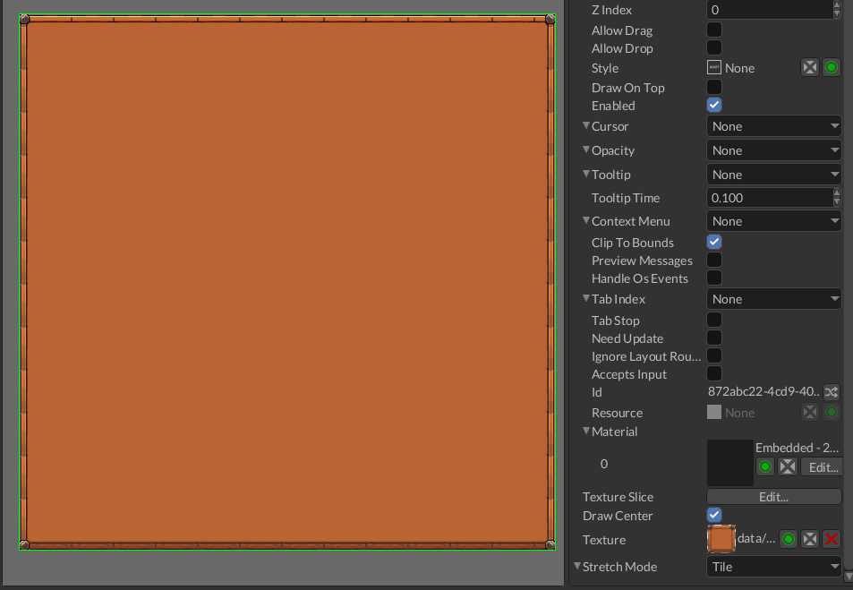
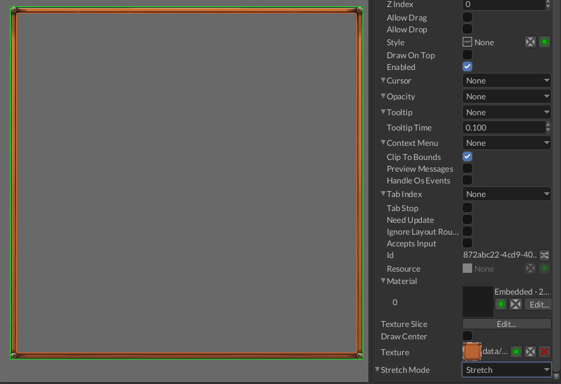

# Nine Patch

`NinePatch` widget is used to split an image in nine sections, where each corner section will
remain the same, while the middle parts between each corner will be used to evenly fill the
space. This widget is primarily used in the UI to create resizable frames, buttons, windows, etc.

## Example

Let's say we want to make a stretchable container for various items, but want to keep the corners undistorted.
We'll use the following frame:



The easiest way of creating such a nine patch frame is to use the texture slice editor, that can be opened
by clicking on `Edit...` button of the texture slice field:



As you can see, the corners of the frame are not distorted.

The same effect can be achieved from code. The following examples shows how to create a nine-patch widget with a texture
and some margins.

```rust
{{#include ../code/snippets/src/ui/nine_patch.rs:create_nine_patch}}
```

## Atlas Region

It is also possible to specify an atlas region where the source image is located:

```rust
{{#include ../code/snippets/src/ui/nine_patch.rs:create_nine_patch_with_region}}
```

## Stretch Mode



It is also possible to specify stretch mode for every part except the corners. This can be done by selecting
the desired mode in `Stretch Mode` property.

## Center Hole



Sometimes there's no need to draw the center tile, it can be achieved by unchecking the `Draw Center` bool 
property.