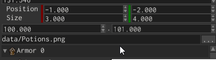

# Range



Range editor is used to display and edit closed ranges like `0..1`. The widget is generic over numeric type,
so you can display and editor ranges of any type, such as `u32`, `f32`, `f64`, etc.

## Example

You can create range editors using [`RangeEditorBuilder`], like so:

```rust,no_run
{{#include ../code/snippets/src/ui/range.rs:create_range_editor}}
```

This example creates an editor for `Range<u32>` type with `0..100` value.

## Value

To change the current value of a range editor, use [`RangeEditorMessage::Value`] message:

```rust,no_run
{{#include ../code/snippets/src/ui/range.rs:change_value}}
```

To "catch" the moment when the value has changed, use the same message, but check for [`MessageDirection::FromWidget`]
direction
on the message:

```rust,no_run
{{#include ../code/snippets/src/ui/range.rs:fetch_value}}
```

Be very careful about the type of the range when sending a message, you need to send a range of exact type, that match
the type
of your editor, otherwise the message have no effect. The same applied to fetching.