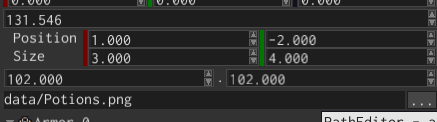

# Rect editor



Rect editor widget is used to show and edit `Rect` values. It shows four numeric fields: two for the top left corner
of a rect, two for its size.

## Example

Rect editor can be created using `RectEditorBuilder`, like so:

```rust
{{#include ../code/snippets/src/ui/rect.rs:create_rect_editor}}
```

## Value

To change the value of a rect editor, use `RectEditorMessage::Value` message:

```rust
{{#include ../code/snippets/src/ui/rect.rs:change_value}}
```

To "catch" the moment when the value of a rect editor has changed, listen to the same message, but check its direction:

```rust
{{#include ../code/snippets/src/ui/rect.rs:fetch_value}}
```