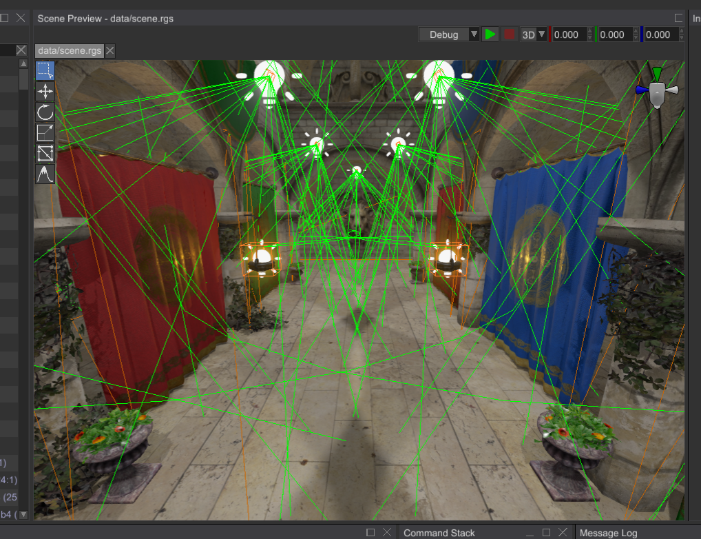

# Rendering

User interface is usually rendered directly on screen, and in most cases this is enough. However, there are some 
specific cases when you need to incorporate user interface in your game scene as an interactive screen (holographic,
for example) or to render some scene inside some UI element (to create some sort of in-game CCTV, for example). This
chapter covers these specific cases and rendering nuances in general.

## Offscreen Rendering

Offscreen rendering is used to render a UI into a texture, so it can be later used in your game scene. Here's a simple
example - holographic inventory in sci-fi games:


Default engine's user interface instance (accessible in `context.user_interfaces.first/first_mut()` from plugin methods) can't be rendered
offscreen due to engine design. However, you can create a new user interface instance, populate it with widgets, and 
then render it to a texture. This could be done like so:

```rust,no_run
{{#include ../code/snippets/src/ui/rendering.rs:rendering}}
```

There's quite a lot of code, but it is quite simple and the comments should help you to understand which part does what.
It uses standard plugin structure and contents of each method should be placed in the according methods in your game.
This code creates a new user interface, a render target of appropriate size and renders the UI into the render
target. The render target then could be used as a diffuse texture in one of your materials, which in its turn, can
be assigned to pretty much any mesh in your game. 

## Embedding Scene into UI

It is possible to "embed" a scene into arbitrary user interface. This could be useful if you need to create some sort
of CCTV, or to show 3D graphics in 2D user interface and so on. To do so, you need to specify a render target for your
scene and then use the texture (render target) in an `Image` widget.

```rust,no_run
{{#include ../code/snippets/src/ui/rendering.rs:reroute_scene_rendering}}
```

This function could be used as-is to re-route rendering of a scene to an `Image` widget. It creates a new render target
first, then it assigns it to the scene, and also it creates a new `Image` widget with the render target as a texture.
A simple example of what this code does is the scene previewer in the editor:



If you set `width` and `height` to match your screen size, you'll create a simple "overlay" that will allow you to 
render scene entities on top of the UI. In this case, however, you also need to configure scene camera accordingly,
and probably use orthographic projection so the coordinates would match.