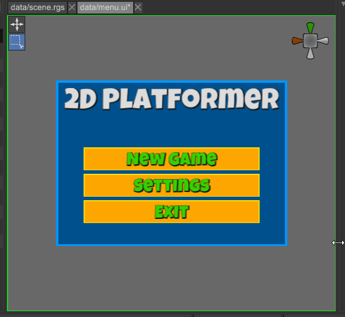

# Screen



Screen is a widget that always has the size of the screen of the UI in which it is used. It is
main use case is to provide automatic layout functionality, that will always provide screen size
to its children widgets. This is needed, because the root node of any UI is [Canvas](canvas.md)
which provides infinite bounds as a layout constraint, thus making it impossible for automatic
fitting to the current screen size. For example, Screen widget could be used as a root node for
[Grid](grid.md) widget - in this case the grid instance will always have the size of the
screen and will automatically shrink or expand when the screen size changes. It is ideal choice if
you want to have some widgets always centered on screen (for example - crosshair, main menu of
your game, etc.).

## How To Create

There are two major ways to create a Screen widget - using the editor or by code.

### Using the Editor

Go to `Create -> UI` menu and find `Screen` widget there, make sure it is a direct child of the
root node of the hierarchy. Alternatively, you can right-click on the root node in the hierarchy
and click `Create Child -> Screen`. After that you can add any number of children nodes to it.
Screen widget does not have any special properties, so you do not need to tweak it at all.

### From Code

The following example creates a simple main menu of a game with just two buttons. The buttons
will always be centered in the current screen bounds. It creates something similar to the gif above,
but not so fancy.

```rust
{{#include ../code/snippets/src/ui/screen.rs:create_always_centered_game_menu}}
```