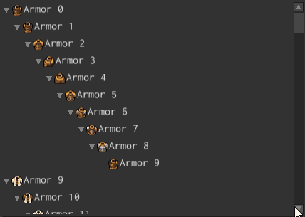

# Tree



Tree widget allows you to create views for hierarchical data. It could be used to show file
system entries, graphs, and anything else that could be represented as a tree.

## Examples

A simple tree with one root and two children items could be created like so:

```rust
# use fyrox_ui::{
#     core::pool::Handle,
#     text::TextBuilder,
#     tree::{TreeBuilder, TreeRootBuilder},
#     widget::WidgetBuilder,
#     BuildContext, UiNode,
# };
#
fn create_tree(ctx: &mut BuildContext) -> Handle<UiNode> {
    // Note, that `TreeRoot` widget is mandatory here. Otherwise some functionality of
    // descendant trees won't work.
    TreeRootBuilder::new(WidgetBuilder::new())
        .with_items(vec![TreeBuilder::new(WidgetBuilder::new())
            .with_content(
                TextBuilder::new(WidgetBuilder::new())
                    .with_text("Root Item 0")
                    .build(ctx),
            )
            .with_items(vec![
                TreeBuilder::new(WidgetBuilder::new())
                    .with_content(
                        TextBuilder::new(WidgetBuilder::new())
                            .with_text("Child Item 0")
                            .build(ctx),
                    )
                    .build(ctx),
                TreeBuilder::new(WidgetBuilder::new())
                    .with_content(
                        TextBuilder::new(WidgetBuilder::new())
                            .with_text("Child Item 1")
                            .build(ctx),
                    )
                    .build(ctx),
            ])
            .build(ctx)])
        .build(ctx)
}
```

Note, that `TreeRoot` widget is mandatory here. Otherwise, some functionality of descendant trees
won't work (primarily - selection). See `TreeRoot` docs for more detailed explanation.

## Built-in controls

Tree widget is a rich control element, which has its own set of controls:

`Any Mouse Button` - select.
`Ctrl+Click` - enables multi-selection.
`Alt+Click` - prevents selection allowing you to use drag'n'drop.
`Shift+Click` - selects a span of items.
`ArrowUp` - navigate up from the topmost selection.
`ArrowDown` - navigate down from the lowermost selection.
`ArrowRight` - expand the selected item (first from the selection) or (if it is expanded), go
down the tree.
`ArrowLeft` - collapse the selected item or (if it is collapsed), go up the tree.

## Adding Items

An item could be added to a tree using `TreeMessage::AddItem` message like so:

```rust
# use fyrox_ui::{
#     core::pool::Handle,
#     message::MessageDirection,
#     text::TextBuilder,
#     tree::{TreeBuilder, TreeMessage},
#     widget::WidgetBuilder,
#     UiNode, UserInterface,
# };
#
fn add_item(tree: Handle<UiNode>, ui: &mut UserInterface) {
    let ctx = &mut ui.build_ctx();

    let item = TreeBuilder::new(WidgetBuilder::new())
        .with_content(
            TextBuilder::new(WidgetBuilder::new())
                .with_text("Some New Item")
                .build(ctx),
        )
        .build(ctx);

    ui.send_message(TreeMessage::add_item(
        tree,
        MessageDirection::ToWidget,
        item,
    ));
}
```

## Removing Items

An item could be removed from a tree using `TreeMessage::RemoveItem` message like so:

```rust
# use fyrox_ui::{
#     core::pool::Handle, message::MessageDirection, tree::TreeMessage, UiNode, UserInterface,
# };
#
fn remove_item(tree: Handle<UiNode>, item_to_remove: Handle<UiNode>, ui: &UserInterface) {
    // Note that the `ui` is borrowed as immutable here, which means that the item will **not**
    // be removed immediately, but on the next update call.
    ui.send_message(TreeMessage::remove_item(
        tree,
        MessageDirection::ToWidget,
        item_to_remove,
    ));
}
```

## Setting New Items

Tree's items could be changed all at once using the `TreeMessage::SetItems` message like so:

```rust
# use fyrox_ui::{
#     core::pool::Handle,
#     message::MessageDirection,
#     text::TextBuilder,
#     tree::{TreeBuilder, TreeMessage},
#     widget::WidgetBuilder,
#     UiNode, UserInterface,
# };
#
fn set_items(tree: Handle<UiNode>, ui: &mut UserInterface) {
    let ctx = &mut ui.build_ctx();

    let items = vec![
        TreeBuilder::new(WidgetBuilder::new())
            .with_content(
                TextBuilder::new(WidgetBuilder::new())
                    .with_text("Item 0")
                    .build(ctx),
            )
            .build(ctx),
        TreeBuilder::new(WidgetBuilder::new())
            .with_content(
                TextBuilder::new(WidgetBuilder::new())
                    .with_text("Item 1")
                    .build(ctx),
            )
            .build(ctx),
    ];

    // A flag, that tells that the UI system must destroy previous items first.
    let remove_previous = true;
    ui.send_message(TreeMessage::set_items(
        tree,
        MessageDirection::ToWidget,
        items,
        remove_previous,
    ));
}
```

## Expanding Items

It is possible to expand/collapse trees at runtime using `TreeMessage::Expand` message. It provides
different expansion strategies, see docs for `TreeExpansionStrategy` for more info. Tree expansion
could useful to highlight something visually.

```rust
# use fyrox_ui::{
#     core::pool::Handle,
#     message::MessageDirection,
#     tree::{TreeExpansionStrategy, TreeMessage},
#     UiNode, UserInterface,
# };
#
fn expand_tree(tree: Handle<UiNode>, ui: &UserInterface) {
    ui.send_message(TreeMessage::expand(
        tree,
        MessageDirection::ToWidget,
        true,
        TreeExpansionStrategy::RecursiveAncestors,
    ));
}
```